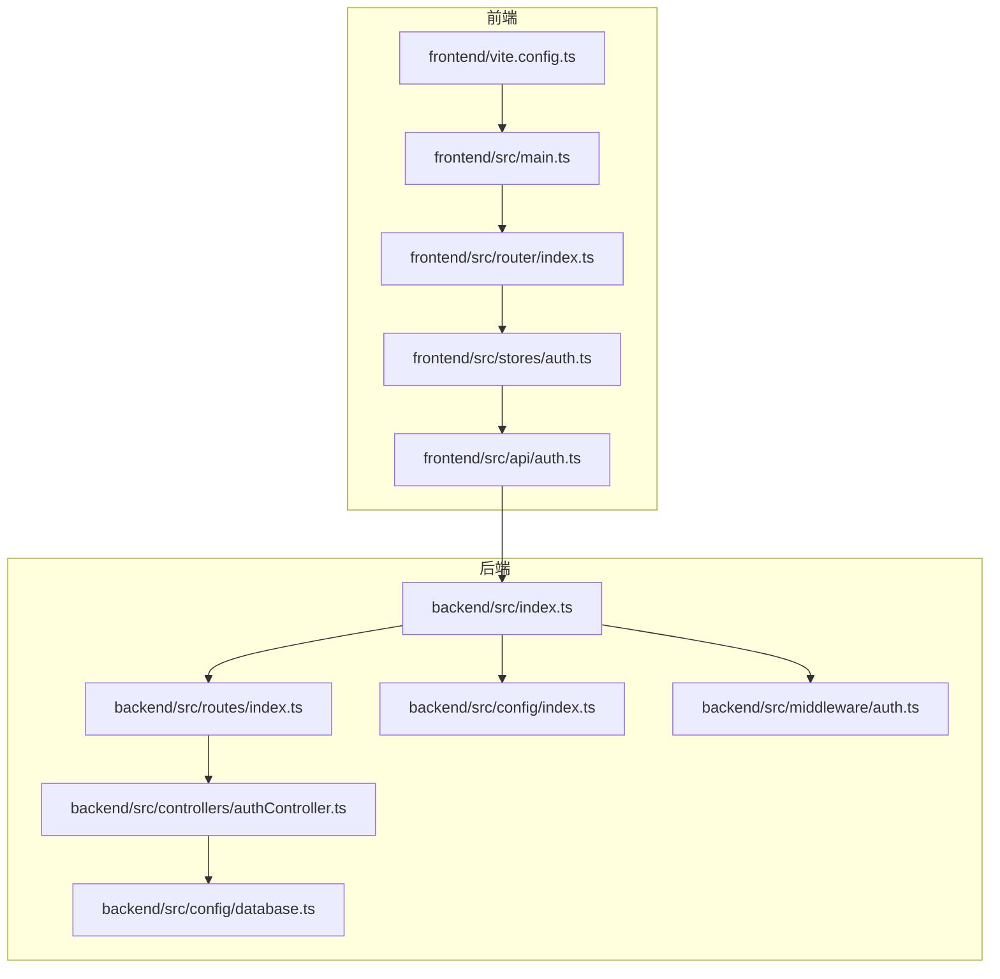
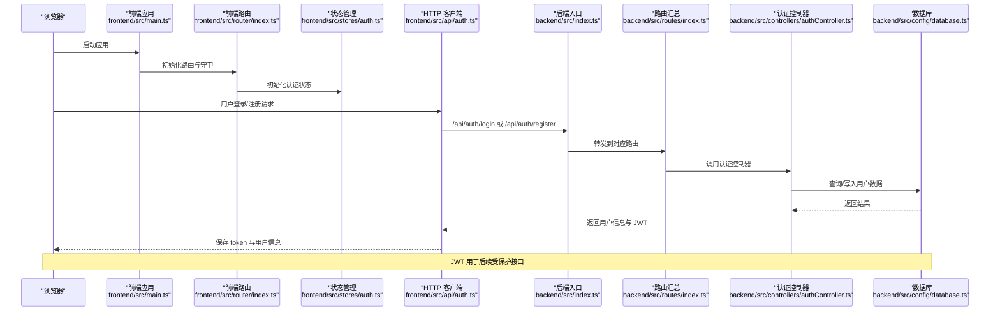
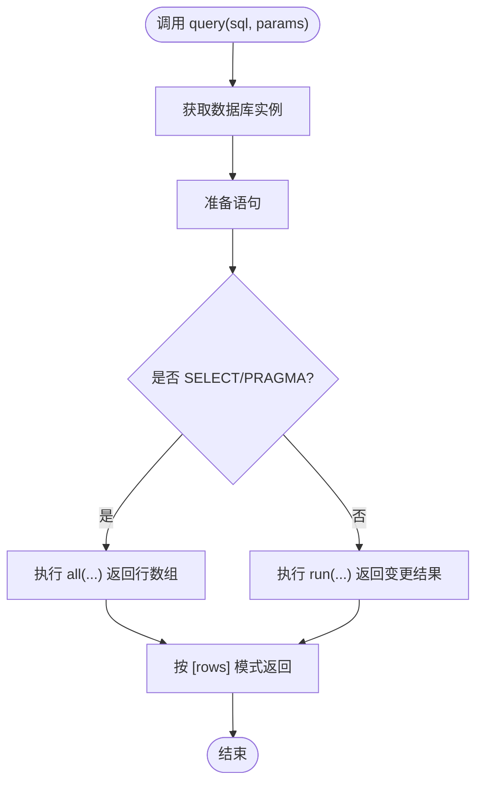
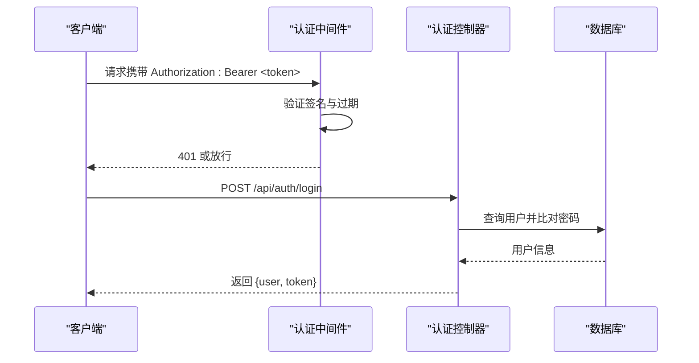
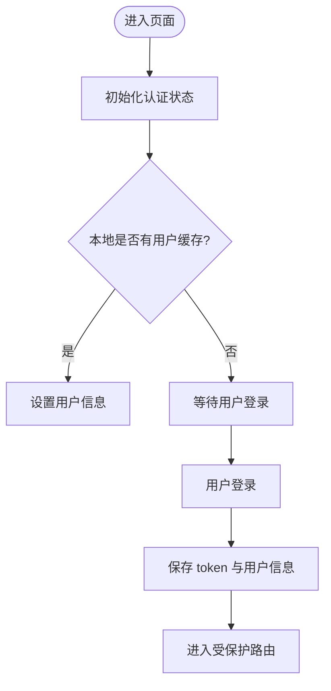
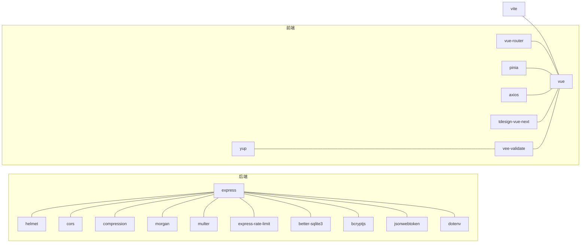

# 技术栈

<cite>
**本文引用的文件**
- [backend/package.json](file://backend/package.json)
- [frontend/package.json](file://frontend/package.json)
- [backend/tsconfig.json](file://backend/tsconfig.json)
- [frontend/tsconfig.json](file://frontend/tsconfig.json)
- [backend/src/index.ts](file://backend/src/index.ts)
- [backend/src/config/database.ts](file://backend/src/config/database.ts)
- [backend/src/config/index.ts](file://backend/src/config/index.ts)
- [backend/src/middleware/auth.ts](file://backend/src/middleware/auth.ts)
- [backend/src/controllers/authController.ts](file://backend/src/controllers/authController.ts)
- [backend/src/routes/index.ts](file://backend/src/routes/index.ts)
- [frontend/vite.config.ts](file://frontend/vite.config.ts)
- [frontend/src/main.ts](file://frontend/src/main.ts)
- [frontend/src/router/index.ts](file://frontend/src/router/index.ts)
- [frontend/src/stores/auth.ts](file://frontend/src/stores/auth.ts)
- [frontend/src/api/auth.ts](file://frontend/src/api/auth.ts)
</cite>

## 目录
1. [引言](#引言)
2. [项目结构](#项目结构)
3. [核心组件](#核心组件)
4. [架构总览](#架构总览)
5. [详细组件分析](#详细组件分析)
6. [依赖关系分析](#依赖关系分析)
7. [性能考量](#性能考量)
8. [故障排查指南](#故障排查指南)
9. [结论](#结论)
10. [附录](#附录)

## 引言
本技术栈文档面向 TingStudio 项目的开发者与维护者，系统梳理后端与前端的技术选型、架构设计与实现要点，并给出学习路径建议与最佳实践。后端采用 Node.js + TypeScript + Express + better-sqlite3 + JWT 认证与安全中间件；前端采用 Vue 3 + TypeScript + Vite + Vue Router + Pinia + TDesign Vue Next + Axios + VeeValidate + Yup。该组合在开发效率、可维护性与运行时性能之间取得平衡，适合中小型团队快速迭代与稳定交付。

## 项目结构
项目采用前后端分离架构，分别独立构建与运行：
- 后端：基于 Express 服务器，通过 better-sqlite3 提供本地化数据库能力，配合 JWT 实现认证，使用 Helmet/CORS/Compression/Morgan 等中间件保障安全与可观测性。
- 前端：基于 Vite 构建，Vue Router 管理页面路由与鉴权守卫，Pinia 管理全局状态，Axios 封装 HTTP 请求，TDesign Vue Next 提供 UI 组件库，VeeValidate + Yup 进行表单校验。

图表来源
- [frontend/src/main.ts:1-17](file://frontend/src/main.ts#L1-L17)
- [frontend/src/router/index.ts:1-165](file://frontend/src/router/index.ts#L1-L165)
- [frontend/src/stores/auth.ts:1-64](file://frontend/src/stores/auth.ts#L1-L64)
- [frontend/src/api/auth.ts:1-36](file://frontend/src/api/auth.ts#L1-L36)
- [frontend/vite.config.ts:1-23](file://frontend/vite.config.ts#L1-L23)
- [backend/src/index.ts:1-61](file://backend/src/index.ts#L1-L61)
- [backend/src/routes/index.ts:1-24](file://backend/src/routes/index.ts#L1-L24)
- [backend/src/config/database.ts:1-70](file://backend/src/config/database.ts#L1-L70)
- [backend/src/config/index.ts:1-24](file://backend/src/config/index.ts#L1-L24)
- [backend/src/middleware/auth.ts:1-38](file://backend/src/middleware/auth.ts#L1-L38)
- [backend/src/controllers/authController.ts:1-89](file://backend/src/controllers/authController.ts#L1-L89)

章节来源
- [backend/src/index.ts:1-61](file://backend/src/index.ts#L1-L61)
- [frontend/src/main.ts:1-17](file://frontend/src/main.ts#L1-L17)

## 核心组件
- 后端核心
  - Express 服务器：统一入口、中间件链、静态资源与健康检查。
  - better-sqlite3：高性能嵌入式数据库，支持 WAL 与外键，适配中小规模数据。
  - JWT 认证：无状态鉴权，结合自定义中间件实现受保护路由。
  - 安全中间件：Helmet、CORS、Compression、Morgan、限流与速率限制。
- 前端核心
  - Vue 3 + TypeScript：类型安全与组合式 API。
  - Vite：快速冷启与热更新，代理到后端 API。
  - Vue Router：路由与鉴权守卫，动态导入视图。
  - Pinia：轻量状态管理，响应式与模块化。
  - TDesign Vue Next：企业级 UI 组件库，样式与主题一致。
  - Axios：HTTP 客户端封装，统一拦截器与错误处理。
  - VeeValidate + Yup：声明式表单校验，提升用户体验与数据质量。

章节来源
- [backend/package.json:1-42](file://backend/package.json#L1-L42)
- [frontend/package.json:1-30](file://frontend/package.json#L1-L30)
- [backend/tsconfig.json:1-25](file://backend/tsconfig.json#L1-L25)
- [frontend/tsconfig.json:1-32](file://frontend/tsconfig.json#L1-L32)

## 架构总览
下图展示前后端交互流程与关键组件协作关系：

图表来源
- [frontend/src/main.ts:1-17](file://frontend/src/main.ts#L1-L17)
- [frontend/src/router/index.ts:148-162](file://frontend/src/router/index.ts#L148-L162)
- [frontend/src/stores/auth.ts:1-64](file://frontend/src/stores/auth.ts#L1-L64)
- [frontend/src/api/auth.ts:1-36](file://frontend/src/api/auth.ts#L1-L36)
- [backend/src/index.ts:35-48](file://backend/src/index.ts#L35-L48)
- [backend/src/routes/index.ts:11-23](file://backend/src/routes/index.ts#L11-L23)
- [backend/src/controllers/authController.ts:1-89](file://backend/src/controllers/authController.ts#L1-L89)
- [backend/src/config/database.ts:44-61](file://backend/src/config/database.ts#L44-L61)

## 详细组件分析

### 后端：Express 服务器与中间件
- 服务器初始化：加载 dotenv、注册全局中间件（安全、跨域、压缩、日志）、解析 JSON/URL 编码、静态文件、健康检查、404 与错误处理。
- 中间件链顺序影响安全性与性能，建议保持 Helmet 在前，CORS/Compression/Morgan 依序配置。
- 静态文件与上传目录：/uploads 作为文件访问入口，便于导出与媒体资源。

章节来源
- [backend/src/index.ts:13-54](file://backend/src/index.ts#L13-L54)

### 后端：数据库连接与查询封装
- better-sqlite3：自动创建数据目录，启用 WAL 与外键，提升并发与一致性。
- 查询封装：统一 query 函数，兼容 SELECT/INSERT/UPDATE/DELETE，返回行数组或 RunResult，便于控制器解构使用。
- 事务封装：transaction(fn) 简化原子操作。

图表来源
- [backend/src/config/database.ts:44-61](file://backend/src/config/database.ts#L44-L61)

章节来源
- [backend/src/config/database.ts:1-70](file://backend/src/config/database.ts#L1-L70)

### 后端：JWT 认证中间件与控制器
- 认证中间件：从 Authorization 头提取 Bearer Token，验证失败返回 401。
- 令牌生成：基于配置的密钥与过期时间生成 JWT，随登录/注册响应下发。
- 控制器：注册检查用户名唯一性、哈希密码入库；登录比对密码、签发令牌；获取当前用户信息。

图表来源
- [backend/src/middleware/auth.ts:13-37](file://backend/src/middleware/auth.ts#L13-L37)
- [backend/src/controllers/authController.ts:42-71](file://backend/src/controllers/authController.ts#L42-L71)
- [backend/src/config/database.ts:44-61](file://backend/src/config/database.ts#L44-L61)

章节来源
- [backend/src/middleware/auth.ts:1-38](file://backend/src/middleware/auth.ts#L1-L38)
- [backend/src/controllers/authController.ts:1-89](file://backend/src/controllers/authController.ts#L1-L89)

### 前端：应用入口与路由守卫
- 应用入口：挂载 Pinia、Router、TDesign，引入全局样式。
- 路由守卫：beforeEach 判断 requiresAuth，未登录跳转 /login，已登录禁止重复进入 /login，否则放行。
- 动态导入：子路由懒加载，优化首屏加载。

章节来源
- [frontend/src/main.ts:1-17](file://frontend/src/main.ts#L1-L17)
- [frontend/src/router/index.ts:148-162](file://frontend/src/router/index.ts#L148-L162)

### 前端：认证状态与 API 封装
- Pinia Store：管理用户、加载状态、登录/注册/登出逻辑，持久化到 localStorage。
- API 层：封装 /auth/* 接口，统一保存/清除 token 与用户信息。
- 与后端协同：登录成功后保存 token 并在后续请求中携带，实现无刷新会话。

图表来源
- [frontend/src/stores/auth.ts:12-32](file://frontend/src/stores/auth.ts#L12-L32)
- [frontend/src/api/auth.ts:19-35](file://frontend/src/api/auth.ts#L19-L35)

章节来源
- [frontend/src/stores/auth.ts:1-64](file://frontend/src/stores/auth.ts#L1-L64)
- [frontend/src/api/auth.ts:1-36](file://frontend/src/api/auth.ts#L1-L36)

### 前端：Vite 开发与代理配置
- 插件与别名：@ 指向 src，提升导入便捷性。
- 代理：/api 代理至后端 3000 端口，解决开发时跨域问题。
- 端口与自动打开：默认 5173，自动打开浏览器。

章节来源
- [frontend/vite.config.ts:1-23](file://frontend/vite.config.ts#L1-L23)

### 后端：路由组织与 API 分层
- 路由汇总：统一挂载 /auth、/materials、/formulas、/salesmen、/versions、/exports、/nutrition 子路由。
- 控制器分层：各模块控制器专注于业务逻辑，复用数据库查询封装与通用响应格式。

章节来源
- [backend/src/routes/index.ts:1-24](file://backend/src/routes/index.ts#L1-L24)

## 依赖关系分析
- 后端依赖
  - 运行时：Express、better-sqlite3、bcryptjs、jsonwebtoken、helmet、cors、compression、morgan、multer、express-rate-limit、dotenv。
  - 类型：@types/* 与 TypeScript。
- 前端依赖
  - 运行时：Vue 3、Vue Router、Pinia、Axios、tdesign-vue-next、vee-validate、yup。
  - 构建：Vite、Vue 插件、TypeScript、Sass、vue-tsc。

图表来源
- [backend/package.json:14-40](file://backend/package.json#L14-L40)
- [frontend/package.json:12-28](file://frontend/package.json#L12-L28)

章节来源
- [backend/package.json:1-42](file://backend/package.json#L1-L42)
- [frontend/package.json:1-30](file://frontend/package.json#L1-L30)

## 性能考量
- 后端
  - better-sqlite3：嵌入式、零配置、低延迟，适合中小规模数据；WAL 模式提升读写并发；外键约束保证一致性。
  - 中间件：Helmet/CORS/Compression/Morgan 顺序合理，避免重复解析与不必要开销。
  - 限流：建议在生产环境启用 rate-limit 中间件，防止暴力破解与滥用。
- 前端
  - Vite：快速冷启动与热更新，代理开发体验佳；动态导入减少首屏体积。
  - TDesign：按需引入与 Tree Shaking 可进一步优化打包体积。
  - Axios：统一拦截器可做缓存与重试策略，降低网络抖动影响。

## 故障排查指南
- 启动失败
  - 后端：检查数据库路径与权限、端口占用、环境变量（JWT 密钥、CORS、上传目录）。
  - 前端：确认 Vite 代理目标与端口、网络连通性。
- 认证问题
  - 前端：确认 localStorage 是否保存 token、请求头是否携带 Authorization。
  - 后端：核对 JWT 密钥与过期配置、中间件是否正确放行。
- 数据库异常
  - 确认 WAL 与外键开启、事务包裹、SQL 参数绑定、错误捕获与日志输出。

章节来源
- [backend/src/index.ts:57-60](file://backend/src/index.ts#L57-L60)
- [backend/src/config/index.ts:10-22](file://backend/src/config/index.ts#L10-L22)
- [backend/src/config/database.ts:18-30](file://backend/src/config/database.ts#L18-L30)
- [frontend/src/api/auth.ts:19-35](file://frontend/src/api/auth.ts#L19-L35)

## 结论
TingStudio 的技术栈以“轻量、高效、易维护”为目标：后端以 Express + better-sqlite3 + JWT 为核心，辅以安全中间件与清晰的控制器分层；前端以 Vue 3 + Vite + Pinia + TDesign 为基础，结合路由守卫与状态持久化，形成一致的开发体验。该组合在中小型项目中具备良好的扩展性与可演进性，适合持续迭代与团队协作。

## 附录
- 学习路径建议
  - 后端：掌握 Express 中间件机制、better-sqlite3 基础与事务、JWT 工作原理与安全实践。
  - 前端：熟悉 Vue 3 组合式 API、Vue Router 导航守卫、Pinia 状态管理、Axios 拦截器与 Vite 生态。
  - 工程化：了解 TypeScript 配置、路径映射、构建与预览脚本、环境变量管理。