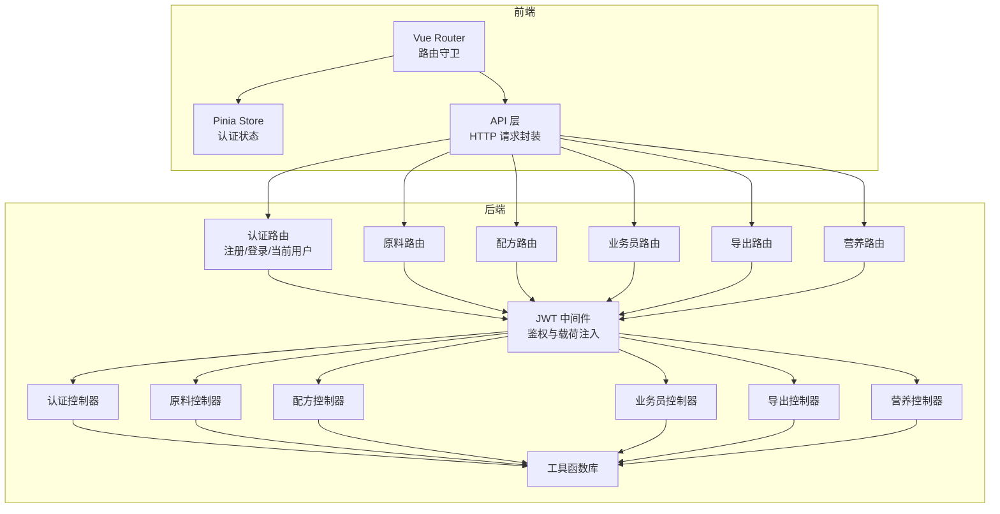
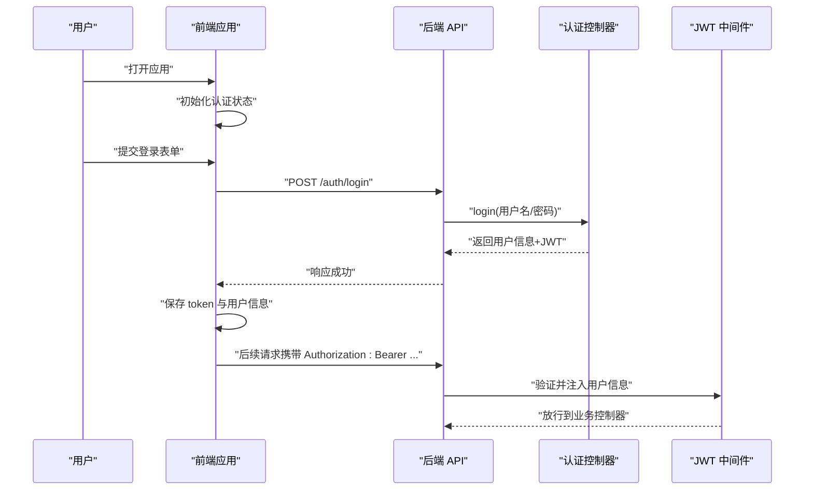
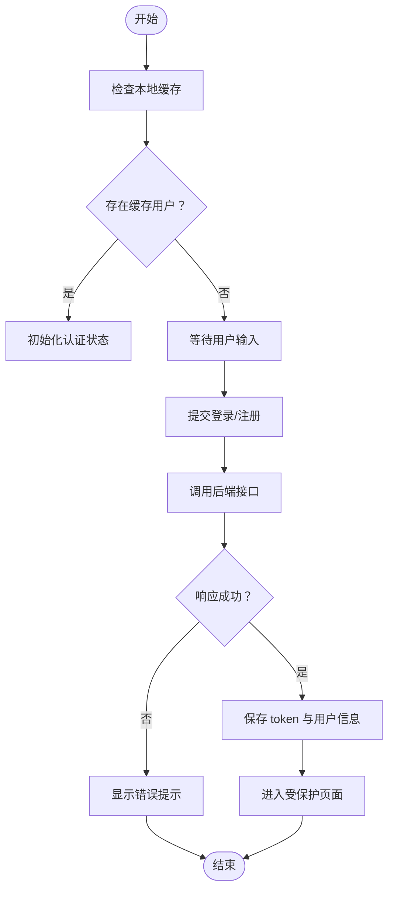
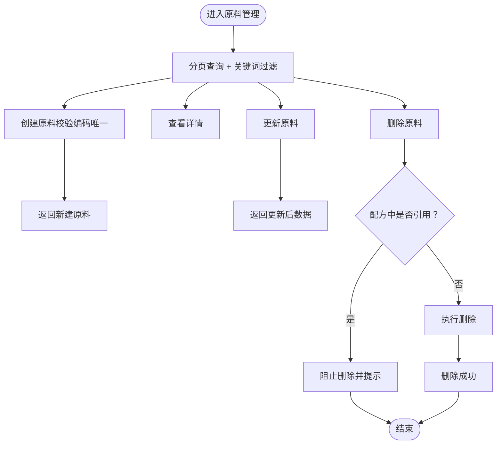
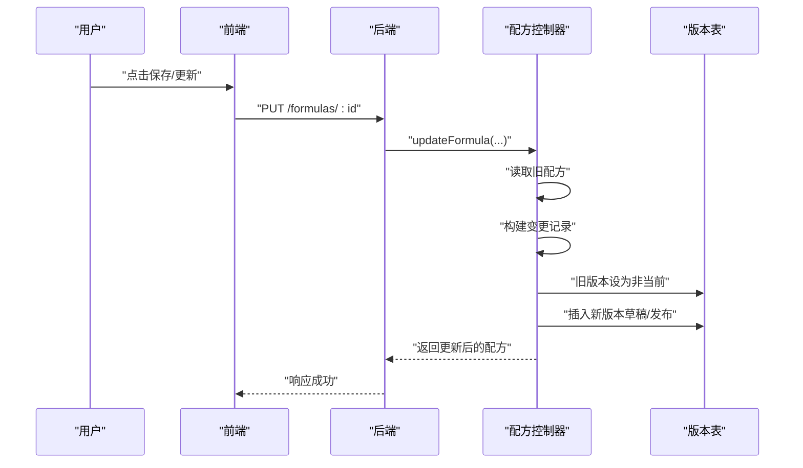
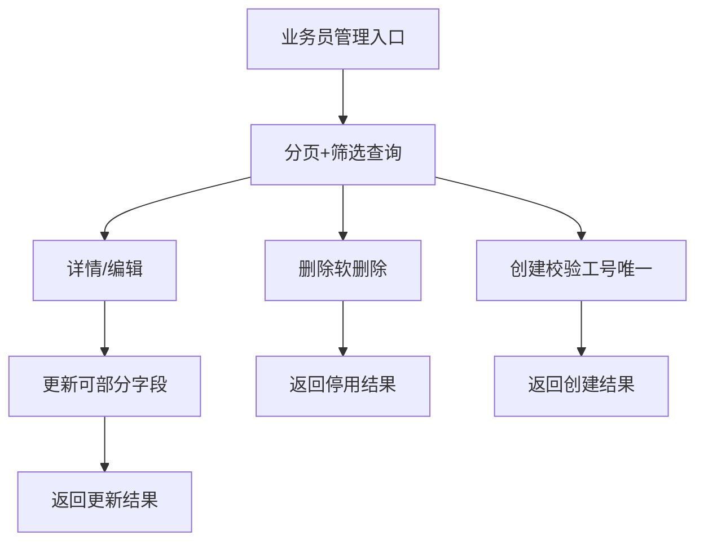
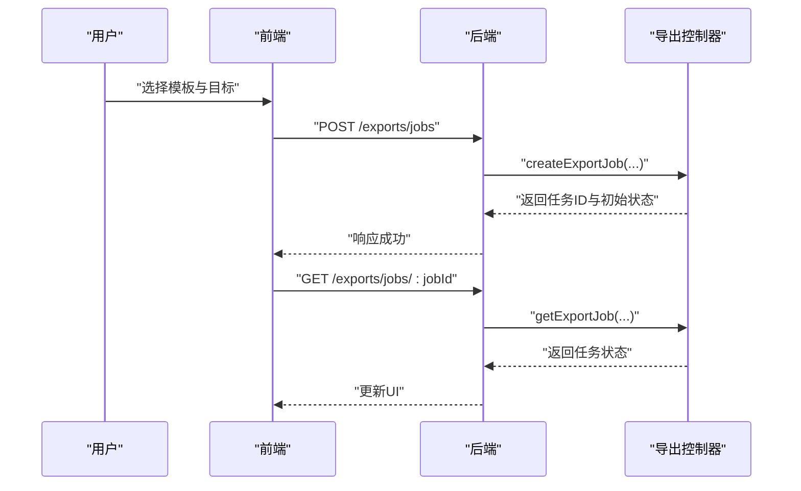
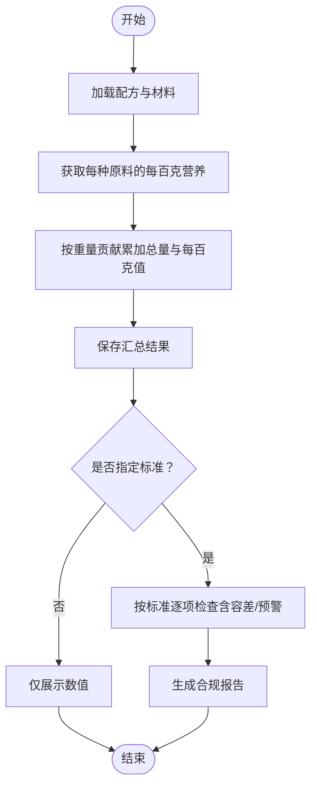
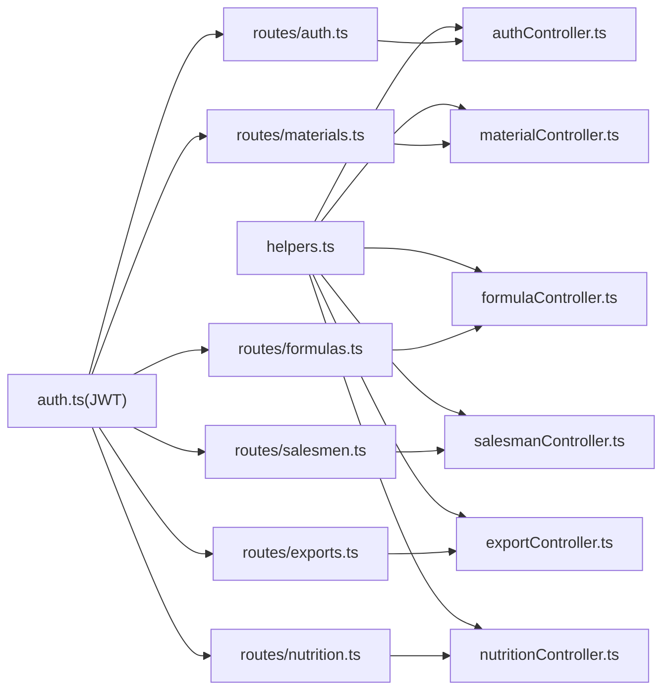

# 核心功能特性

<cite>
**本文档引用的文件**
- [backend/src/controllers/authController.ts](file://backend/src/controllers/authController.ts)
- [backend/src/middleware/auth.ts](file://backend/src/middleware/auth.ts)
- [backend/src/routes/auth.ts](file://backend/src/routes/auth.ts)
- [backend/src/controllers/materialController.ts](file://backend/src/controllers/materialController.ts)
- [backend/src/routes/materials.ts](file://backend/src/routes/materials.ts)
- [backend/src/controllers/formulaController.ts](file://backend/src/controllers/formulaController.ts)
- [backend/src/routes/formulas.ts](file://backend/src/routes/formulas.ts)
- [backend/src/controllers/salesmanController.ts](file://backend/src/controllers/salesmanController.ts)
- [backend/src/routes/salesmen.ts](file://backend/src/routes/salesmen.ts)
- [backend/src/controllers/exportController.ts](file://backend/src/controllers/exportController.ts)
- [backend/src/routes/exports.ts](file://backend/src/routes/exports.ts)
- [backend/src/controllers/nutritionController.ts](file://backend/src/controllers/nutritionController.ts)
- [backend/src/routes/nutrition.ts](file://backend/src/routes/nutrition.ts)
- [backend/src/utils/helpers.ts](file://backend/src/utils/helpers.ts)
- [frontend/src/stores/auth.ts](file://frontend/src/stores/auth.ts)
- [frontend/src/api/auth.ts](file://frontend/src/api/auth.ts)
- [frontend/src/router/index.ts](file://frontend/src/router/index.ts)
- [frontend/src/types/user.ts](file://frontend/src/types/user.ts)
- [frontend/src/types/material.ts](file://frontend/src/types/material.ts)
- [frontend/src/types/formula.ts](file://frontend/src/types/formula.ts)
</cite>

## 目录
1. [引言](#引言)
2. [项目结构](#项目结构)
3. [核心组件](#核心组件)
4. [架构总览](#架构总览)
5. [详细组件分析](#详细组件分析)
6. [依赖关系分析](#依赖关系分析)
7. [性能考虑](#性能考虑)
8. [故障排查指南](#故障排查指南)
9. [结论](#结论)
10. [附录](#附录)

## 引言
本文件面向 TingStudio 的使用者与实施人员，系统化梳理六大核心功能模块的能力边界与实现要点：认证系统（JWT、多角色、Token续期）、原料管理（CRUD、唯一编码校验、引用检测）、配方管理（CRUD、关键词搜索、自动版本控制、版本对比）、业务员管理（CRUD、搜索筛选、软删除）、导出与分享（模板管理、任务跟踪、分享链接）、营养分析（成分录入、汇总计算、标准管理、合规检查）。文档通过“业务价值—核心能力—使用场景—实现特点”的维度，辅以可视化图示，帮助快速建立对系统能力全景的理解。

## 项目结构
后端采用 Express + TypeScript，按“控制器-中间件-路由-工具”分层组织；前端基于 Vue 3 + Pinia + Vue Router，采用单页应用架构。认证中间件统一拦截路由，各模块路由受控于认证策略；控制器负责具体业务逻辑，工具函数提供通用能力（分页、命名转换、JSON安全解析等）。

图表来源
- [frontend/src/router/index.ts:1-165](file://frontend/src/router/index.ts#L1-L165)
- [frontend/src/stores/auth.ts:1-64](file://frontend/src/stores/auth.ts#L1-L64)
- [frontend/src/api/auth.ts:1-36](file://frontend/src/api/auth.ts#L1-L36)
- [backend/src/middleware/auth.ts:1-38](file://backend/src/middleware/auth.ts#L1-L38)
- [backend/src/routes/auth.ts:1-20](file://backend/src/routes/auth.ts#L1-L20)
- [backend/src/routes/materials.ts:1-22](file://backend/src/routes/materials.ts#L1-L22)
- [backend/src/routes/formulas.ts:1-28](file://backend/src/routes/formulas.ts#L1-L28)
- [backend/src/routes/salesmen.ts:1-24](file://backend/src/routes/salesmen.ts#L1-L24)
- [backend/src/routes/exports.ts:1-34](file://backend/src/routes/exports.ts#L1-L34)
- [backend/src/routes/nutrition.ts:1-31](file://backend/src/routes/nutrition.ts#L1-L31)
- [backend/src/utils/helpers.ts:1-86](file://backend/src/utils/helpers.ts#L1-L86)

章节来源
- [frontend/src/router/index.ts:1-165](file://frontend/src/router/index.ts#L1-L165)
- [backend/src/middleware/auth.ts:1-38](file://backend/src/middleware/auth.ts#L1-L38)
- [backend/src/utils/helpers.ts:1-86](file://backend/src/utils/helpers.ts#L1-L86)

## 核心组件
- 认证系统：提供注册、登录、当前用户查询；基于 JWT 的无状态鉴权；支持 admin 角色；前端持久化存储 token 与用户信息。
- 原料管理：提供原料 CRUD、关键词检索、唯一编码约束、删除前引用检测（配方 JSON 包含引用即禁止删除）。
- 配方管理：提供配方 CRUD、关键词搜索、业务员过滤、自动版本控制（变更即生成新版本）、版本对比。
- 业务员管理：提供业务员 CRUD、关键词/状态/部门筛选、软删除（状态置 inactive）。
- 导出与分享：提供导出模板管理（默认模板互斥）、导出任务创建与查询、公开分享链接创建与访问、API 数据接口管理。
- 营养分析：提供原料营养录入与版本化、配方营养汇总计算、标准管理、合规检查与报告生成。

章节来源
- [backend/src/controllers/authController.ts:1-89](file://backend/src/controllers/authController.ts#L1-L89)
- [backend/src/controllers/materialController.ts:1-129](file://backend/src/controllers/materialController.ts#L1-L129)
- [backend/src/controllers/formulaController.ts:1-287](file://backend/src/controllers/formulaController.ts#L1-L287)
- [backend/src/controllers/salesmanController.ts:1-125](file://backend/src/controllers/salesmanController.ts#L1-L125)
- [backend/src/controllers/exportController.ts:1-230](file://backend/src/controllers/exportController.ts#L1-L230)
- [backend/src/controllers/nutritionController.ts:1-641](file://backend/src/controllers/nutritionController.ts#L1-L641)

## 架构总览
以下序列图展示认证流程与前端状态管理的协作：

图表来源
- [frontend/src/stores/auth.ts:1-64](file://frontend/src/stores/auth.ts#L1-L64)
- [frontend/src/api/auth.ts:1-36](file://frontend/src/api/auth.ts#L1-L36)
- [backend/src/controllers/authController.ts:42-71](file://backend/src/controllers/authController.ts#L42-L71)
- [backend/src/middleware/auth.ts:13-31](file://backend/src/middleware/auth.ts#L13-L31)
- [backend/src/routes/auth.ts:17-19](file://backend/src/routes/auth.ts#L17-L19)

## 详细组件分析

### 认证系统
- 业务价值：保障系统访问安全，区分普通配方师与管理员权限，简化前端会话管理。
- 核心能力：
  - 注册：用户名唯一性校验，密码加密存储，默认角色为配方师。
  - 登录：凭用户名与密码获取 JWT。
  - 当前用户：基于 JWT 载荷返回用户信息。
  - JWT：中间件解析 Authorization 头，校验失败返回 401。
- 使用场景：首次使用系统进行身份注册；日常登录进入工作台；跨页面刷新后恢复登录态。
- 实现特点：
  - 响应统一包装 success 结构；错误按类型返回 401/409/500。
  - 前端使用 localStorage 缓存用户信息与 token，路由守卫控制访问。

图表来源
- [frontend/src/stores/auth.ts:12-32](file://frontend/src/stores/auth.ts#L12-L32)
- [frontend/src/api/auth.ts:19-35](file://frontend/src/api/auth.ts#L19-L35)
- [backend/src/controllers/authController.ts:8-39](file://backend/src/controllers/authController.ts#L8-L39)

章节来源
- [backend/src/controllers/authController.ts:1-89](file://backend/src/controllers/authController.ts#L1-L89)
- [backend/src/middleware/auth.ts:1-38](file://backend/src/middleware/auth.ts#L1-L38)
- [backend/src/routes/auth.ts:1-20](file://backend/src/routes/auth.ts#L1-L20)
- [frontend/src/stores/auth.ts:1-64](file://frontend/src/stores/auth.ts#L1-L64)
- [frontend/src/api/auth.ts:1-36](file://frontend/src/api/auth.ts#L1-L36)
- [frontend/src/router/index.ts:148-162](file://frontend/src/router/index.ts#L148-L162)

### 原料管理
- 业务价值：规范原料基础数据，确保配方配方的可追溯与一致性。
- 核心能力：
  - CRUD：创建、查询、更新、删除。
  - 搜索：支持名称/编码关键词模糊匹配。
  - 唯一性：编码唯一约束，冲突返回 409。
  - 引用检测：删除前检查是否在配方 JSON 中被引用，避免破坏配方完整性。
- 使用场景：新增植物/辅料等原料；维护库存与单位；删除不再使用的原料。
- 实现特点：
  - 默认单位与比例因子预设；删除时通过 LIKE 检索 JSON 文本中的引用键值。
  - 分页查询与总数统计；响应统一包装。

图表来源
- [backend/src/controllers/materialController.ts:6-38](file://backend/src/controllers/materialController.ts#L6-L38)
- [backend/src/controllers/materialController.ts:57-79](file://backend/src/controllers/materialController.ts#L57-L79)
- [backend/src/controllers/materialController.ts:81-106](file://backend/src/controllers/materialController.ts#L81-L106)
- [backend/src/controllers/materialController.ts:108-129](file://backend/src/controllers/materialController.ts#L108-L129)
- [backend/src/routes/materials.ts:1-22](file://backend/src/routes/materials.ts#L1-L22)

章节来源
- [backend/src/controllers/materialController.ts:1-129](file://backend/src/controllers/materialController.ts#L1-L129)
- [backend/src/routes/materials.ts:1-22](file://backend/src/routes/materials.ts#L1-L22)
- [frontend/src/types/material.ts:1-30](file://frontend/src/types/material.ts#L1-L30)

### 配方管理
- 业务价值：支撑配方设计、变更追踪与合规审核，提升配方质量与可追溯性。
- 核心能力：
  - CRUD：创建、查询、更新、删除。
  - 搜索：支持名称/业务员名称关键词与业务员过滤。
  - 版本控制：每次材料变更自动生成新版本，保留变更记录与快照；旧版本标记为非当前。
  - 版本对比：列出历史版本并支持对比视图。
- 使用场景：创建新配方；调整材料配比；审计变更历史；生成合规报告。
- 实现特点：
  - admin 可查看全部配方，普通用户仅可见本人创建。
  - 自动生成初始版本与草稿版本；版本号按小数递增。
  - 变更记录通过对比新旧材料清单生成。

图表来源
- [backend/src/controllers/formulaController.ts:132-218](file://backend/src/controllers/formulaController.ts#L132-L218)
- [backend/src/controllers/formulaController.ts:245-286](file://backend/src/controllers/formulaController.ts#L245-L286)
- [backend/src/routes/formulas.ts:1-28](file://backend/src/routes/formulas.ts#L1-L28)

章节来源
- [backend/src/controllers/formulaController.ts:1-287](file://backend/src/controllers/formulaController.ts#L1-L287)
- [backend/src/routes/formulas.ts:1-28](file://backend/src/routes/formulas.ts#L1-L28)
- [frontend/src/types/formula.ts:1-33](file://frontend/src/types/formula.ts#L1-L33)

### 业务员管理
- 业务价值：统一管理业务员档案，便于配方归属与统计分析。
- 核心能力：
  - CRUD：创建、查询、更新、软删除。
  - 搜索：支持姓名/工号/电话关键词与状态、部门过滤。
  - 软删除：将状态置为 inactive，保留历史数据。
- 使用场景：新增业务员；调整部门/联系方式；停用离职人员。
- 实现特点：
  - 工号唯一约束；更新时可选择性覆盖字段；删除走软删除。

图表来源
- [backend/src/controllers/salesmanController.ts:6-43](file://backend/src/controllers/salesmanController.ts#L6-L43)
- [backend/src/controllers/salesmanController.ts:61-83](file://backend/src/controllers/salesmanController.ts#L61-L83)
- [backend/src/controllers/salesmanController.ts:85-113](file://backend/src/controllers/salesmanController.ts#L85-L113)
- [backend/src/controllers/salesmanController.ts:115-125](file://backend/src/controllers/salesmanController.ts#L115-L125)
- [backend/src/routes/salesmen.ts:1-24](file://backend/src/routes/salesmen.ts#L1-L24)

章节来源
- [backend/src/controllers/salesmanController.ts:1-125](file://backend/src/controllers/salesmanController.ts#L1-L125)
- [backend/src/routes/salesmen.ts:1-24](file://backend/src/routes/salesmen.ts#L1-L24)

### 导出与分享
- 业务价值：标准化导出格式与流程，支持公开分享与外部系统对接。
- 核心能力：
  - 模板管理：按类型创建/查询模板，支持默认模板互斥。
  - 任务跟踪：创建导出任务并查询状态。
  - 分享链接：创建公开分享，支持有效期、下载次数、允许邮箱等限制。
  - API 接口管理：创建与查询数据接口配置。
- 使用场景：批量导出配方；向外部共享特定配方版本；对接第三方系统。
- 实现特点：
  - 模板默认位点与互斥更新；任务状态机 pending/完成等；分享访问无需认证但做有效期与次数校验。

图表来源
- [backend/src/controllers/exportController.ts:55-102](file://backend/src/controllers/exportController.ts#L55-L102)
- [backend/src/controllers/exportController.ts:104-117](file://backend/src/controllers/exportController.ts#L104-L117)
- [backend/src/routes/exports.ts:20-23](file://backend/src/routes/exports.ts#L20-L23)

章节来源
- [backend/src/controllers/exportController.ts:1-230](file://backend/src/controllers/exportController.ts#L1-L230)
- [backend/src/routes/exports.ts:1-34](file://backend/src/routes/exports.ts#L1-L34)

### 营养分析
- 业务价值：量化配方营养成分，辅助合规与产品标签制作。
- 核心能力：
  - 成分录入：为原料设置每百克营养素含量与数据源、备注，并支持版本化。
  - 汇总计算：按配方材料与成品重量计算总重、总量与每百克值。
  - 标准管理：维护不同类别的营养标准（目标值、容差范围、必填字段）。
  - 合规检查：基于标准进行逐项检查，输出检查结果与建议，并生成报告。
  - 表格数据：输出与 Excel 一致的计算表格与标签行。
- 使用场景：为新原料建立营养档案；计算配方营养；对照标准进行合规评估；生成报告。
- 实现特点：
  - 支持按原料 ID 或名称匹配营养数据；缺失时给出提示。
  - 技术处理规则与 Excel 一致（如零阈值归零、能量重算）。
  - NRV 基准值内置，支持自定义扩展。

图表来源
- [backend/src/controllers/nutritionController.ts:123-242](file://backend/src/controllers/nutritionController.ts#L123-L242)
- [backend/src/controllers/nutritionController.ts:290-407](file://backend/src/controllers/nutritionController.ts#L290-L407)
- [backend/src/controllers/nutritionController.ts:420-640](file://backend/src/controllers/nutritionController.ts#L420-L640)

章节来源
- [backend/src/controllers/nutritionController.ts:1-641](file://backend/src/controllers/nutritionController.ts#L1-L641)
- [backend/src/routes/nutrition.ts:1-31](file://backend/src/routes/nutrition.ts#L1-L31)

## 依赖关系分析
- 控制器依赖工具函数：分页、命名转换、JSON 安全解析、时间与 ID 生成。
- 路由依赖中间件：认证中间件统一拦截受保护路由。
- 前端依赖路由与状态：路由守卫控制访问，Pinia 管理认证状态，API 层统一封装请求。

图表来源
- [backend/src/utils/helpers.ts:1-86](file://backend/src/utils/helpers.ts#L1-L86)
- [backend/src/middleware/auth.ts:1-38](file://backend/src/middleware/auth.ts#L1-L38)
- [backend/src/routes/auth.ts:1-20](file://backend/src/routes/auth.ts#L1-L20)
- [backend/src/routes/materials.ts:1-22](file://backend/src/routes/materials.ts#L1-L22)
- [backend/src/routes/formulas.ts:1-28](file://backend/src/routes/formulas.ts#L1-L28)
- [backend/src/routes/salesmen.ts:1-24](file://backend/src/routes/salesmen.ts#L1-L24)
- [backend/src/routes/exports.ts:1-34](file://backend/src/routes/exports.ts#L1-L34)
- [backend/src/routes/nutrition.ts:1-31](file://backend/src/routes/nutrition.ts#L1-L31)

章节来源
- [backend/src/utils/helpers.ts:1-86](file://backend/src/utils/helpers.ts#L1-L86)
- [backend/src/middleware/auth.ts:1-38](file://backend/src/middleware/auth.ts#L1-L38)
- [backend/src/routes/*:1-34](file://backend/src/routes/auth.ts#L1-L34)

## 性能考虑
- 分页与排序：后端统一分页参数与排序，避免一次性返回大量数据。
- 批量查询：配方列表批量拉取版本信息，减少多次往返。
- JSON 存储与检索：原料/配方/营养等以 JSON 字段存储，注意在高并发写入时的锁竞争与索引策略。
- 缓存与本地存储：前端对用户信息与 token 进行本地持久化，减少重复登录成本。
- 建议：对高频查询字段（如原料编码、业务员工号、配方名称）建立索引；对 JSON 检索使用合适的数据模型或物化列优化。

## 故障排查指南
- 认证失败
  - 现象：401 未提供令牌或令牌无效。
  - 排查：确认 Authorization 头格式为 Bearer <token>；检查 token 是否过期；核对前端是否正确保存 token。
- 注册失败
  - 现象：409 用户名已存在。
  - 排查：更换用户名或清理缓存后重试。
- 原料删除失败
  - 现象：400 该原料正在被配方使用，无法删除。
  - 排查：先在配方中移除该原料或替换为其他原料后再删除。
- 配方更新未生成版本
  - 现象：更新后未出现新版本。
  - 排查：确认材料列表发生变更；检查版本号生成逻辑与变更对比。
- 营养计算缺失
  - 现象：某些原料无营养数据导致汇总异常。
  - 排查：为原料补充每百克营养数据；或在配方中使用名称匹配替代。
- 导出任务状态异常
  - 现象：任务长时间 pending。
  - 排查：检查任务创建参数与模板配置；关注后端异步处理状态。

章节来源
- [backend/src/controllers/authController.ts:13-21](file://backend/src/controllers/authController.ts#L13-L21)
- [backend/src/controllers/materialController.ts:113-121](file://backend/src/controllers/materialController.ts#L113-L121)
- [backend/src/controllers/formulaController.ts:167-211](file://backend/src/controllers/formulaController.ts#L167-L211)
- [backend/src/controllers/nutritionController.ts:146-167](file://backend/src/controllers/nutritionController.ts#L146-L167)
- [backend/src/controllers/exportController.ts:55-72](file://backend/src/controllers/exportController.ts#L55-L72)

## 结论
TingStudio 通过清晰的模块划分与统一的鉴权机制，实现了从基础数据到高级分析的完整闭环。认证系统保障安全，原料与业务员管理奠定数据基础，配方管理与版本控制强化可追溯性，导出与分享打通内外部协作，营养分析提供科学决策依据。建议在生产环境中完善索引与监控，持续优化用户体验与数据一致性。

## 附录
- 统一响应结构：success(true/false) + message + data/pagination。
- 分页参数：page/pageSize，服务端限制最大页大小。
- JSON 安全解析：对异常 JSON 字符串提供默认值兜底。

章节来源
- [backend/src/utils/helpers.ts:26-51](file://backend/src/utils/helpers.ts#L26-L51)
- [backend/src/utils/helpers.ts:77-85](file://backend/src/utils/helpers.ts#L77-L85)