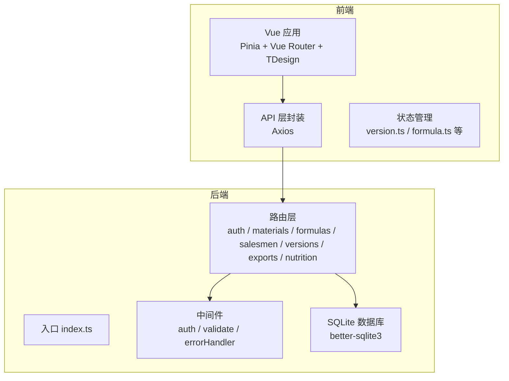
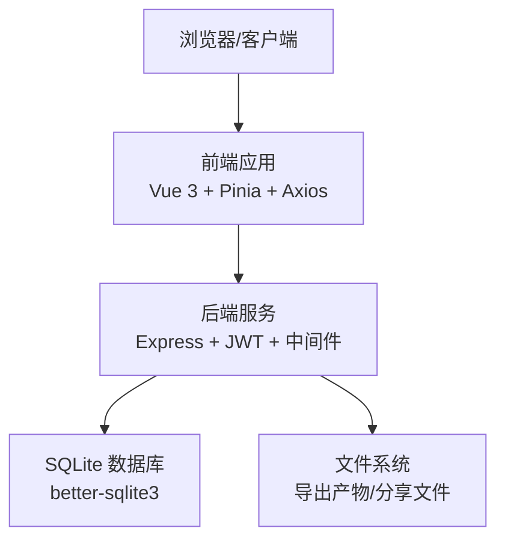
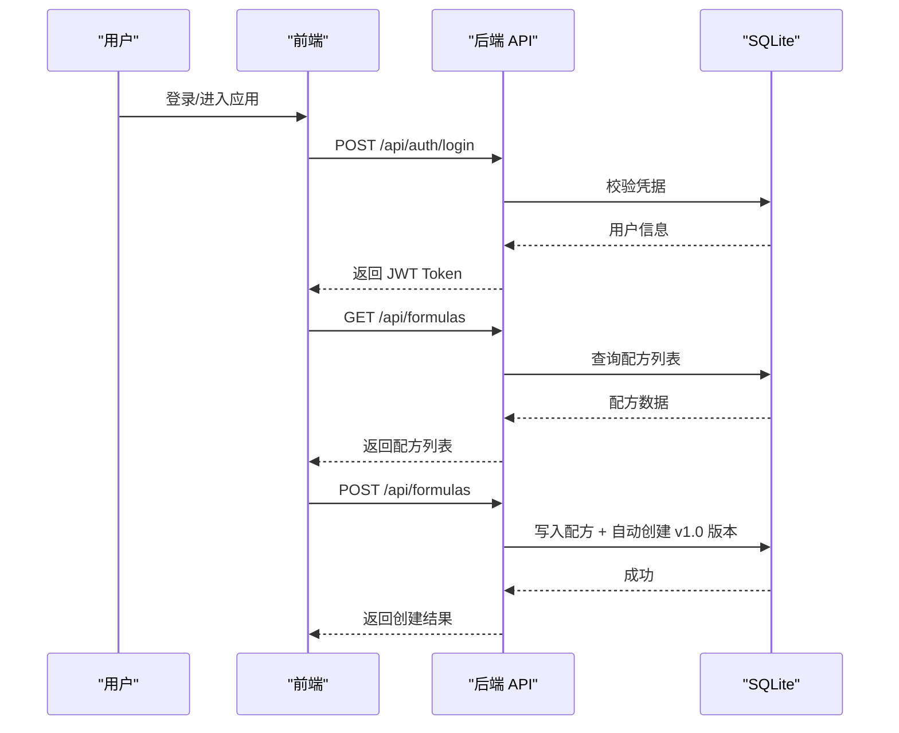
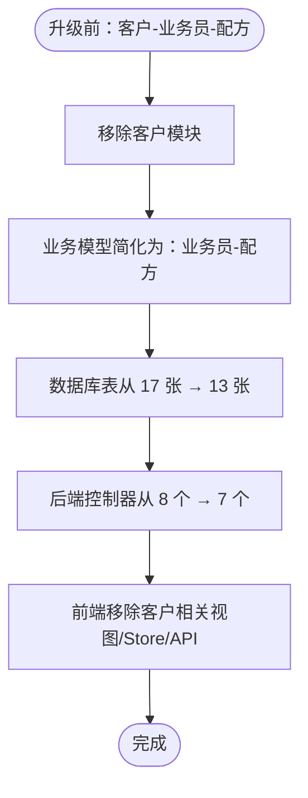
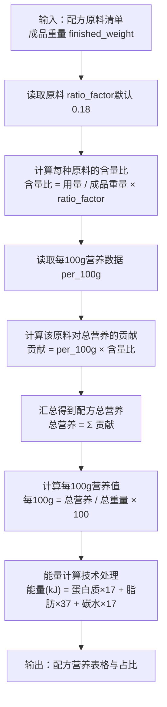
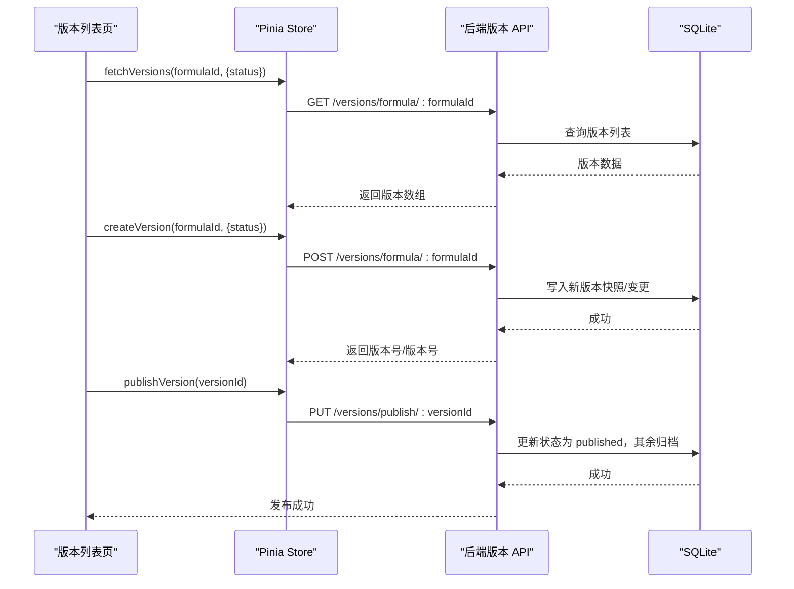

# 版本历史

<cite>
**本文引用的文件**
- [README.md](file://README.md)
- [HOME_UPDATE.md](file://HOME_UPDATE.md)
- [API_DOC.md](file://backend/API_DOC.md)
- [DATABASE_DOC.md](file://backend/DATABASE_DOC.md)
- [backend/package.json](file://backend/package.json)
- [frontend/package.json](file://frontend/package.json)
- [backend/src/controllers/versionController.ts](file://backend/src/controllers/versionController.ts)
- [backend/src/routes/versions.ts](file://backend/src/routes/versions.ts)
- [backend/src/controllers/formulaController.ts](file://backend/src/controllers/formulaController.ts)
- [backend/src/scripts/init.sql](file://backend/src/scripts/init.sql)
- [frontend/src/views/versions/VersionList.vue](file://frontend/src/views/versions/VersionList.vue)
- [frontend/src/views/versions/VersionCompare.vue](file://frontend/src/views/versions/VersionCompare.vue)
- [frontend/src/stores/version.ts](file://frontend/src/stores/version.ts)
- [frontend/src/api/version.ts](file://frontend/src/api/version.ts)
- [frontend/src/types/formula.ts](file://frontend/src/types/formula.ts)
- [backend/src/controllers/nutritionController.ts](file://backend/src/controllers/nutritionController.ts)
</cite>

## 目录
1. [引言](#引言)
2. [项目结构](#项目结构)
3. [核心组件](#核心组件)
4. [架构总览](#架构总览)
5. [详细组件分析](#详细组件分析)
6. [依赖关系分析](#依赖关系分析)
7. [性能考量](#性能考量)
8. [故障排查指南](#故障排查指南)
9. [结论](#结论)
10. [附录](#附录)

## 引言
本文件系统梳理 TingStudio 从 v1.0.0 到当前 v2.2.0 的完整演进历程，聚焦关键里程碑版本的功能与技术升级，帮助用户理解项目发展脉络与未来方向。重点包括：
- v2.0.0：前后端分离、JWT 认证、RESTful API、配方版本控制、导出与分享、营养分析能力
- v2.1.0：业务模型简化（移除客户管理，改为业务员关联）
- v2.2.0：配方计算优化（成品重量、含量比系数、能量计算）

## 项目结构
TingStudio 采用前后端分离架构：
- 后端：基于 Node.js + Express + SQLite，提供 RESTful API、JWT 认证、版本控制、导出与分享、营养分析等模块
- 前端：基于 Vue 3 + TypeScript + Vite，使用 Pinia 状态管理、TDesign UI、Axios 与后端交互



图表来源
- [README.md:65-113](file://README.md#L65-L113)
- [backend/src/index.ts](file://backend/src/index.ts)
- [backend/src/routes/index.ts](file://backend/src/routes/index.ts)

章节来源
- [README.md:65-113](file://README.md#L65-L113)
- [backend/package.json:1-42](file://backend/package.json#L1-L42)
- [frontend/package.json:1-30](file://frontend/package.json#L1-L30)

## 核心组件
- 认证与权限：JWT Token、多角色（admin/formulist）、Token 自动续期与过期处理
- 原料管理：CRUD、唯一编码校验、配方引用检测
- 配方管理：CRUD、关键词搜索与业务员过滤、自动版本控制、手动创建/发布版本、版本对比
- 业务员管理：CRUD、搜索与状态筛选、软删除
- 导出与分享：模板管理、任务跟踪、分享链接（密码、过期、下载限制）
- 营养分析：原料营养录入、配方汇总计算、营养标准管理、合规性检查

章节来源
- [README.md:30-64](file://README.md#L30-L64)
- [API_DOC.md:82-714](file://backend/API_DOC.md#L82-L714)

## 架构总览
v2.0.0 起，系统采用前后端分离架构，后端提供统一 RESTful API，前端通过 Axios 调用接口；数据库采用 SQLite（better-sqlite3），配合初始化脚本完成建表与种子数据填充。



图表来源
- [README.md:9-29](file://README.md#L9-L29)
- [backend/src/scripts/init.sql:1-228](file://backend/src/scripts/init.sql#L1-L228)

章节来源
- [README.md:9-29](file://README.md#L9-L29)
- [backend/src/scripts/init.sql:1-228](file://backend/src/scripts/init.sql#L1-L228)

## 详细组件分析

### v2.0.0：前后端分离与核心能力上线
- 架构升级：前后端分离（Vue 3 + Express + SQLite），引入 RESTful API 与 JWT 认证
- 版本控制：配方版本自动/手动创建、版本对比、版本快照
- 导出与分享：模板管理、任务跟踪、分享链接能力
- 营养分析：原料营养录入、配方汇总计算、营养标准与合规检查
- 数据模型：13 张表，涵盖用户、原料、配方、业务员、版本、导出、营养等模块
- 开发脚本：数据库初始化、种子数据填充、API 文档与数据库文档生成



图表来源
- [API_DOC.md:82-297](file://backend/API_DOC.md#L82-L297)
- [backend/src/controllers/formulaController.ts:88-130](file://backend/src/controllers/formulaController.ts#L88-L130)
- [backend/src/scripts/init.sql:33-49](file://backend/src/scripts/init.sql#L33-L49)

章节来源
- [README.md:178-220](file://README.md#L178-L220)
- [API_DOC.md:82-297](file://backend/API_DOC.md#L82-L297)
- [DATABASE_DOC.md:9-457](file://backend/DATABASE_DOC.md#L9-L457)
- [backend/src/scripts/init.sql:1-228](file://backend/src/scripts/init.sql#L1-L228)

### v2.1.0：业务模型简化（移除客户管理）
- 移除客户管理模块，业务模型从“客户-业务员-配方”简化为“业务员-配方”
- 用户角色精简为 admin / formulist
- 数据库从 17 张表精简为 13 张表，后端控制器与前端视图同步调整
- 前端移除客户相关页面、API、Store 与类型定义



图表来源
- [README.md:202-210](file://README.md#L202-L210)
- [DATABASE_DOC.md:9-21](file://backend/DATABASE_DOC.md#L9-L21)

章节来源
- [README.md:202-210](file://README.md#L202-L210)
- [DATABASE_DOC.md:9-21](file://backend/DATABASE_DOC.md#L9-L21)

### v2.2.0：配方计算优化
- 新增成品重量 finished_weight 与含量比系数 ratio_factor（默认 0.18）
- 含量比计算：含量比 = 原料用量 / 成品重量 × 含量比系数
- 支持原料级别含量比系数覆盖（不同原料可单独设置 ratioFactor）
- 营养汇总计算：营养成分合计 = Σ(每100g × 含量比)
- 能量计算：能量(kJ) = 蛋白质×17 + 脂肪×37 + 碳水化合物×17
- 前端配方详情页新增返回按钮、成品重量/含量比系数展示，技术处理依据列橙色区分，含量比显示优化为百分比



图表来源
- [API_DOC.md:221-278](file://backend/API_DOC.md#L221-L278)
- [backend/src/controllers/nutritionController.ts:496-640](file://backend/src/controllers/nutritionController.ts#L496-L640)
- [DATABASE_DOC.md:44-98](file://backend/DATABASE_DOC.md#L44-L98)

章节来源
- [README.md:191-201](file://README.md#L191-L201)
- [API_DOC.md:221-278](file://backend/API_DOC.md#L221-L278)
- [backend/src/controllers/nutritionController.ts:496-640](file://backend/src/controllers/nutritionController.ts#L496-L640)
- [DATABASE_DOC.md:44-98](file://backend/DATABASE_DOC.md#L44-L98)

### 版本控制模块（v2.0.0 起）
- 前端版本列表页：状态筛选、创建版本、发布版本、版本对比、快照查看
- 后端版本控制器：获取版本列表/详情、创建版本（自动/手动）、发布版本、版本对比（原料、业务员、描述变更统计）



图表来源
- [frontend/src/views/versions/VersionList.vue:108-137](file://frontend/src/views/versions/VersionList.vue#L108-L137)
- [frontend/src/stores/version.ts:12-56](file://frontend/src/stores/version.ts#L12-L56)
- [backend/src/controllers/versionController.ts:6-111](file://backend/src/controllers/versionController.ts#L6-L111)
- [backend/src/controllers/versionController.ts:113-157](file://backend/src/controllers/versionController.ts#L113-L157)
- [backend/src/controllers/versionController.ts:159-269](file://backend/src/controllers/versionController.ts#L159-L269)

章节来源
- [frontend/src/views/versions/VersionList.vue:1-173](file://frontend/src/views/versions/VersionList.vue#L1-L173)
- [frontend/src/views/versions/VersionCompare.vue:1-146](file://frontend/src/views/versions/VersionCompare.vue#L1-L146)
- [frontend/src/stores/version.ts:1-83](file://frontend/src/stores/version.ts#L1-L83)
- [frontend/src/api/version.ts:1-35](file://frontend/src/api/version.ts#L1-L35)
- [backend/src/controllers/versionController.ts:1-270](file://backend/src/controllers/versionController.ts#L1-L270)
- [backend/src/routes/versions.ts:1-17](file://backend/src/routes/versions.ts#L1-L17)

### v1.x：单体应用与早期功能
- v1.0.0：LocalStorage 单体应用，包含用户注册登录、客户/原料/配方管理
- v1.1.0：主页优化（城市定位、天气显示、锁屏按钮、自动初始化示例数据）
- v1.2.0：配方详情弹窗、统一操作按钮样式、WebView 定位报错修复

章节来源
- [README.md:231-234](file://README.md#L231-L234)
- [HOME_UPDATE.md:1-273](file://HOME_UPDATE.md#L1-L273)

## 依赖关系分析
- 版本控制模块依赖配方模块（版本属于配方），前端通过 Pinia Store 与 API 层交互
- 营养分析模块依赖原料营养表与配方表，计算结果写入配方营养汇总表
- 导出与分享模块依赖配方与版本，支持 PDF/Excel/API/打印等多种导出形式

```mermaid
erDiagram
USERS {
text id PK
text username UK
text password
text role
text created_at
text updated_at
}
MATERIALS {
text id PK
text name
text code UK
text unit
real stock
text material_type
real ratio_factor
text created_by FK
text created_at
text updated_at
}
SALEMEN {
text id PK
text name
text code UK
text department
text phone
text email
text status
text created_by
text created_at
text updated_at
}
FORMULAS {
text id PK
text name
text salesman_id FK
text salesman_name
text materials_json
real finished_weight
text description
text created_by FK
text created_at
text updated_at
}
FORMULA_VERSIONS {
text version_id PK
text formula_id FK
text version_number
text version_name
text changes_json
text snapshot_json
text status
int is_current
text created_by
text created_at
}
EXPORT_TEMPLATES {
text template_id PK
text name
text description
text type
text format_config_json
int is_default
text created_by
text created_at
}
EXPORT_JOBS {
text job_id PK
text formula_id FK
text version_id
text template_id
text export_type
text status
text file_url
text file_name
text api_endpoint
int progress
text error_message
text created_by
text created_at
text completed_at
}
API_DATA_INTERFACES {
text interface_id PK
text name
text description
text endpoint UK
text method
text authentication
text auth_config_json
text data_format
text field_mapping_json
text rate_limit_json
text retry_config_json
text created_by
text created_at
text updated_at
}
SHARE_CONFIGS {
text share_id PK
text formula_id FK
text version_id
text share_type
text share_url
text password
text expire_date
text allowed_emails_json
int download_limit
int download_count
text created_by
text created_at
}
MATERIAL_NUTRITION {
text nutrition_id PK
text material_id FK UK
text per_100g_json
text data_version
text data_source
text notes
text last_updated
}
FORMULA_NUTRITION_SUMMARIES {
text summary_id PK
text formula_id FK
text version_id UK
real total_weight
text total_nutrition_json
text per_100g_nutrition_json
text material_breakdown_json
text calculated_by
text calculated_at
}
NUTRITION_PROFILES {
text profile_id PK
text name
text description
text category
text target_values_json
text tolerance_ranges_json
text mandatory_fields_json
text created_at
text updated_at
}
NUTRITION_ANALYSIS_REPORTS {
text report_id PK
text formula_id FK
text version_id
text summary_id FK
text compliance_check_json
text recommendations_json
text generated_by
text generated_at
}
USERS ||--o{ MATERIALS : "创建"
USERS ||--o{ FORMULAS : "创建"
USERS ||--o{ SALEMEN : "创建"
USERS ||--o{ FORMULA_VERSIONS : "创建"
USERS ||--o{ EXPORT_TEMPLATES : "创建"
USERS ||--o{ EXPORT_JOBS : "创建"
USERS ||--o{ API_DATA_INTERFACES : "创建"
USERS ||--o{ SHARE_CONFIGS : "创建"
USERS ||--o{ FORMULA_NUTRITION_SUMMARIES : "计算"
USERS ||--o{ NUTRITION_ANALYSIS_REPORTS : "生成"
SALEMEN ||--o{ FORMULAS : "关联"
MATERIALS ||--|| MATERIAL_NUTRITION : "营养数据"
FORMULAS ||--o{ FORMULA_VERSIONS : "版本"
FORMULAS ||--o{ EXPORT_JOBS : "导出"
FORMULAS ||--o{ FORMULA_NUTRITION_SUMMARIES : "汇总"
FORMULAS ||--o{ SHARE_CONFIGS : "分享"
FORMULA_NUTRITION_SUMMARIES ||--o{ NUTRITION_ANALYSIS_REPORTS : "报告"
```

图表来源
- [DATABASE_DOC.md:25-457](file://backend/DATABASE_DOC.md#L25-L457)

章节来源
- [DATABASE_DOC.md:25-457](file://backend/DATABASE_DOC.md#L25-L457)

## 性能考量
- 数据库：SQLite WAL 模式，启用外键约束；JSON 字段以 TEXT 存储，应用层解析，适合中小规模数据与单机部署
- 版本控制：版本快照与变更记录以 JSON 存储，便于对比但需注意字段长度与查询性能；建议对频繁查询字段建立索引
- 营养计算：按配方遍历原料进行逐项计算，复杂度 O(N)；建议在前端做缓存与增量更新，避免重复计算
- 导出任务：异步处理，前端轮询进度；建议合理设置并发与重试策略，防止资源争用

## 故障排查指南
- 认证失败：确认请求头 Authorization 为 Bearer Token，且 Token 未过期；检查后端中间件是否正确注入用户信息
- 版本发布异常：确认目标版本所属配方存在，发布时会将同一配方的其他版本归档；检查数据库外键约束与事务一致性
- 营养计算缺失：若原料无营养数据，系统会记录缺失清单；可通过备选查找（按名称匹配）或手动录入 per_100g 数据
- 导出任务失败：检查模板配置、文件路径与权限、API 接口连通性；关注错误信息与进度状态

章节来源
- [API_DOC.md:9-71](file://backend/API_DOC.md#L9-L71)
- [backend/src/controllers/versionController.ts:113-157](file://backend/src/controllers/versionController.ts#L113-L157)
- [backend/src/controllers/nutritionController.ts:466-485](file://backend/src/controllers/nutritionController.ts#L466-L485)

## 结论
TingStudio 从 v1.0.0 的单体应用逐步演进至 v2.2.0 的前后端分离平台，完成了业务模型简化与配方计算优化两大关键升级。v2.0.0 引入的 JWT 认证、RESTful API、版本控制、导出与分享、营养分析等能力，奠定了系统的现代化基础；v2.1.0 的业务模型简化提升了系统简洁性；v2.2.0 的配方计算优化进一步增强了配方管理的专业性与准确性。建议在后续版本中持续完善数据一致性、性能监控与扩展性设计。

## 附录
- 快速开始与环境要求：详见 README 的“快速开始”与“环境要求”
- API 文档与数据库文档：详见 backend/API_DOC.md 与 DATABASE_DOC.md
- 版本对比与快照：前端版本管理页面支持对比与快照查看

章节来源
- [README.md:115-166](file://README.md#L115-L166)
- [API_DOC.md:1-714](file://backend/API_DOC.md#L1-L714)
- [DATABASE_DOC.md:1-457](file://backend/DATABASE_DOC.md#L1-L457)