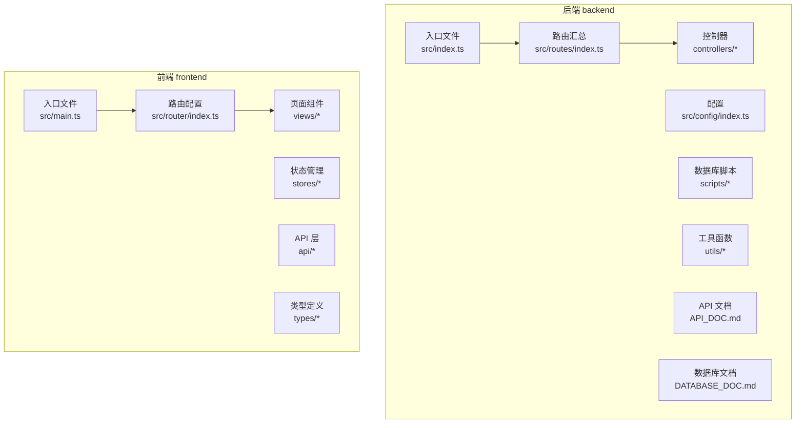
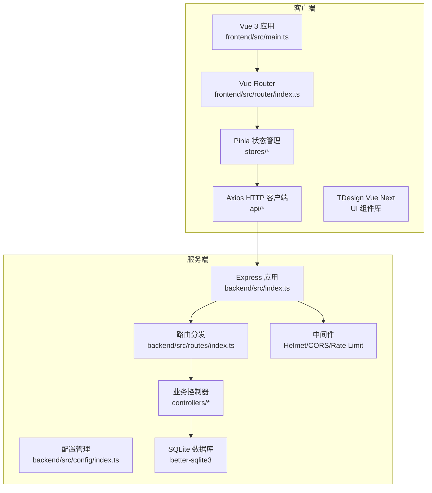
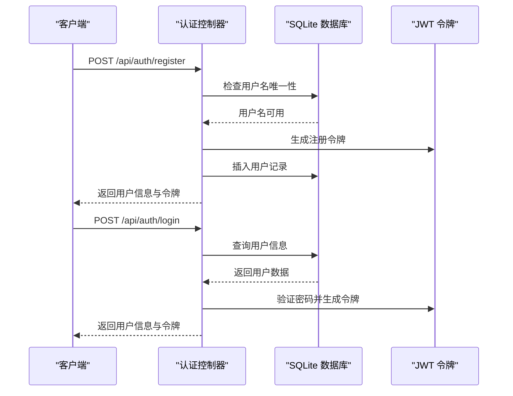
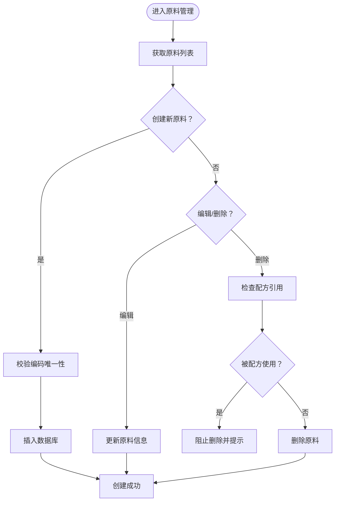
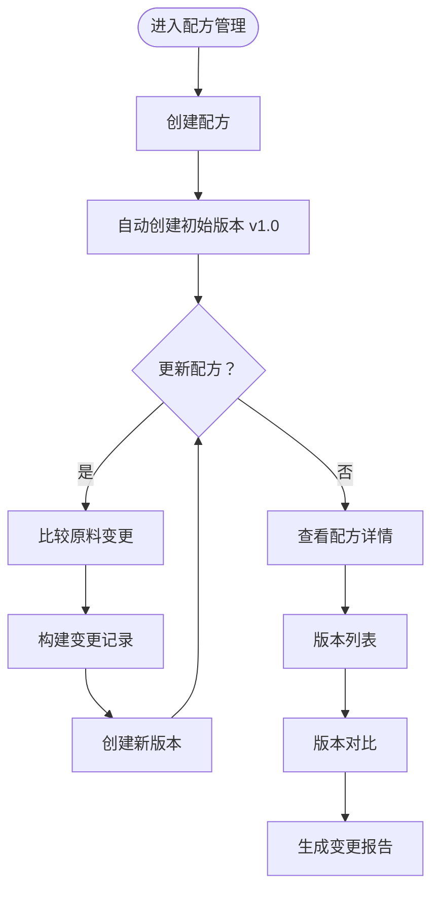
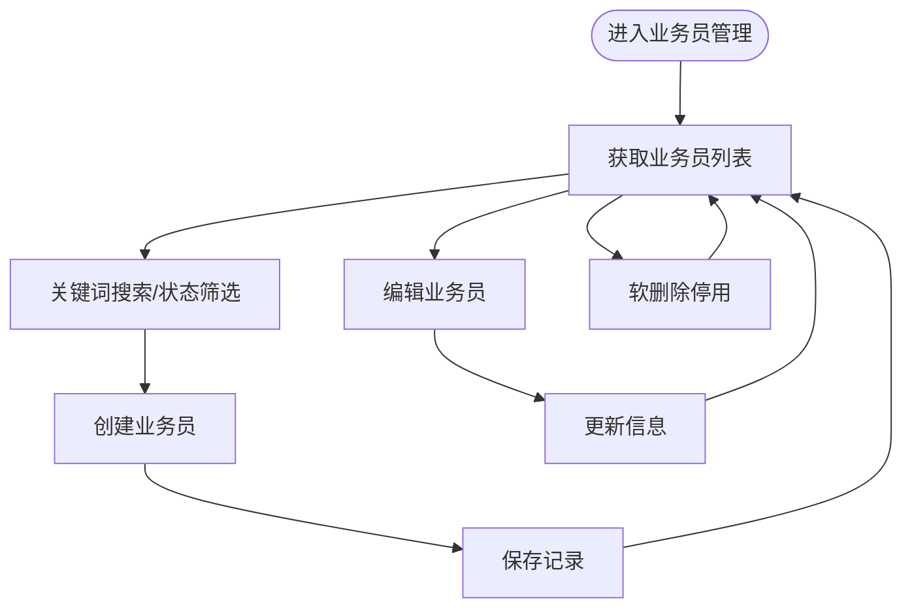
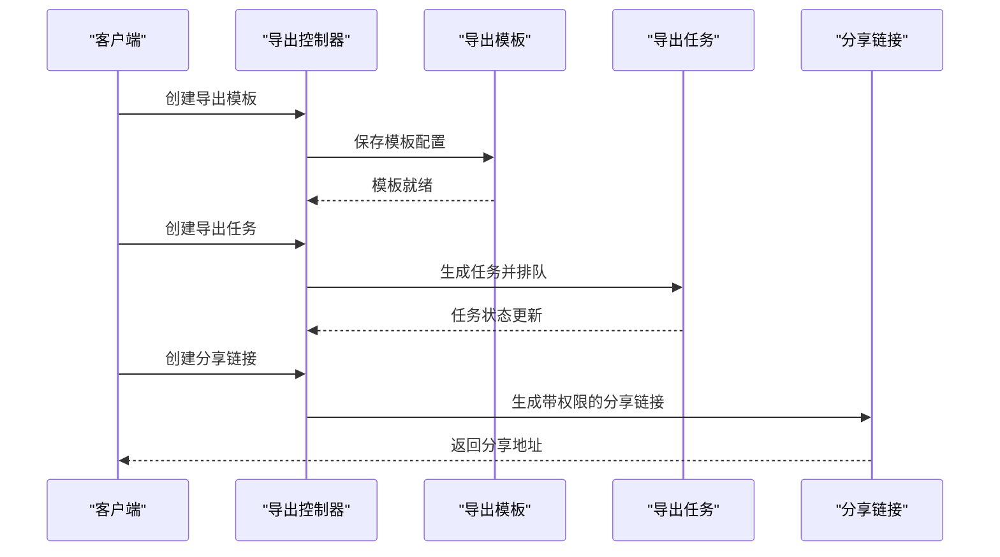
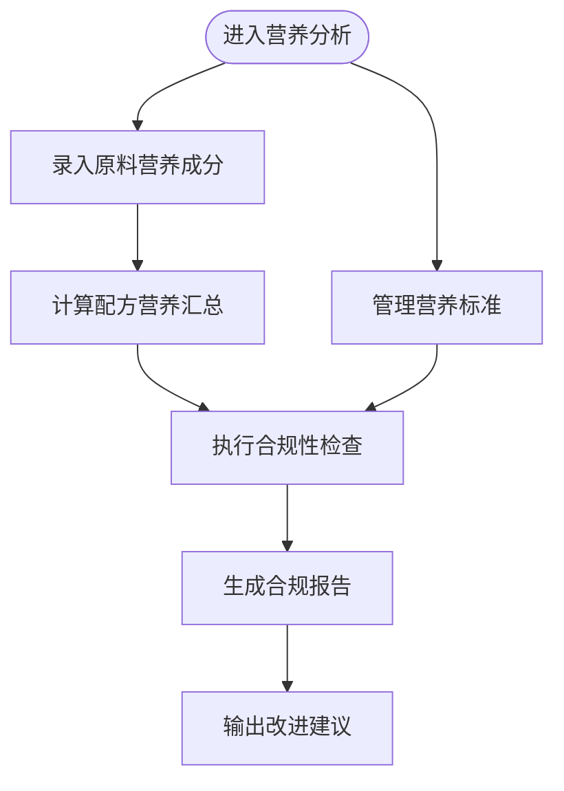
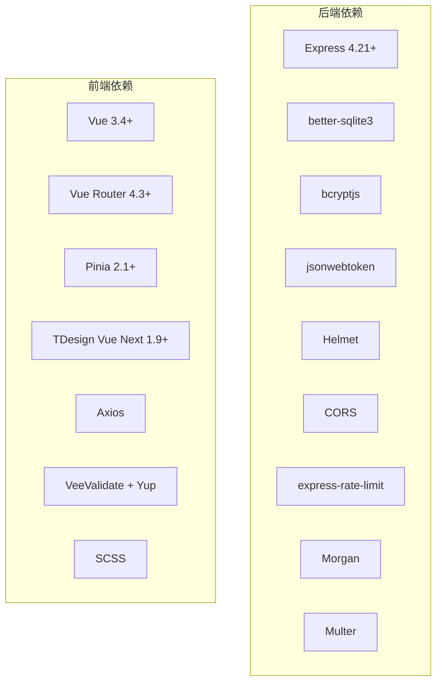

# 项目概述

<cite>
**本文档引用的文件**
- [README.md](file://README.md)
- [package.json](file://package.json)
- [backend/package.json](file://backend/package.json)
- [frontend/package.json](file://frontend/package.json)
- [backend/src/index.ts](file://backend/src/index.ts)
- [backend/src/config/index.ts](file://backend/src/config/index.ts)
- [backend/src/routes/index.ts](file://backend/src/routes/index.ts)
- [backend/src/controllers/authController.ts](file://backend/src/controllers/authController.ts)
- [backend/src/controllers/materialController.ts](file://backend/src/controllers/materialController.ts)
- [backend/src/controllers/formulaController.ts](file://backend/src/controllers/formulaController.ts)
- [backend/src/controllers/salesmanController.ts](file://backend/src/controllers/salesmanController.ts)
- [backend/API_DOC.md](file://backend/API_DOC.md)
- [frontend/src/router/index.ts](file://frontend/src/router/index.ts)
- [frontend/src/main.ts](file://frontend/src/main.ts)
- [HOME_UPDATE.md](file://HOME_UPDATE.md)
</cite>

## 目录
1. [引言](#引言)
2. [项目结构](#项目结构)
3. [核心组件](#核心组件)
4. [架构总览](#架构总览)
5. [详细组件分析](#详细组件分析)
6. [依赖关系分析](#依赖关系分析)
7. [性能考虑](#性能考虑)
8. [故障排除指南](#故障排除指南)
9. [结论](#结论)
10. [附录](#附录)

## 引言
TingStudio 是一个面向食品配方工作的数据管理平台，采用前后端分离架构，提供认证系统、原料管理、配方管理、业务员管理、导出分享、营养分析等完整功能链路。项目以 Vue 3 + Express + SQLite 为核心技术栈，支持 JWT 认证、RESTful API、配方版本控制、营养合规检查等企业级特性。

项目定位为专业化的配方数据管理解决方案，服务于配方师、业务员及相关管理人员，帮助用户高效管理配方全生命周期，确保数据一致性与合规性。

**章节来源**
- [README.md:1-227](file://README.md#L1-L227)

## 项目结构
项目采用典型的前后端分离结构，后端位于 backend 目录，前端位于 frontend 目录，各自独立开发与部署。整体目录组织如下：

**图表来源**
- [backend/src/index.ts:1-61](file://backend/src/index.ts#L1-L61)
- [backend/src/routes/index.ts:1-24](file://backend/src/routes/index.ts#L1-L24)
- [frontend/src/main.ts:1-17](file://frontend/src/main.ts#L1-L17)
- [frontend/src/router/index.ts:1-165](file://frontend/src/router/index.ts#L1-L165)

**章节来源**
- [README.md:65-113](file://README.md#L65-L113)

## 核心组件
TingStudio 的核心组件围绕七个业务模块展开，每个模块都有对应的控制器、路由与前端视图，形成完整的 CRUD 闭环。核心组件包括：

- 认证系统：用户注册/登录、JWT 令牌管理、多角色支持（admin/formulist）
- 原料管理：原料信息 CRUD、唯一编码校验、配方引用检测
- 配方管理：配方 CRUD、关键词搜索、业务员过滤、版本控制、版本对比
- 业务员管理：业务员 CRUD、关键词搜索、状态筛选、软删除
- 导出与分享：导出模板管理、任务创建与跟踪、分享链接（密码、过期、下载限制）
- 营养分析：原料营养录入、配方营养汇总、营养标准管理、合规性检查
- 版本管理：自动/手动版本、版本对比、变更记录

这些组件通过 RESTful API 进行通信，前端使用 Vue Router 进行页面导航，Pinia 进行状态管理，TDesign Vue Next 提供 UI 组件库。

**章节来源**
- [README.md:30-64](file://README.md#L30-L64)
- [backend/API_DOC.md:1-688](file://backend/API_DOC.md#L1-L688)

## 架构总览
TingStudio 采用前后端分离架构，后端基于 Express 提供 RESTful API，前端基于 Vue 3 提供交互界面。整体架构如下：

**图表来源**
- [backend/src/index.ts:1-61](file://backend/src/index.ts#L1-L61)
- [backend/src/config/index.ts:1-24](file://backend/src/config/index.ts#L1-L24)
- [backend/src/routes/index.ts:1-24](file://backend/src/routes/index.ts#L1-L24)
- [frontend/src/main.ts:1-17](file://frontend/src/main.ts#L1-L17)
- [frontend/src/router/index.ts:1-165](file://frontend/src/router/index.ts#L1-L165)

**章节来源**
- [backend/src/index.ts:1-61](file://backend/src/index.ts#L1-L61)
- [frontend/src/main.ts:1-17](file://frontend/src/main.ts#L1-L17)

## 详细组件分析

### 认证系统
认证系统负责用户身份验证与授权，支持 JWT 令牌管理与多角色权限控制。核心流程如下：

**图表来源**
- [backend/src/controllers/authController.ts:1-89](file://backend/src/controllers/authController.ts#L1-L89)
- [backend/API_DOC.md:82-161](file://backend/API_DOC.md#L82-L161)

**章节来源**
- [backend/src/controllers/authController.ts:1-89](file://backend/src/controllers/authController.ts#L1-L89)
- [backend/API_DOC.md:82-161](file://backend/API_DOC.md#L82-L161)

### 原料管理
原料管理模块提供完整的 CRUD 操作，包含唯一编码校验与配方引用检测，防止误删正在使用的原料。核心流程如下：

**图表来源**
- [backend/src/controllers/materialController.ts:1-129](file://backend/src/controllers/materialController.ts#L1-L129)
- [backend/API_DOC.md:163-217](file://backend/API_DOC.md#L163-L217)

**章节来源**
- [backend/src/controllers/materialController.ts:1-129](file://backend/src/controllers/materialController.ts#L1-L129)
- [backend/API_DOC.md:163-217](file://backend/API_DOC.md#L163-L217)

### 配方管理
配方管理模块支持配方的完整生命周期管理，包括版本控制与版本对比。核心流程如下：

**图表来源**
- [backend/src/controllers/formulaController.ts:1-268](file://backend/src/controllers/formulaController.ts#L1-L268)
- [backend/API_DOC.md:219-293](file://backend/API_DOC.md#L219-L293)

**章节来源**
- [backend/src/controllers/formulaController.ts:1-268](file://backend/src/controllers/formulaController.ts#L1-L268)
- [backend/API_DOC.md:219-293](file://backend/API_DOC.md#L219-L293)

### 业务员管理
业务员管理模块提供业务员的 CRUD 操作与状态管理，支持关键词搜索与状态筛选。核心流程如下：

**图表来源**
- [backend/src/controllers/salesmanController.ts:1-125](file://backend/src/controllers/salesmanController.ts#L1-L125)
- [backend/API_DOC.md:295-358](file://backend/API_DOC.md#L295-L358)

**章节来源**
- [backend/src/controllers/salesmanController.ts:1-125](file://backend/src/controllers/salesmanController.ts#L1-L125)
- [backend/API_DOC.md:295-358](file://backend/API_DOC.md#L295-L358)

### 导出与分享
导出与分享模块支持多种导出格式与分享机制，包括 PDF、Excel、API 接口与打印模板。核心流程如下：

**图表来源**
- [backend/API_DOC.md:464-554](file://backend/API_DOC.md#L464-L554)

**章节来源**
- [backend/API_DOC.md:464-554](file://backend/API_DOC.md#L464-L554)

### 营养分析
营养分析模块提供原料营养录入、配方营养汇总与合规性检查功能。核心流程如下：

**图表来源**
- [backend/API_DOC.md:556-675](file://backend/API_DOC.md#L556-L675)

**章节来源**
- [backend/API_DOC.md:556-675](file://backend/API_DOC.md#L556-L675)

## 依赖关系分析
TingStudio 的技术栈选择体现了对易用性、性能与可维护性的平衡。后端依赖包括 Express Web 框架、better-sqlite3 SQLite 驱动、bcryptjs 密码加密、jsonwebtoken JWT 令牌、Helmet/CORS/Rate Limit 安全中间件、Morgan 日志等。前端依赖包括 Vue 3、Vue Router、Pinia、TDesign Vue Next、Axios、VeeValidate/Yup 表单验证、SCSS 等。

**图表来源**
- [backend/package.json:14-26](file://backend/package.json#L14-L26)
- [frontend/package.json:12-20](file://frontend/package.json#L12-L20)

**章节来源**
- [backend/package.json:14-26](file://backend/package.json#L14-L26)
- [frontend/package.json:12-20](file://frontend/package.json#L12-L20)

## 性能考虑
- 数据库性能：使用 SQLite 作为嵌入式数据库，适合中小规模数据与单机部署；对于大量并发写入场景，可考虑迁移到 PostgreSQL 或 MySQL。
- API 性能：启用压缩中间件（compression）减少传输体积；合理设置分页参数避免一次性返回过多数据。
- 前端性能：使用 Vite 构建工具提供快速开发与生产构建；Pinia 状态管理减少不必要的组件重渲染。
- 安全性能：启用 Helmet 提升安全头部配置；CORS 严格控制跨域访问；Rate Limit 防止暴力破解与滥用。
- 缓存策略：可引入 Redis 缓存热点数据，减少数据库压力；对静态资源使用 CDN 加速。

## 故障排除指南
- 启动失败：检查 Node.js 与 npm 版本是否满足要求（Node.js 18+，npm 9+）。
- 数据库初始化：执行后端初始化脚本（npm run init-db）与种子数据填充（npm run seed）。
- API 认证：确保请求头包含有效的 Bearer Token，检查 JWT 密钥与过期时间配置。
- 跨域问题：确认 CORS 配置允许前端域名（默认 http://localhost:5173）。
- 文件上传：检查上传目录权限与文件大小限制配置。
- 前端路由：确认 Vue Router 配置正确，路由守卫逻辑符合认证要求。

**章节来源**
- [README.md:115-148](file://README.md#L115-L148)
- [backend/src/config/index.ts:1-24](file://backend/src/config/index.ts#L1-L24)
- [frontend/src/router/index.ts:148-162](file://frontend/src/router/index.ts#L148-L162)

## 结论
TingStudio 通过前后端分离架构与模块化设计，构建了一个功能完备、易于扩展的食品配方数据管理平台。其技术栈选择兼顾了开发效率与运行效率，认证系统、原料管理、配方管理、业务员管理、导出分享、营养分析等功能模块相互协作，形成了完整的业务闭环。随着版本迭代，项目持续优化用户体验与数据治理能力，为后续的功能扩展与性能提升奠定了坚实基础。

## 附录

### 技术栈与版本信息
- 后端：Node.js + TypeScript + Express + better-sqlite3 + JWT + 安全中间件
- 前端：Vue 3 + TypeScript + Vite + Vue Router + Pinia + TDesign + Axios + 表单验证
- 数据库：SQLite（嵌入式）

**章节来源**
- [README.md:9-29](file://README.md#L9-L29)

### 许可证信息
项目采用 MIT 许可证，允许自由使用、复制、修改、分发与再许可，但需保留版权声明与许可声明。

**章节来源**
- [README.md:224-227](file://README.md#L224-L227)

### 版本演进历史
- v2.2.0：配方管理新增成品重量与含量比系数，营养计算公式重构，支持原料级别系数覆盖
- v2.1.0：移除客户管理模块，简化业务模型，配方关联改为业务员，数据库从 17 张表精简为 13 张表
- v2.0.0：架构升级为前后端分离，新增 JWT 认证体系与多角色权限，新增配方版本控制与导出管理
- v1.2.0：新增配方详情弹窗，统一操作按钮样式，修复 WebView 定位报错
- v1.1.0：新增主页（侧边栏导航、猫咪Logo动画），实现天气显示与每日祝福语，添加锁屏功能
- v1.0.0：项目初始版本（LocalStorage 单体应用）

**章节来源**
- [README.md:178-223](file://README.md#L178-L223)