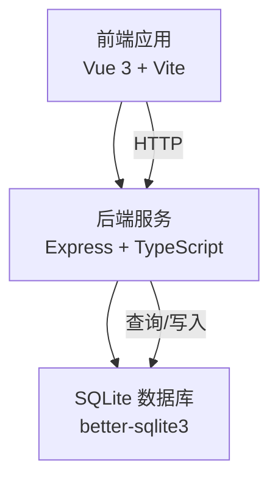
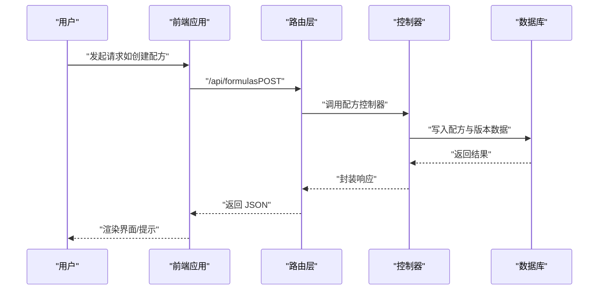
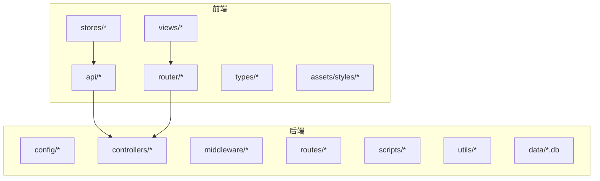
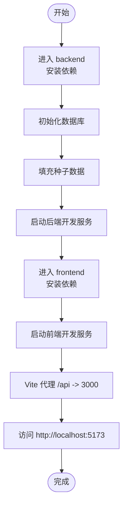

# 项目简介

<cite>
**本文引用的文件**
- [README.md](file://README.md)
- [backend/package.json](file://backend/package.json)
- [frontend/package.json](file://frontend/package.json)
- [backend/src/index.ts](file://backend/src/index.ts)
- [frontend/src/main.ts](file://frontend/src/main.ts)
- [backend/DATABASE_DOC.md](file://backend/DATABASE_DOC.md)
- [backend/API_DOC.md](file://backend/API_DOC.md)
- [backend/src/controllers/formulaController.ts](file://backend/src/controllers/formulaController.ts)
- [backend/src/routes/index.ts](file://backend/src/routes/index.ts)
- [frontend/src/router/index.ts](file://frontend/src/router/index.ts)
- [frontend/src/stores/auth.ts](file://frontend/src/stores/auth.ts)
- [backend/src/config/database.ts](file://backend/src/config/database.ts)
- [frontend/vite.config.ts](file://frontend/vite.config.ts)
</cite>

## 目录
1. [项目概述](#项目概述)
2. [技术架构](#技术架构)
3. [核心功能与业务价值](#核心功能与业务价值)
4. [主要应用场景与目标用户](#主要应用场景与目标用户)
5. [解决的核心业务痛点](#解决的核心业务痛点)
6. [前后端分离架构优势](#前后端分离架构优势)
7. [技术选型理由](#技术选型理由)
8. [项目结构概览](#项目结构概览)
9. [快速开始指南](#快速开始指南)
10. [结语](#结语)

## 项目概述
TingStudio 是一个面向食品配方工作的专业数据管理平台，围绕“配方管理”这一核心业务，提供从原料管理、业务员协同、配方版本控制、营养分析到导出分享的完整闭环能力。项目采用前后端分离架构，后端基于 Node.js + Express + TypeScript，前端基于 Vue 3 + TypeScript，数据库选用 SQLite（better-sqlite3），整体技术栈现代、轻量且易于部署。

- 平台定位：食品配方工作数据管理平台
- 业务主线：配方生命周期管理（创建、维护、版本化、合规检查、导出分享）
- 企业级特性：JWT 认证、RESTful API、版本控制、营养合规检查、导出任务与分享链接

**章节来源**
- [README.md:1-227](file://README.md#L1-L227)

## 技术架构
- 后端：Node.js + Express 4.21+，TypeScript，使用 better-sqlite3 作为数据库驱动，集成 Helmet、CORS、Rate Limit、Morgan 等中间件保障安全与可观测性。
- 前端：Vue 3.4+（Composition API），TypeScript 5.4+，Vite 5.1+，Pinia 2.1+，Vue Router 4.3+，TDesign Vue Next 1.9+，Axios，VeeValidate + Yup，SCSS。
- 数据库：SQLite（WAL 模式 + 外键约束），数据文件位于 backend/data/tingstudio.db。
- 开发体验：前后端分别独立开发，前端通过 Vite 代理将 /api 请求转发至后端本地服务，端口分别为 5173（前端）与 3000（后端）。

**图表来源**
- [backend/src/index.ts:13-55](file://backend/src/index.ts#L13-L55)
- [frontend/src/main.ts:1-17](file://frontend/src/main.ts#L1-17)
- [backend/src/config/database.ts:10-37](file://backend/src/config/database.ts#L10-L37)

**章节来源**
- [backend/package.json:1-42](file://backend/package.json#L1-L42)
- [frontend/package.json:1-30](file://frontend/package.json#L1-L30)
- [backend/src/index.ts:13-55](file://backend/src/index.ts#L13-L55)
- [frontend/vite.config.ts:12-22](file://frontend/vite.config.ts#L12-L22)

## 核心功能与业务价值
- 认证系统：JWT 登录/注册、多角色（admin/formulist）、Token 自动续期与过期处理。
- 原料管理：CRUD、唯一编码校验、配方引用检测（防误删）。
- 配方管理：CRUD、关键词搜索与业务员过滤、自动版本控制、手动创建/发布版本、版本对比。
- 业务员管理：CRUD、关键词搜索与状态筛选、软删除（停用）。
- 导出与分享：模板管理（PDF/Excel/API/打印）、导出任务创建与状态跟踪、分享链接（密码、过期时间、下载限制）。
- 营养分析：原料营养录入（每 100g）、配方营养汇总计算、营养标准管理（按人群分类）、合规性检查（与标准对比，生成建议）。

这些能力共同解决了配方工作中的“数据孤岛”“版本混乱”“营养不合规”“协作效率低”等关键问题，显著提升配方研发与交付的质量与效率。

**章节来源**
- [README.md:30-64](file://README.md#L30-L64)
- [backend/API_DOC.md:82-688](file://backend/API_DOC.md#L82-L688)

## 主要应用场景与目标用户
- 场景一：配方研发团队日常管理
  - 目标用户：配方师、研发工程师
  - 价值：集中管理配方与原料，自动版本控制，避免重复劳动与错误传播。
- 场景二：业务员协同与交付
  - 目标用户：销售/业务员
  - 价值：通过业务员维度关联配方，便于跨部门协作与知识沉淀。
- 场景三：合规与质量管控
  - 目标用户：质检/合规人员
  - 价值：内置营养标准与合规检查，辅助生成报告与改进建议。
- 场景四：批量导出与外部共享
  - 目标用户：运营/市场/外部合作伙伴
  - 价值：统一导出模板与分享机制，降低交付成本与信息泄露风险。

**章节来源**
- [README.md:30-64](file://README.md#L30-L64)
- [backend/API_DOC.md:464-554](file://backend/API_DOC.md#L464-L554)

## 解决的核心业务痛点
- 配方管理复杂性
  - 问题：配方频繁修改但缺乏版本化，导致历史不可追溯、回滚困难。
  - 方案：自动/手动版本控制，版本对比可视化，确保变更可追踪、可恢复。
- 原料追踪困难
  - 问题：原料种类繁多、编码不统一，跨配方引用关系不清。
  - 方案：唯一编码校验、配方引用检测、原料营养录入与汇总，形成闭环数据。
- 业务员协作效率低
  - 问题：配方与业务员脱节，信息分散，沟通成本高。
  - 方案：业务员维度关联配方，支持按业务员检索与筛选，提升协作效率。
- 营养合规风险
  - 问题：营养指标不一致、缺乏标准对照，易引发合规风险。
  - 方案：营养标准管理与合规检查，自动生成报告与建议，降低风险。
- 导出与分享成本高
  - 问题：模板不统一、流程繁琐、外部分享缺乏安全控制。
  - 方案：模板管理、导出任务跟踪、分享链接（密码/过期/下载限制），标准化交付流程。

**章节来源**
- [backend/src/controllers/formulaController.ts:67-199](file://backend/src/controllers/formulaController.ts#L67-L199)
- [backend/DATABASE_DOC.md:25-170](file://backend/DATABASE_DOC.md#L25-L170)
- [backend/API_DOC.md:556-688](file://backend/API_DOC.md#L556-L688)

## 前后端分离架构优势
- 开发效率
  - 前后端独立开发、独立部署，互不干扰；前端通过代理访问后端 API，提升联调效率。
- 技术栈现代化
  - 前端采用 Composition API、TypeScript、组件化 UI 库；后端采用 Express + TypeScript，兼顾性能与可维护性。
- 可扩展性强
  - 模块化路由与控制器，便于新增业务模块；数据库采用 SQLite，便于本地开发与轻量部署。
- 安全与可观测性
  - 后端集成 Helmet、CORS、Rate Limit、Morgan 等中间件，保障请求安全与日志可观测。

**图表来源**
- [backend/src/routes/index.ts:11-23](file://backend/src/routes/index.ts#L11-L23)
- [backend/src/controllers/formulaController.ts:67-109](file://backend/src/controllers/formulaController.ts#L67-L109)
- [backend/src/config/database.ts:44-55](file://backend/src/config/database.ts#L44-L55)

**章节来源**
- [frontend/src/router/index.ts:148-162](file://frontend/src/router/index.ts#L148-L162)
- [frontend/vite.config.ts:12-22](file://frontend/vite.config.ts#L12-L22)

## 技术选型理由
- Vue 3 + Express + SQLite 的组合优势
  - Vue 3：响应式与 Composition API 提升开发体验；生态丰富、学习曲线平缓。
  - Express：轻量、灵活、生态成熟，适合中小型项目与快速迭代。
  - SQLite：零配置、文件型数据库，适合本地开发、演示与轻量生产场景。
- JWT 认证与 RESTful API
  - 统一认证与鉴权，便于前后端解耦与第三方集成。
- Pinia + Vue Router + TDesign
  - 状态管理清晰、路由配置灵活、UI 组件库稳定，降低前端开发成本。

**章节来源**
- [README.md:9-29](file://README.md#L9-L29)
- [backend/package.json:14-26](file://backend/package.json#L14-L26)
- [frontend/package.json:12-20](file://frontend/package.json#L12-L20)

## 项目结构概览
- 后端（backend）
  - config：数据库、JWT、应用配置
  - controllers：7 个业务模块控制器（认证、原料、配方、业务员、版本、导出、营养）
  - middleware：认证、校验、错误处理中间件
  - routes：路由汇总与各模块路由
  - scripts：数据库初始化、种子数据、营养数据导入等脚本
  - utils：工具函数与日志
  - data：SQLite 数据库文件
- 前端（frontend）
  - api：HTTP 封装与各模块 API
  - router：路由配置与鉴权守卫
  - stores：Pinia 状态管理（认证、列表、分页等）
  - views：页面组件（登录/注册、配方、原料、业务员、版本、导出、营养、首页、工具箱）
  - types：类型定义
  - assets/styles：全局样式
  - public：静态资源（如初始化页面）

**图表来源**
- [README.md:65-113](file://README.md#L65-L113)

**章节来源**
- [README.md:65-113](file://README.md#L65-L113)

## 快速开始指南
- 环境要求：Node.js 18+，npm 9+
- 后端
  - 进入 backend 目录，安装依赖并初始化数据库与种子数据，启动开发服务。
- 前端
  - 进入 frontend 目录，安装依赖，启动开发服务（自动代理 /api 到后端）。
- 访问：浏览器打开 http://localhost:5173，使用测试账号登录体验。

**图表来源**
- [README.md:115-148](file://README.md#L115-L148)
- [frontend/vite.config.ts:12-22](file://frontend/vite.config.ts#L12-L22)

**章节来源**
- [README.md:115-148](file://README.md#L115-L148)

## 结语
TingStudio 以“配方管理”为核心，通过前后端分离架构与现代技术栈，构建了从数据采集、版本控制、营养分析到导出分享的完整工作流。它既适合初学者快速上手，也具备企业级特性与扩展空间，能够有效提升配方研发与交付的效率与质量。