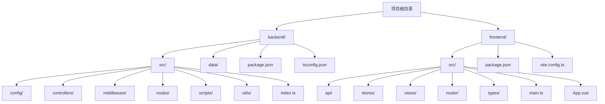
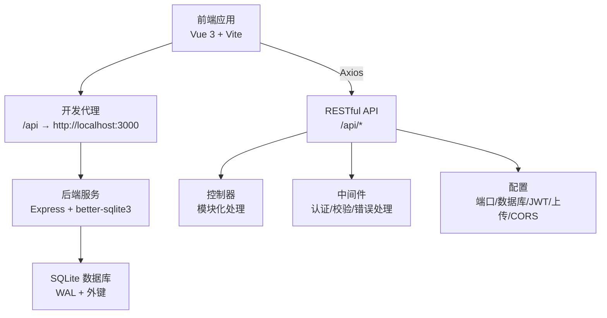
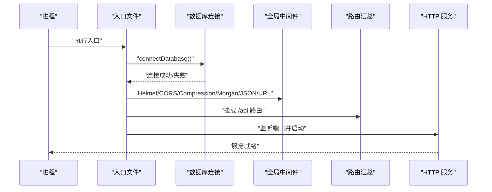
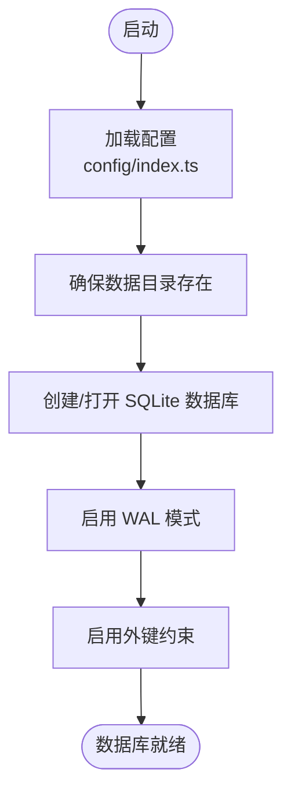
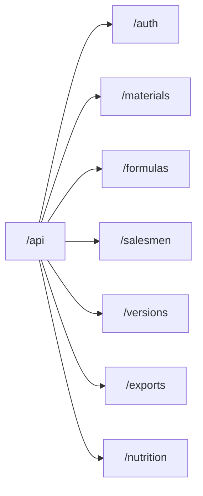
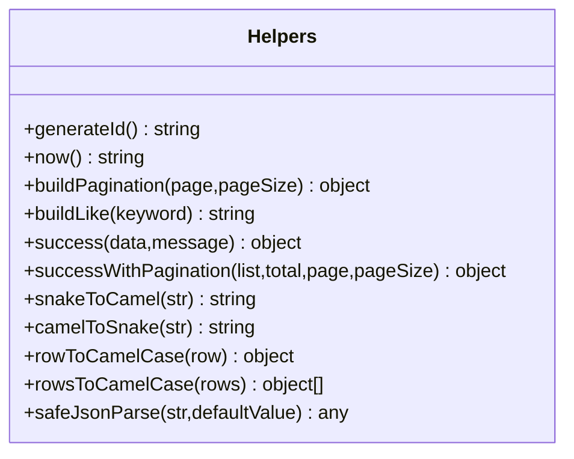
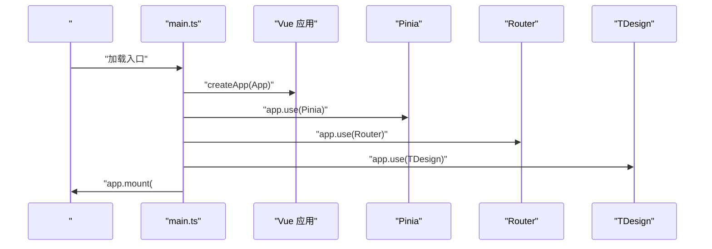
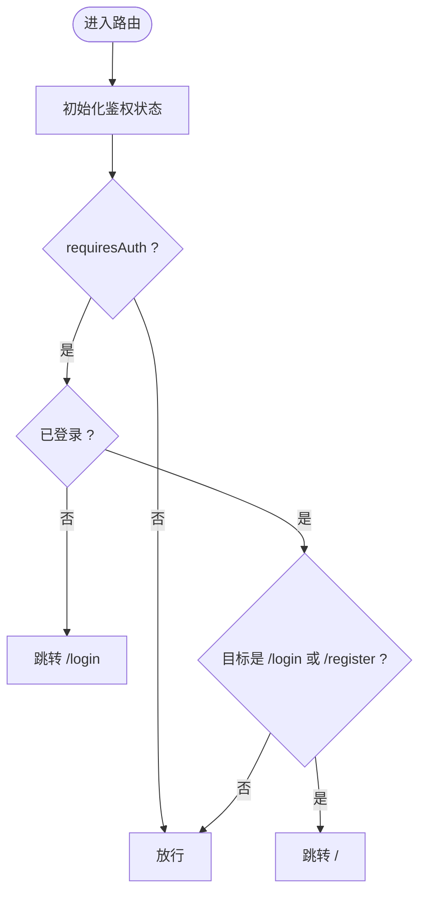
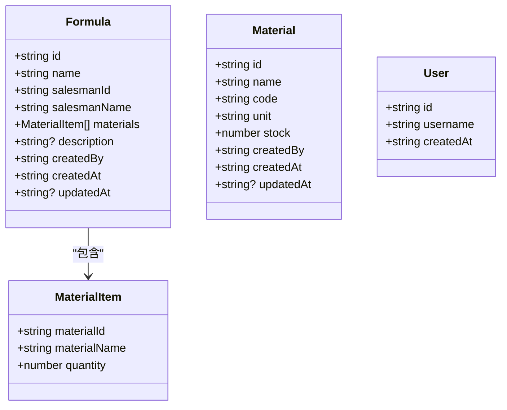
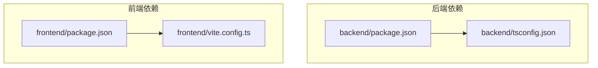

# 项目结构

<cite>
**本文引用的文件**
- [backend/src/index.ts](file://backend/src/index.ts)
- [backend/src/config/index.ts](file://backend/src/config/index.ts)
- [backend/src/config/database.ts](file://backend/src/config/database.ts)
- [backend/src/routes/index.ts](file://backend/src/routes/index.ts)
- [backend/src/utils/helpers.ts](file://backend/src/utils/helpers.ts)
- [backend/package.json](file://backend/package.json)
- [backend/tsconfig.json](file://backend/tsconfig.json)
- [frontend/src/main.ts](file://frontend/src/main.ts)
- [frontend/src/router/index.ts](file://frontend/src/router/index.ts)
- [frontend/src/types/formula.ts](file://frontend/src/types/formula.ts)
- [frontend/src/types/material.ts](file://frontend/src/types/material.ts)
- [frontend/src/types/user.ts](file://frontend/src/types/user.ts)
- [frontend/vite.config.ts](file://frontend/vite.config.ts)
- [frontend/package.json](file://frontend/package.json)
- [README.md](file://README.md)
</cite>

## 目录
1. [引言](#引言)
2. [项目结构](#项目结构)
3. [核心组件](#核心组件)
4. [架构总览](#架构总览)
5. [详细组件分析](#详细组件分析)
6. [依赖关系分析](#依赖关系分析)
7. [性能考虑](#性能考虑)
8. [故障排查指南](#故障排查指南)
9. [结论](#结论)
10. [附录](#附录)

## 引言
本文件面向 TingStudio v2.0 项目，系统化梳理前后端分离架构下的目录组织与职责划分，重点解析：
- 后端 backend/ 的分层设计与模块化组织（配置、控制器、中间件、路由、脚本、工具）
- 前端 frontend/ 的分层设计与模块化组织（API 层、状态管理、页面视图、路由、类型定义）
- 从根目录到各层级的文件组织逻辑、命名规范与设计原则
- 为开发者提供清晰的代码导航指南与最佳实践建议

## 项目结构
TingStudio 采用前后端分离架构，根目录包含 backend/ 与 frontend/ 两大核心目录，分别承载服务端与客户端代码，并辅以文档与脚本资源。

图表来源
- [README.md:65-113](file://README.md#L65-L113)
- [backend/src/index.ts:1-61](file://backend/src/index.ts#L1-L61)
- [frontend/src/main.ts:1-17](file://frontend/src/main.ts#L1-L17)

章节来源
- [README.md:65-113](file://README.md#L65-L113)
- [backend/src/index.ts:1-61](file://backend/src/index.ts#L1-L61)
- [frontend/src/main.ts:1-17](file://frontend/src/main.ts#L1-L17)

## 核心组件
本节概述两大核心目录的设计理念与职责边界：

- backend/
  - 职责：提供 RESTful API、数据库连接与管理、统一中间件、脚本化初始化与种子数据、日志与工具函数
  - 设计原则：模块化、可扩展、可维护；通过配置集中管理环境变量与默认值；通过工具函数统一响应格式与数据转换
  - 关键入口：src/index.ts 启动服务、挂载路由、静态资源与全局中间件
  - 关键配置：src/config/index.ts 提供端口、数据库路径、JWT、上传、CORS 等配置；src/config/database.ts 管理 SQLite 连接、事务与查询封装
  - 关键路由：src/routes/index.ts 汇总各模块路由并挂载到 /api 前缀
  - 关键工具：src/utils/helpers.ts 提供 ID 生成、时间、分页、模糊查询、响应构造、命名转换、JSON 安全解析等通用能力

- frontend/
  - 职责：提供 Vue 3 应用、路由与页面视图、状态管理、类型定义、API 封装与样式
  - 设计原则：按功能域拆分目录（api、stores、views），统一类型定义，组件化页面与布局
  - 关键入口：src/main.ts 创建应用实例、安装插件（Pinia、Router、TDesign）、挂载根组件
  - 关键路由：src/router/index.ts 定义登录/注册与主页面子路由，结合鉴权守卫实现访问控制
  - 关键类型：src/types/ 下定义实体与表单类型，确保前后端契约一致
  - 关键配置：frontend/vite.config.ts 配置别名与开发服务器代理，将 /api 代理到后端 3000 端口

章节来源
- [backend/src/index.ts:1-61](file://backend/src/index.ts#L1-L61)
- [backend/src/config/index.ts:1-24](file://backend/src/config/index.ts#L1-L24)
- [backend/src/config/database.ts:1-70](file://backend/src/config/database.ts#L1-L70)
- [backend/src/routes/index.ts:1-24](file://backend/src/routes/index.ts#L1-L24)
- [backend/src/utils/helpers.ts:1-86](file://backend/src/utils/helpers.ts#L1-L86)
- [frontend/src/main.ts:1-17](file://frontend/src/main.ts#L1-L17)
- [frontend/src/router/index.ts:1-165](file://frontend/src/router/index.ts#L1-L165)
- [frontend/vite.config.ts:1-23](file://frontend/vite.config.ts#L1-L23)

## 架构总览
前后端通过 RESTful API 通信，前端通过 /api 前缀访问后端接口，开发时由 Vite 代理转发请求。后端使用 Express + better-sqlite3，提供 JWT 认证、CORS、Helmet、压缩与日志等基础能力。

图表来源
- [frontend/vite.config.ts:12-21](file://frontend/vite.config.ts#L12-L21)
- [backend/src/index.ts:34-48](file://backend/src/index.ts#L34-L48)
- [backend/src/config/database.ts:21-23](file://backend/src/config/database.ts#L21-L23)
- [backend/src/config/index.ts:3-23](file://backend/src/config/index.ts#L3-L23)

章节来源
- [frontend/vite.config.ts:12-21](file://frontend/vite.config.ts#L12-L21)
- [backend/src/index.ts:34-48](file://backend/src/index.ts#L34-L48)
- [backend/src/config/database.ts:21-23](file://backend/src/config/database.ts#L21-L23)
- [backend/src/config/index.ts:3-23](file://backend/src/config/index.ts#L3-L23)

## 详细组件分析

### 后端：入口与启动流程
- 入口文件负责加载 dotenv、初始化 Express、启用安全与压缩中间件、配置静态资源、挂载路由、健康检查、404 与错误处理，并监听端口输出日志
- 通过异步函数统一启动流程，异常捕获后记录日志并退出进程

图表来源
- [backend/src/index.ts:13-55](file://backend/src/index.ts#L13-L55)

章节来源
- [backend/src/index.ts:1-61](file://backend/src/index.ts#L1-L61)

### 后端：配置与数据库
- 应用配置集中于 config/index.ts，包含端口、环境、数据库路径、JWT 密钥与过期时间、上传目录与大小限制、CORS 源等
- 数据库连接封装于 config/database.ts，负责目录创建、WAL 模式与外键开启、查询与事务封装、连接关闭

图表来源
- [backend/src/config/database.ts:10-37](file://backend/src/config/database.ts#L10-L37)
- [backend/src/config/index.ts:6-23](file://backend/src/config/index.ts#L6-L23)

章节来源
- [backend/src/config/index.ts:1-24](file://backend/src/config/index.ts#L1-L24)
- [backend/src/config/database.ts:1-70](file://backend/src/config/database.ts#L1-L70)

### 后端：路由与模块化
- 路由汇总文件将认证、原料、配方、业务员、版本、导出、营养等模块路由挂载到 /api 前缀下，便于统一管理与扩展

图表来源
- [backend/src/routes/index.ts:11-23](file://backend/src/routes/index.ts#L11-L23)

章节来源
- [backend/src/routes/index.ts:1-24](file://backend/src/routes/index.ts#L1-L24)

### 后端：工具与通用能力
- helpers.ts 提供 ID 生成、时间、分页、模糊查询、统一响应、命名转换、JSON 安全解析等通用能力，降低重复代码并提升一致性

图表来源
- [backend/src/utils/helpers.ts:3-86](file://backend/src/utils/helpers.ts#L3-L86)

章节来源
- [backend/src/utils/helpers.ts:1-86](file://backend/src/utils/helpers.ts#L1-L86)

### 前端：入口与应用装配
- main.ts 创建 Vue 应用、安装 Pinia、Router、TDesign，并引入全局样式，最后挂载到 #app
- 该流程确保应用具备状态管理、路由导航与 UI 组件库支持

图表来源
- [frontend/src/main.ts:9-16](file://frontend/src/main.ts#L9-L16)

章节来源
- [frontend/src/main.ts:1-17](file://frontend/src/main.ts#L1-L17)

### 前端：路由与鉴权守卫
- router/index.ts 定义登录/注册与主页面子路由，设置 meta.requiresAuth 控制是否需要登录
- beforeEach 钩子中初始化鉴权状态，未登录用户跳转登录，已登录用户禁止访问登录页，否则放行

图表来源
- [frontend/src/router/index.ts:148-162](file://frontend/src/router/index.ts#L148-L162)

章节来源
- [frontend/src/router/index.ts:1-165](file://frontend/src/router/index.ts#L1-L165)

### 前端：类型定义与契约
- types/formula.ts 定义配方、原料项、表单与查询参数等类型
- types/material.ts 定义原料、表单与查询参数等类型
- types/user.ts 定义用户、登录/注册表单与鉴权状态类型

图表来源
- [frontend/src/types/formula.ts:7-24](file://frontend/src/types/formula.ts#L7-L24)
- [frontend/src/types/material.ts:1-17](file://frontend/src/types/material.ts#L1-L17)
- [frontend/src/types/user.ts:1-22](file://frontend/src/types/user.ts#L1-L22)

章节来源
- [frontend/src/types/formula.ts:1-33](file://frontend/src/types/formula.ts#L1-L33)
- [frontend/src/types/material.ts:1-30](file://frontend/src/types/material.ts#L1-L30)
- [frontend/src/types/user.ts:1-22](file://frontend/src/types/user.ts#L1-L22)

## 依赖关系分析
- 后端
  - 启动脚本与依赖：package.json 定义 dev/build/start 与 init-db/seed/import-nutrition 等脚本，依赖 express、better-sqlite3、helmet、cors、compression、morgan、bcryptjs、jsonwebtoken、multer 等
  - TypeScript 配置：tsconfig.json 使用 bundler 模块解析、ES2022 目标、路径别名 @/* 指向 src/*
- 前端
  - 依赖：vue、vue-router、pinia、tdesign-vue-next、axios、vee-validate、yup 等
  - 构建：vite.config.ts 配置别名与代理，开发服务器端口 5173，将 /api 代理到后端 3000 端口

图表来源
- [backend/package.json:6-12](file://backend/package.json#L6-L12)
- [backend/tsconfig.json:18-20](file://backend/tsconfig.json#L18-L20)
- [frontend/package.json:6-10](file://frontend/package.json#L6-L10)
- [frontend/vite.config.ts:7-21](file://frontend/vite.config.ts#L7-L21)

章节来源
- [backend/package.json:1-42](file://backend/package.json#L1-L42)
- [backend/tsconfig.json:1-25](file://backend/tsconfig.json#L1-L25)
- [frontend/package.json:1-30](file://frontend/package.json#L1-L30)
- [frontend/vite.config.ts:1-23](file://frontend/vite.config.ts#L1-L23)

## 性能考虑
- 数据库层面
  - WAL 模式提升并发读写性能，外键约束保障数据一致性
  - 事务封装用于批量写入或复杂操作，减少往返与回滚成本
- 服务端层面
  - 压缩中间件降低传输体积；日志中间件便于问题追踪
  - 限制请求体大小与分页上限，避免资源滥用
- 前端层面
  - 路由懒加载减少首屏包体；组件化与状态管理按需渲染
  - 开发代理避免跨域与额外网络开销

## 故障排查指南
- 启动失败
  - 后端：检查数据库连接是否成功、端口占用、环境变量是否正确
  - 前端：确认代理配置是否指向后端地址、端口是否开放
- 接口异常
  - 检查路由前缀 /api 是否正确、控制器是否返回统一响应格式
  - 查看中间件是否拦截异常并返回错误处理
- 数据不一致
  - 确认事务包裹与回滚策略；核对数据库 WAL 与外键设置
- 类型不匹配
  - 对照 types/ 下的类型定义，确保前后端契约一致

章节来源
- [backend/src/index.ts:57-60](file://backend/src/index.ts#L57-L60)
- [backend/src/config/database.ts:21-23](file://backend/src/config/database.ts#L21-L23)
- [frontend/vite.config.ts:15-20](file://frontend/vite.config.ts#L15-L20)

## 结论
TingStudio 通过清晰的前后端分层与模块化组织，实现了高内聚、低耦合的架构设计。后端以配置为中心、以工具函数为支撑、以路由模块化为扩展点；前端以类型定义为契约、以路由与状态管理为核心、以组件化页面为载体。配合统一的脚本与配置，开发者可以快速上手并持续演进。

## 附录

### 文件命名规范与目录设计原则
- 目录命名
  - 使用小写与短横线/下划线组合，语义明确（如 config、controllers、middleware、routes、scripts、utils）
- 文件命名
  - 后端：模块控制器使用模块名 + Controller.ts（如 authController.ts），路由文件使用模块名 + .ts（如 auth.ts），工具文件使用具体语义（如 helpers.ts、logger.ts）
  - 前端：API 文件使用模块名 + .ts（如 auth.ts、material.ts），状态管理按模块命名（如 auth.ts、material.ts），视图组件使用 PascalCase（如 Login.vue、MaterialList.vue），类型文件使用领域名（如 formula.ts、material.ts、user.ts）
- 路径别名
  - 后端使用 @/* 指向 src/*，前端使用 @/* 指向 src/
- 路由与页面
  - 路由按功能域分组，页面组件按模块划分，meta.title 与 requiresAuth 明确页面语义与鉴权需求
- 配置与环境
  - 配置集中于 config/index.ts，环境变量通过 dotenv 注入，避免硬编码

章节来源
- [backend/src/config/index.ts:1-24](file://backend/src/config/index.ts#L1-L24)
- [backend/tsconfig.json:18-20](file://backend/tsconfig.json#L18-L20)
- [frontend/vite.config.ts:7-11](file://frontend/vite.config.ts#L7-L11)
- [frontend/src/router/index.ts:6-146](file://frontend/src/router/index.ts#L6-L146)
- [frontend/src/types/formula.ts:1-33](file://frontend/src/types/formula.ts#L1-L33)
- [frontend/src/types/material.ts:1-30](file://frontend/src/types/material.ts#L1-L30)
- [frontend/src/types/user.ts:1-22](file://frontend/src/types/user.ts#L1-L22)