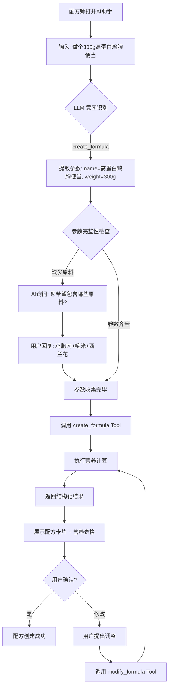
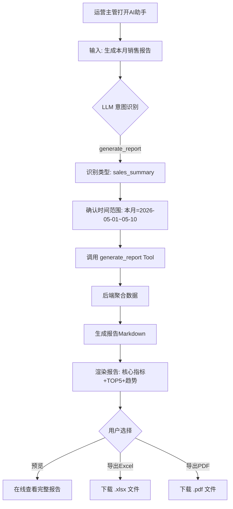
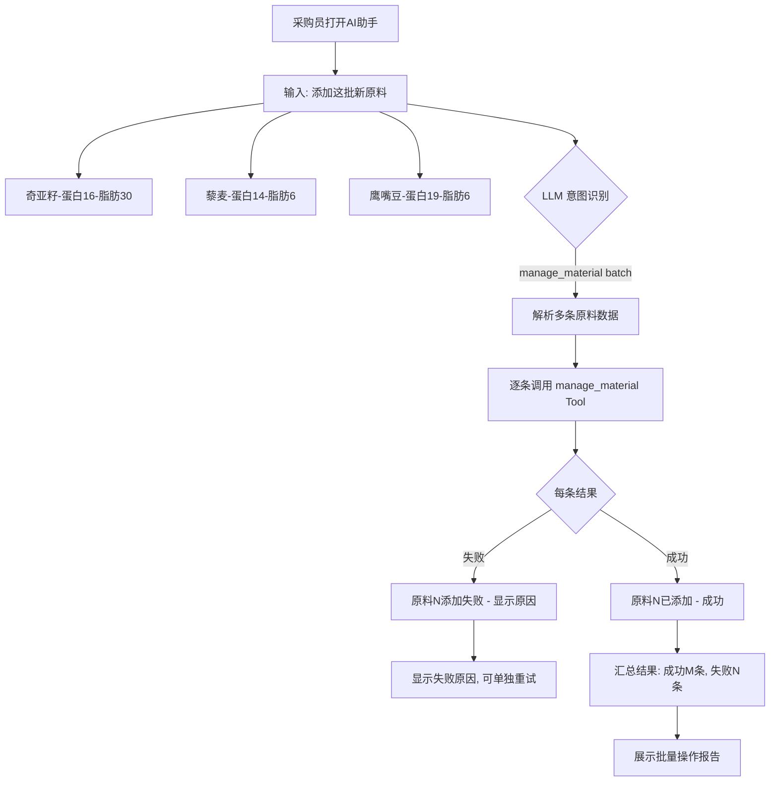

# TingStudio AI Agent 智能交互系统 — 产品需求文档 (PRD)

> **版本**: v1.4\
> **日期**: 2026-05-10\
> **状态**: ✅ 已确认，可启动实施\
> **模块**: AI Agent 智能对话系统\
> **关联文档**:
>
> - [AI助手工作台-完整实施计划.md](./AI助手工作台-完整实施计划.md)
> - [AI助手页面项目设计文档.md](./AI助手页面项目设计文档.md)
> - [AI助手模块编码实施与验收报告.md](./AI助手模块编码实施与验收报告.md)
> - [周报与月报功能规划文档.md](./report-feature-plan.md)

***

## 文档修订记录

| 版本   | 日期         | 修订内容        | 修订人          | 状态  |
| ---- | ---------- | ----------- | ------------ | --- |
| v1.0 | 2026-05-10 | 初始版本，完成需求梳理 | AI Assistant | 已确认 |
| v1.1 | 2026-05-10 | 新增F6业务员管理/F7销量分析模块；补充配方成本报价/原料单价/文件上传解析功能 | AI Assistant | 已确认 |
| v1.2 | 2026-05-10 | 完善营养计算引擎(7步法)：添加药材/辅料区分、ratioFactor、Atwater系数、NRV%计算、0界限值归零规则、包装/其他成本 | AI Assistant | 已确认 |
| v1.3 | 2026-05-10 | 新增F3.5配方原料含量比(ratioFactor)分级校验系统；修复Mermaid图表渲染问题(移除HTML标签/emoji) | AI Assistant | 已确认 |
| v1.4 | 2026-05-10 | 新增第十章编码实施计划：4阶段交付策略(P1-P4)、技术栈选型、目录结构规划、关键代码实现(LLM服务层/Tool注册/营养引擎/校验器/成本计算器/文件解析)、里程碑时间线、资源配置与风险控制、验收检查清单 | AI Assistant | **已确认** |

**确认签署区**：

| 角色    | 姓名                         | 日期             | 签署意见             |
| ----- | -------------------------- | -------------- | ---------------- |
| 产品负责人 | \_\_\_\_\_\_\_\_\_\_\_\_\_ | 2026-05-10      | ✅ 通过 |
| 技术负责人 | \_\_\_\_\_\_\_\_\_\_\_\_\_ | 2026-05-10      | ✅ 通过 |
| 业务方代表 | \_\_\_\_\_\_\_\_\_\_\_\_\_ | 2026-05-10      | ✅ 通过 |

> **文档状态**: 🟢 **已确认** - 需求文档 v1.4 版本已通过评审，可启动编码实施（详见第十章：编码实施计划）

***

## 目录

- [一、项目背景与目标](#一项目背景与目标)
- [二、产品定位与设计理念](#二产品定位与设计理念)
- [三、功能需求](#三功能需求)
  - [3.1 核心功能架构](#31核心功能架构)
  - [3.2 F1 配方智能创建与管理](#f1-配方智能创建与管理)
  - [3.3 F2 原料智能管理](#f2-原料智能管理)
  - [3.4 F3 营养分析引擎](#f3-营养分析引擎)
  - [3.5 F4 数据报告生成](#f4-数据报告生成)
  - [3.6 F5 对话管理与上下文](#f5-对话管理与上下文)
- [四、非功能需求](#四非功能需求)
- [五、用户场景与业务流程](#五用户场景与业务流程)
- [六、数据需求与接口规范](#六数据需求与接口规范)
- [七、技术约束与决策](#七技术约束与决策)
- [八、验收标准](#八验收标准)
- [九、风险评估与应对](#九风险评估与应对)

***

## 一、项目背景与目标

### 1.1 业务背景

TingStudio 配方管理系统已具备以下核心能力：

- **配方管理**：配方的 CRUD、版本对比、营养计算
- **原料管理**：原料库维护、营养数据录入
- **智能解析**：AI 解析配方文件（Excel/图片）和原料营养文件
- **自然语言检索**：NL2SQL 查询能力
- **报告系统**：周报/月报生成（规划中）

当前 AI 助手工作台（AIDashboard.vue）已完成 UI 布局改造，采用**三栏布局**：

- **左栏**：数据概览卡片 + 快捷操作
- **中间栏**：AI 对话区（核心）
- **右栏**：AI 推荐操作 + 最近访问 + 待办事项

### 1.2 当前痛点

| 痛点编号 | 痛点描述                       | 影响范围 | 严重程度 |
| ---- | -------------------------- | ---- | ---- |
| P1   | 配方录入依赖表单逐项填写，单份耗时 15-30 分钟 | 全体用户 | 高    |
| P2   | 原料营养数据需手动查询和录入，易出错         | 运营人员 | 中    |
| P3   | 营养分析需切换多个页面查看，缺乏一站式体验      | 配方师  | 中    |
| P4   | 报告生成流程复杂，需手动聚合多源数据         | 管理层  | 低    |
| P5   | 用户需要记忆复杂的操作路径才能完成任务        | 新用户  | 中    |

### 1.3 项目目标

#### 1.3.1 总体目标

将 AI 对话区从**通用聊天工具**升级为**领域专用的智能业务代理（Agent）**，实现：

```
用户自然语言输入 → LLM 理解意图 → Function Calling 调用业务API → 结构化结果返回
```

#### 1.3.2 量化指标

| 目标维度    | 当前基线       | 目标值       | 提升幅度     |
| ------- | ---------- | --------- | -------- |
| 配方创建效率  | 15-30 分钟/份 | 3-5 分钟/份  | **70%↑** |
| 原料添加效率  | 2-3 分钟/条   | <30 秒/条   | **85%↑** |
| 营养分析获取  | 跨页面 2-3 分钟 | 对话内 <10 秒 | **95%↑** |
| 操作路径复杂度 | 平均 5-7 步   | 平均 2-3 步  | **50%↓** |
| 用户学习成本  | 需培训上手      | 自然语言即可使用  | **显著降低** |

### 1.4 项目范围

#### ✅ 包含范围

1. **Function Calling 工具集**：6 个核心业务工具
2. **System Prompt 工程**：角色定义 + 行为约束
3. **结构化输出格式**：固定 JSON Schema
4. **营养计算引擎**：确定性公式（非 AI 猜测）
5. **前端交互增强**：快捷指令、一键操作按钮

#### ❌ 明确排除范围

1. **Vector Database / RAG 系统**：不需要语义检索，营养数据是确定性的
2. **知识库 / Embedding**：不需要外部知识注入
3. **Agent 自主规划**：不需要 AI 自主决策和多步推理
4. **多模态输入（语音/视频）**：本次不涉及
5. **个性化推荐引擎**：不在本次范围

***

## 二、产品定位与设计理念

### 2.1 产品定位

> **"以自然语言为接口的确定性业务执行器"**

AI Agent 不是"思考者"，而是**翻译层**——将用户的自然语言翻译为系统可执行的 API 调用。

### 2.2 核心设计原则

| 原则        | 说明                            | 示例                              |
| --------- | ----------------------------- | ------------------------------- |
| **确定性优先** | 所有数值来自固定公式或数据库，AI 不编造数据       | 营养值 = Σ(每100g值 × 实际重量) / 100    |
| **工具驱动**  | AI 只做"理解意图+提取参数"，实际操作调用已有 API | 创建配方 = 调用 `POST /api/formulas`  |
| **透明可控**  | 用户可看到 AI 执行了什么操作，可撤销/修改       | 显示 "正在调用 create\_formula 工具..." |
| **渐进式引导** | 信息不足时主动询问，而非猜测                | "请确认成品重量是多少克？"                  |

### 2.3 架构哲学

```
┌─────────────────────────────────────────────────────────────┐
│                      用户输入层                               │
│            "帮我做个200g低糖蛋糕，用杏仁粉替代面粉"           │
└──────────────────────────────┬──────────────────────────────┘
                               ↓
┌─────────────────────────────────────────────────────────────┐
│                    LLM 理解层 (DeepSeek/GPT)                  │
│  任务: 意图识别 + 参数提取 + 多轮补全                        │
│                                                              │
│  输出: {                                                     │
│    intent: "create_formula",                                 │
│    params: { name, target_weight, materials[], tags[] }      │
│  }                                                          │
└──────────────────────────────┬──────────────────────────────┘
                               ↓
┌─────────────────────────────────────────────────────────────┐
│                  Tool / Function 层                          │
│                                                              │
│  ┌─────────────┐ ┌─────────────┐ ┌─────────────┐          │
│  │ formula_    │ │ material_   │ │ nutrition_  │          │
│  │ create      │ │ search/add  │ │ calc        │          │
│  │ query       │ │             │ │             │          │
│  │ modify      │ │             │ │             │          │
│  └──────┬──────┘ └──────┬──────┘ └──────┬──────┘          │
│         ↓               ↓               ↓                   │
│  ┌──────────────────────────────────────────────────┐       │
│  │         业务逻辑层 (现有代码，无需重写)            │       │
│  │  • formulas CRUD (/api/formulas)                 │       │
│  │  • materials CRUD (/api/materials)               │       │
│  │  • nutrition 计算 (固定公式)                     │       │
│  │  • reports 生成 (/api/reports)                   │       │
│  └──────────────────────────────────────────────────┘       │
└──────────────────────────────┬──────────────────────────────┘
                               ↓
┌─────────────────────────────────────────────────────────────┐
│                    输出渲染层                                 │
│                                                              │
│  格式选项:                                                    │
│  • Markdown 表格 (默认)                                      │
│  • 结构化卡片 (可交互)                                       │
│  • JSON (调试模式)                                           │
│  • 一键操作按钮 ("创建配方" / "加入购物车")                  │
└─────────────────────────────────────────────────────────────┘
```

***

## 三、功能需求

### 3.1 核心功能架构

#### 3.1.1 功能模块总览

| 模块编号 | 模块名称          | 功能描述             | 优先级 | 复杂度 |
| ---- | ------------- | ---------------- | --- | --- |
| F1   | **配方智能创建与管理** | 自然语言创建/查询/修改配方   | P0  | ⭐⭐⭐ |
| F2   | **原料智能管理**    | 自然语言添加/查询原料及营养数据 | P0  | ⭐⭐  |
| F3   | **营养分析引擎**    | 固定公式计算，支持实时预览    | P0  | ⭐⭐  |
| F4   | **数据报告生成**    | 一键生成周报/月报/自定义报告  | P1  | ⭐⭐⭐ |
| F5   | **对话管理与上下文**  | 多轮对话、历史记录、会话恢复   | P0  | ⭐⭐  |
| F6   | **业务员智能管理**    | 自然语言完成业务员CRUD操作     | P0  | ⭐⭐  |
| F7   | **销量智能分析**    | 多维度销量统计、可视化与预警    | P1  | ⭐⭐⭐ |

#### 3.1.2 Tool（工具）清单

```typescript
// 核心 Tool 定义（共 8 个）
interface ToolDefinition {
  name: string;
  description: string;
  parameters: {
    type: 'object';
    properties: Record<string, ParameterSchema>;
    required?: string[];
  };
}

// 详细定义见第六章「数据需求与接口规范」
```

***

### 3.2 F1 配方智能创建与管理

#### 3.2.1 功能描述

用户通过自然语言描述需求，AI Agent 自动提取参数并调用配方 CRUD API，完成配方的创建、查询、修改操作。

#### 3.2.2 用户故事

**US-1.1**: 作为配方师，我希望用自然语言快速创建新配方，以便减少表单填写时间。

**US-1.2**: 作为运营人员，我希望用模糊条件搜索配方，以便快速找到目标配方。

**US-1.3**: 作为研发人员，我希望让 AI 帮我调整配方参数（如减糖、替换原料），以便快速迭代优化。

#### 3.2.3 功能点分解

```
F1 配方智能管理
├── F1.1 自然语言创建配方
│   ├── 支持描述方式:
│   │   ├── "帮我做个xxx配方" → 提取名称 + 默认参数
│   │   ├── "做一个200g的xxx" → 提取名称 + 成品重量
│   │   ├── "低糖/无麸质/高蛋白xxx" → 提取饮食标签
│   │   └── "用[原料列表]做个xxx" → 提取原料 + 名称
│   │
│   ├── 参数提取规则:
│   │   ├── name (必填): 配方名称
│   │   ├── target_weight (必填): 成品重量(g)，未指定时询问
│   │   ├── materials (可选): 原料列表，未提供时询问或推荐
│   │   ├── dietary_tags (可选): 饮食标签，自动识别关键词
│   │   └── description (可选): 描述信息
│   │
│   └── 缺失参数处理:
│       ├── 必填参数缺失 → 主动询问用户
│       ├── 可选参数缺失 → 使用合理默认值并告知用户
│       └── 参数模糊时 → 提供候选值让用户选择
│
├── F1.2 智能配方搜索
│   ├── 支持查询维度:
│   │   ├── 关键词搜索: "找巧克力蛋糕配方"
│   │   ├── 条件筛选: "蛋白质>25g且热量<400的配方"
│   │   ├── 标签过滤: "所有低糖配方"
│   │   └── 组合查询: "上周创建的高蛋白配方"
│   │
│   └── 结果展示:
│       ├── 表格形式 (名称/热量/蛋白/状态)
│       ├── 点击可查看详情
│       └── 支持"基于此配方创建副本"
│
├── F1.3 智能配方修改
│   ├── 支持修改类型:
│   │   ├── 调整用量: "把糖减少30%"
│   │   ├── 替换原料: "把面粉换成杏仁粉"
│   │   ├── 添加原料: "再加10g可可粉"
│   │   ├── 删除原料: "去掉花生"
│   │   └── 整体缩放: "配方翻倍/减半"
│   │
│   ├── 修改前确认:
│   │   ├── 显示修改前后对比
│   │   ├── 列出受影响的营养值变化
│   │   └── 用户确认后执行
│   │
│   └── 修改后反馈:
│       ├── 更新后的营养数据
│       └── 可选: "是否保存为新版本？"
│
└── F1.4 配方模板推荐 (P1)
    ├── 基于历史配方推荐相似模板
    ├── 基于饮食标签推荐热门模板
    └── 基于库存原料推荐可用模板

├── F1.5 配方成本与报价管理
│   ├── 成本自动计算:
│   │   ├── 单原料成本 = (原料用量(g) / 1000) × 原料单价(元/kg)
│   │   │   例: 杏仁粉 60g ÷ 1000 × ¥50/kg = ¥3.00
│   │   ├── 原料小计 = Σ(各原料成本小计)
│   │   │   例: ¥3.00 + ¥3.70 + ... = ¥12.50
│   │   ├── 成本小计 = 原料小计 + 包装成本 + 其他成本
│   │   │   例: ¥12.50 + ¥2.00(包装) + ¥1.50(其他) = ¥16.00
│   │   ├── 总价(含利润) = 成本小计 × (1 + 利润率/100)
│   │   │   例: ¥16.00 × (1 + 30/100) = ¥20.80
│   │   ├── 每100g成本 = 成本小计 / (成品重量 / 100)
│   │   │   例: ¥16.00 ÷ (200g / 100) = ¥8.00/100g
│   │   └── 成本占比 = (单原料成本 / 原料小计) × 100%
│   │
│   ├── 报价管理:
│   │   ├── 利润率模式: "利润率30%" → 总价 = 成本小计 × (1+0.3)
│   │   ├── 固定加价: "每份加价50元" → 总价 = 成本小计 + 加价
│   │   ├── 阶梯报价: 按采购量设定不同单价
│   │   └── 批量报价: 对多份配方统一生成报价单
│   │
│   ├── 价格联动:
│   │   ├── 原料单价变更 → 自动重算配方成本
│   │   ├── 用量调整 → 实时更新成本明细
│   │   ├── 营养目标约束下的成本优化建议
│   │   └── 成本历史追踪 (记录每次价格变动)
│   │
│   └── 输出展示:
│       ├── 成本明细表 (原料/单价/用量/小计/占比)
│       ├── 成本汇总卡片 (原料小计/包装/其他/总成本/总价/100g成本)
│       ├── 报价单预览 (可导出PDF/Excel)
│       └── 价格对比 (与同类配方成本对比)
│
└── F1.6 文件上传与智能解析
    ├── 支持文件格式:
    │   ├── Excel (.xlsx/.xls): 配方表/原料表/价格表
    │   ├── 图片 (.jpg/.png/.webp): 手写配方/标签照片
    │   ├── PDF: 供应商报价单/产品说明书
    │   └── 纯文本 (.txt/.csv): 简单列表格式
    │
    ├── 解析能力:
    │   ├── 表格结构识别 (Excel多Sheet)
    │   ├── OCR文字提取 (图片/PDF扫描件)
    │   ├── 字段智能映射 (自动匹配名称/重量/营养/价格)
    │   ├── 多语言支持 (中英文混合内容)
    │   └── 数据清洗 (去重/格式标准化/异常值标记)
    │
    ├── 交互流程:
    │   ├── Step 1: 用户上传文件或拖拽到对话框
    │   ├── Step 2: AI 预览解析结果 (表格形式展示)
    │   ├── Step 3: 用户确认/修正字段映射
    │   ├── Step 4: 一键导入为配方或原料记录
    │   └── Step 5: 导入后可继续对话调整
    │
    └── 解析结果示例:
        ```
        📎 文件: 配方清单.xlsx (已解析)
        
        识别到 3 条配方记录:
        ┌──────┬─────────────┬──────┬────────┬────────┐
        │ #    │ 名称         │ 重量  │ 原料数  │ 状态   │
        ├──────┼─────────────┼──────┼────────┼────────┤
        │ 1    │ 甘绪理膏     │ 200g │ 8种    │ ✅完整  │
        │ 2    │ 荣华天晞膏   │ 180g │ 7种    │ ⚠️缺营养│
        │ 3    │ 正阳御湿膏   │ 220g │ 9种    │ ✅完整  │
        └──────┴─────────────┴──────┴────────┴────────┘
        
        [✅ 全部导入] [📋 逐条确认] [✏️ 编辑后再导入]
        ```
```

#### 3.2.4 输入输出示例

**输入示例**:

```
用户: 帮我做一个200g的低糖巧克力蛋糕配方，用杏仁粉替代面粉，不要花生
```

**AI 处理过程**:

```
Step 1: 意图识别 → create_formula
Step 2: 参数提取:
  - name: "低糖巧克力蛋糕"
  - target_weight: 200
  - dietary_tags: ["low-sugar", "gluten-free"]
  - materials_hint: ["杏仁粉", "巧克力"], exclude: ["花生", "面粉"]
Step 3: 调用 tool: create_formula(params)
Step 4: 返回结构化结果
```

**输出示例**:

```markdown
## ✅ 配方已创建

**配方名称**: 低糖巧克力蛋糕  
**成品重量**: 200g  
**饮食标签**: #低糖 #无麸质  

### 📊 营养成分 (每100g)

| 项目 | 数量 | 单位 |
|------|------|------|
| 🔥 热量 | 320 | kcal |
| 💪 蛋白质 | 8.5 | g |
| 🧈 脂肪 | 18.2 | g |
| 🍞 碳水化合物 | 28.5 | g |
| 🧂 钠 | 120 | mg |

### 🧾 原料明细

| 原料 | 重量 | 占比 | 热量(kcal) | 蛋白质(g) |
|------|------|------|-----------|-----------|
| 杏仁粉 | 60g | 30% | 132 | 5.4 |
| 黑巧克力 | 40g | 20% | 112 | 2.0 |
| 鸡蛋 | 50g | 25% | 35 | 4.4 |
| 代糖(赤藓糖醇) | 30g | 15% | 0 | 0 |
| 可可粉 | 12g | 6% | 28 | 1.8 |
| 泡打粉 | 4g | 2% | 0 | 0 |
| 盐 | 2g | 1% | 0 | 0 |
| 植物油 | 2g | 1% | 18 | 0 |

**总计**: 200g | 325 kcal | 蛋白 13.6g | 脂肪 20.2g | 碳水 30.3g

---

[📝 编辑配方] [📋 复制到剪贴板] [🔄 基于此创建变体]
```

***

### 3.3 F2 原料智能管理

#### 3.3.1 功能描述

支持用户通过自然语言添加、查询原料及其营养数据，自动关联营养信息。

#### 3.3.2 用户故事

**US-2.1**: 作为采购员，我希望用自然语言快速添加新原料及其营养数据，以便减少手动录入时间。

**US-2.2**: 作为配方师，我希望查询某原料的营养成分，以便在配方设计中准确计算。

#### 3.3.3 功能点分解

```
F2 原料智能管理
├── F2.1 自然语言添加原料
│   ├── 支持输入方式:
│   │   ├── "添加杏仁粉，蛋白质20g，脂肪18g/100g"
│   │   ├── "新增原料: 奇亚籽"
│   │   └── "录入一批原料: [列表]"
│   │
│   ├── 自动填充逻辑:
│   │   ├── 名称必填，其他字段可选
│   │   ├── 营养数据部分提供时，标记缺失字段
│   │   ├── 单位默认 "g"，类型默认 "supplement"
│   │   └── 编码自动生成 (调用 GET /api/materials/next-code)
│   │
│   └── 数据验证:
│       ├── 原料名查重
│       ├── 营养值合理性检查 (如 protein ≥ 0)
│       └── 与已有数据差异提示 (如果同名原料已存在)
│
├── F2.2 原料智能查询
│   ├── 支持查询方式:
│   │   ├── "查一下杏仁粉的营养数据"
│   │   ├── "高蛋白的原料有哪些"
│   │   ├── "碳水低于10g的原料"
│   │   └── "找类似杏仁粉的替代品"
│   │
│   └── 结果展示:
│       ├── 营养数据卡片 (每100g)
│       ├── 与同类原料对比
│       └── "添加到配方" 快捷操作
│
└── F2.3 原料替代建议 (P1)
    ├── 基于营养成分相似度推荐
    ├── 考虑过敏原约束 (如"无花生")
    └── 显示替代前后营养差异

├── F2.4 原料价格管理
│   ├── 单价录入:
│   │   ├── 自然语言输入: "杏仁粉单价25元/500g"
│   │   ├── 多供应商报价: 支持记录多个供应商的不同单价
│   │   ├── 价格单位自动换算: 元/g / 元/kg / 元/斤
│   │   └── 采购日期与有效期: 记录价格时效性
│   │
│   ├── 价格查询:
│   │   ├── "查一下杏仁粉现在的价格"
│   │   ├── "哪些原料最近涨价了"
│   │   ├── "高蛋白且单价<50元/kg的原料"
│   │   └── 历史价格走势 (支持图表展示)
│   │
│   ├── 价格联动:
│   │   ├── 原料单价更新 → 自动重算所有关联配方成本
│   │   ├── 批量调价: "所有糖类原料涨价10%"
│   │   └── 成本预警: 某原料价格超过设定阈值时提醒
│   │
│   └── 输出展示:
│       ├── 价格卡片 (当前价/历史最低/供应商对比)
│       ├── 关联配方影响列表 (受影响的配方及成本变化)
│       └── 价格趋势图 (近N期价格走势)
│
└── F2.5 文件上传与智能解析
    ├── 支持文件格式 (同F1.6):
    │   ├── Excel (.xlsx/.xls): 原料清单/营养表/价格表
    │   ├── 图片 (.jpg/.png/.webp): 产品标签/营养成分表照片
    │   ├── PDF: 供应商产品手册/检测报告
    │   └── 纯文本 (.txt/.csv): 简单列表格式
    │
    ├── 解析场景:
    │   ├── 场景1 - 批量导入原料库:
    │   │   └── 从Excel表格批量提取原料名称+营养+价格
    │   ├── 场景2 - 营养数据补全:
    │   │   └── 上传产品标签图片 → OCR识别 → 自动填充营养字段
    │   ├── 场景3 - 价格表同步:
    │   │   └── 导入供应商最新报价单 → 批量更新原料单价
    │   └── 场景4 - 检测报告解析:
    │       └── 解析第三方检测报告 → 校验或补充营养数据
    │
    ├── 交互流程 (同F1.6):
    │   ├── Step 1: 用户上传文件
    │   ├── Step 2: AI 预览解析结果
    │   ├── Step 3: 字段映射确认/修正
    │   ├── Step 4: 一键导入或选择性导入
    │   └── Step 5: 导入后继续对话调整
    │
    └── 解析结果示例:
        ```
        📎 文件: 原料价格表_202605.xlsx (已解析)
        
        识别到 15 条原料价格记录:
        ┌──────┬──────────┬──────────┬────────┬────────┬────────┐
        │ #    │ 名称      │ 单价     │ 单位    │ 供应商  │ 状态   │
        ├──────┼──────────┼──────────┼────────┼────────┼────────┤
        │ 1    │ 杏仁粉    │ ¥25.00   │ 500g   │ A供应   │ ✅可导入│
        │ 2    │ 黑巧克力  │ ¥18.50   │ 200g   │ B供应   │ ✅可导入│
        │ 3    │ 酸枣仁    │ ¥45.00   │ kg     │ C供应   │ ⚠️已有价│
        │ ...  │ ...      │ ...      │ ...    │ ...    │ ...   │
        └──────┴──────────┴──────────┴────────┴────────┴────────┘
        
        检测到 3 条记录与现有原料重复，将覆盖原有价格
        
        [✅ 全部导入] [📋 逐条确认] [🔄 仅更新价格]
        ```
```

#### 3.3.4 输入输出示例

**输入**:

```
用户: 添加新原料奇亚籽，蛋白质16g，脂肪30g，碳水44g，热量486kcal，都是每100g的
```

**输出**:

```markdown
## ✅ 原料已添加

**原料名称**: 奇亚籽  
**编码**: MTL-20260510-001 (自动生成)  
**单位**: g  
**类型**: supplement  

### 📊 营养成分 (每100g)

| 项目 | 数量 | 单位 |
|------|------|------|
| 🔥 热量 | 486 | kcal |
| 💪 蛋白质 | 16.0 | g |
| 🧈 脂肪 | 30.0 | g |
| 🍞 碳水化合物 | 44.0 | g |
| 🧂 钠 | — | mg (待补充) |

> ⚠️ 钠含量未提供，建议后续补充完善

[✏️ 编辑] [📋 复制] [➕ 加入配方]
```

***

### 3.4 F3 营养分析引擎

#### 3.4.1 功能描述

**核心原则**: 营养计算是**确定性数学运算**，不是 AI 猜测。所有数值必须通过固定公式计算得出。

#### 3.4.2 计算公式规范

```typescript
/**
 * 营养计算公式 (固定不变 - 完整版)
 * 
 * 核心原则: 确定性数学运算，非AI猜测
 */

// ==================== 基础类型定义 ====================

interface NutritionPer100g {
  calories: number;     // kcal/100g (能量)
  protein: number;      // g/100g (蛋白质)
  fat: number;          // g/100g (脂肪)
  carbohydrate: number; // g/100g (碳水化合物)
  sodium: number;       // mg/100g (钠)
}

type MaterialType = 'herb' | 'supplement';  // 药材 / 辅料

interface MaterialInput {
  name: string;
  type: MaterialType;           // 原料类型: 药材或辅料
  quantity: number;             // 使用量(g) - 即weightGrams
  nutrition: NutritionPer100g;  // 来自数据库的权威数据(每100g值)
  ratioFactor?: number;         // 含量比系数 (药材默认0.18, 辅料默认1.0)
}

interface FormulaInput {
  finishedWeight: number;       // 成品总重量(g)
  materials: MaterialInput[];   // 原料列表
  packagingCost?: number;       // 包装成本(元)
  otherCost?: number;           // 其他成本(元)
  profitRate?: number;          // 利润率(%)
}

// ==================== NRV 参考值常量 ====================

const NRV_REFERENCE = {
  energy: 8400,     // kJ (能量参考值)
  protein: 60,      // g
  fat: 60,          // g
  carbohydrate: 300, // g
  sodium: 2000,     // mg
} as const;

// ==================== Atwater 能量转换系数 ====================

const ATWATER_COEFFICIENTS = {
  protein_kJ_per_g: 17,        // 蛋白质: 17 kJ/g
  fat_kJ_per_g: 37,            // 脂肪: 37 kJ/g
  carb_kJ_per_g: 17,           // 碳水化合物: 17 kJ/g
  kJ_to_kcal: 0.239,           // kJ → kcal 换算系数
} as const;

// ==================== 归零阈值常量 ====================

const ZERO_THRESHOLD = {
  energy_kJ: 17,        // 能量 ≤ 17kJ → 归零
  protein_g: 0.5,       // 蛋白质 ≤ 0.5g → 归零
  fat_g: 0.5,           // 脂肪 ≤ 0.5g → 归零
  carbohydrate_g: 0.5,  // 碳水化合物 ≤ 0.5g → 归零
  sodium_mg: 5,         // 钠 ≤ 5mg → 归零
} as const;

// ==================== 计算结果接口 ====================

interface CalculationResult {
  // 原始计算值 (归零前)
  raw: {
    weight: number;
    energy_kJ: number;
    calories: number;
    protein: number;
    fat: number;
    carbohydrate: number;
    sodium: number;
  };
  // 标签显示值 (归零后 - 用于营养成分表)
  label: {
    energy_kJ: number;
    calories: number;
    protein: number;
    fat: number;
    carbohydrate: number;
    sodium: number;
  };
  // NRV% 值
  nrv: {
    energy_percent: number;
    protein_percent: number;
    fat_percent: number;
    carbohydrate_percent: number;
    sodium_percent: number;
  };
  // 每100g成品值
  per100g: {
    energy_kJ: number;
    calories: number;
    protein: number;
    fat: number;
    carbohydrate: number;
    sodium: number;
  };
  // 成本信息
  cost?: {
    materialCost: number;      // 原料小计(元)
    packagingCost: number;     // 包装成本(元)
    otherCost: number;         // 其他成本(元)
    totalCost: number;         // 成本小计(元)
    totalPrice: number;        // 总价(含利润)(元)
    costPer100g: number;       // 每100g成本(元)
  };
  // 原料明细
  details: Array<{
    name: string;
    type: MaterialType;
    quantity: number;
    ratio: number;             // 含量比
    contribution: {            // 该原料贡献值
      energy_kJ: number;
      protein: number;
      fat: number;
      carbohydrate: number;
      sodium: number;
    };
  }>;
}
```

#### 3.4.3 完整计算步骤（7步法）

```
┌─────────────────────────────────────────────────────────────┐
│                  营养成分计算流程 (7步法)                     │
│                                                             │
│  Step 1: 数据准备                                           │
│  ├── 获取配方数据 (finishedWeight + materials[])              │
│  ├── 区分原料类型: type='herb'(药材) / 'supplement'(辅料)    │
│  └── 设置含量比系数:                                         │
│      ├── 药材: ratioFactor = 0.18 (默认)                     │
│      └── 辅料: supplementRatioFactor = 1.0 (默认)             │
│                                                             │
│  Step 2: 计算含量比 (Ratio Calculation)                      │
│  ├── 公式: ratio = (quantity / finishedWeight) × ratioFactor │
│  ├── 示例(药材): ratio = (36g / 200g) × 0.18 = 0.0324      │
│  └── 示例(辅料): ratio = (50g / 200g) × 1.0 = 0.25         │
│                                                             │
│  Step 3: 汇总各原料营养贡献                                   │
│  ├── 对每项营养素X:                                          │
│  │   contribution_X = Σ(nutrition_X_per100g × ratio)         │
│  └── 遍历所有原料求和                                        │
│                                                             │
│  Step 4: Atwater 能量计算                                    │
│  ├── 公式:                                                  │
│  │   energy_kJ = protein×17 + fat×37 + carbohydrate×17       │
│  └── 换算: calories = energy_kJ × 0.239                     │
│                                                             │
│  Step 5: NRV% 计算                                           │
│  ├── 公式: nrv% = (营养素值 / NRV参考值) × 100               │
│  └── 参考: 能量8400kJ / 蛋白60g / 脂肪60g / 碳水300g / 钠2000mg│
│                                                             │
│  Step 6: 0界限值归零处理 (标签显示规则)                       │
│  ├── 能量 ≤ 17kJ → 显示为 0                                 │
│  ├── 蛋白质 ≤ 0.5g → 显示为 0                               │
│  ├── 脂肪 ≤ 0.5g → 显示为 0                                 │
│  ├── 碳水化合物 ≤ 0.5g → 显示为 0                           │
│  └── 钠 ≤ 5mg → 显示为 0                                    │
│                                                             │
│  Step 7: 归零后能量重算                                      │
│  └── 用归零后的蛋白/脂肪/碳水重新计算能量                     │
│      energy_final = P'×17 + F'×37 + C'×17                   │
│      (P'/F'/C' 为归零后的值)                                │
│                                                             │
└─────────────────────────────────────────────────────────────┘
```

#### 3.4.4 成本计算规范

```
┌─────────────────────────────────────────────────────────────┐
│                    成本计算公式                               │
│                                                             │
│  原料成本计算:                                              │
│  ┌──────────────────────────────────────────────────┐       │
│  │ 原料小计 = Σ(原料用量(g) / 1000 × 原料单价(元/kg)) │       │
│  │                                                  │       │
│  │ 例: 杏仁粉 60g × ¥50/kg ÷ 1000 = ¥3.00          │       │
│  │     黑巧克力 40g × ¥92.5/kg ÷ 1000 = ¥3.70       │       │
│  │     ...                                            │       │
│  │ 原料小计 = ¥3.00 + ¥3.70 + ... = ¥12.50          │       │
│  └──────────────────────────────────────────────────┘       │
│                                                             │
│  总成本计算:                                                │
│  ┌──────────────────────────────────────────────────┐       │
│  │ 成本小计 = 原料小计 + 包装成本 + 其他成本          │       │
│  │                                                  │       │
│  │ 例: 原料小计 ¥12.50                               │       │
│  │     + 包装成本 ¥2.00                              │       │
│  │     + 其他成本 ¥1.50                              │       │
│  │ = 成本小计 ¥16.00                                 │       │
│  └──────────────────────────────────────────────────┘       │
│                                                             │
│  报价计算:                                                  │
│  ┌──────────────────────────────────────────────────┐       │
│  │ 总价 = 成本小计 × (1 + 利润率/100)                │       │
│  │                                                  │       │
│  │ 例: ¥16.00 × (1 + 30/100) = ¥20.80              │       │
│  └──────────────────────────────────────────────────┘       │
│                                                             │
│  单位成本:                                                  │
│  ┌──────────────────────────────────────────────────┐       │
│  │ 每100g成本 = 成本小计 ÷ (成品重量 / 100)          │       │
│  │                                                  │       │
│  │ 例: ¥16.00 ÷ (200g / 100) = ¥8.00/100g          │       │
│  └──────────────────────────────────────────────────┘       │
│                                                             │
└─────────────────────────────────────────────────────────────┘
```

#### 3.4.3 功能点分解

```
F3 营养分析引擎
├── F3.1 实时营养计算
│   ├── 触发时机:
│   │   ├── 创建/修改配方时自动触发
│   │   ├── 用户主动请求 "这个配方多少卡路里"
│   │   └── 修改原料后即时重新计算
│   │
│   ├── 计算精度:
│   │   ├── 热量/重量: 四舍五入到整数
│   │   ├── 宏量营养素: 保留1位小数
│   │   ├── 微量元素: 保留整数
│   │   └── 占比百分比: 保留1位小数
│   │
│   └── 输出格式:
│       ├── Markdown 表格 (默认)
│       ├── 结构化 JSON (程序调用)
│       └── 可视化图表 (P2: 饼图/柱状图)
│
├── F3.2 营养目标匹配
│   ├── 支持目标类型:
│   │   ├── 热量上限: "控制在350kcal以内"
│   │   ├── 蛋白质下限: "至少25g蛋白质"
│   │   ├── 碳水限制: "低碳水<20g"
│   │   └── 综合评分: 符合生酮/低GI等标准
│   │
│   └── 匹配结果:
│       ├── ✅ 符合 / ❌ 不符合
│       ├── 差距分析 (超了多少/差多少)
│       └── 优化建议 (如何调整以满足目标)
│
├── F3.3 过敏原检测
│   ├── 检测项目:
│   │   ├── 含麸质原料 (小麦/大麦/黑麦)
│   │   ├── 坚果类 (杏仁/核桃/腰果等)
│   │   ├── 乳制品 (牛奶/奶油/黄油等)
│   │   ├── 大豆制品
│   │   └── 其他常见过敏原
│   │
│   └── 输出:
│       ├── 标注含有的过敏原
│       ├── 提示风险等级
│       └── 建议替代方案
│
└── F3.4 营养对比分析 (P1)
    ├── 两个配方对比
    ├── 修改前后对比
    └── 与行业标准的对比
```

├── F3.5 配方原料含量比(ratioFactor)分级校验系统 (P0)
│   ├── 校验目标:
│   │   ├── 确保所有原料的含量比总和在合理范围内
│   │   ├── 防止配方数据录入错误导致营养计算失真
│   │   └── 前后端双重保障，确保数据一致性
│   │
│   ├── 分级校验规则:
│   │
│   │   ┌───────────────┬─────────────────────────────┬────────────────────────────────┐
│   │   │ 校验级别       │ 范围                         │ 行为                            │
│   │   ├───────────────┼─────────────────────────────┼────────────────────────────────┤
│   │   │ 🟢 normal      │ [0.98, 1.02]                │ 校验通过，正常创建              │
│   │   ├───────────────┼─────────────────────────────┼────────────────────────────────┤
│   │   │ 🟡 warning     │ [0.95, 0.98) ∪ (1.02, 1.05] │ 弹出确认对话框，用户确认后继续  │
│   │   ├───────────────┼─────────────────────────────┼────────────────────────────────┤
│   │   │ 🟠 high_warning│ [0.92, 0.95) ∪ (1.05, 1.08] │ 弹出确认对话框 + 标记需人工审核 │
│   │   ├───────────────┼─────────────────────────────┼────────────────────────────────┤
│   │   │ 🔴 error       │ <0.92 or >1.08               │ **拒绝创建**，提示修正原料用量  │
│   │   └───────────────┴─────────────────────────────┴────────────────────────────────┘
│   │
│   ├── 含量比计算公式:
│   │   ├── 单原料含量比: `ratio_i = (quantity_i / finishedWeight) × ratioFactor_i`
│   │   ├── 药材默认系数: `ratioFactor = 0.18`
│   │   ├── 辅料默认系数: `ratioFactor = 1.0`
│   │   └── 总和校验: `totalRatio = Σ(ratio_i)`，需落在 [0.98, 1.02] 为最佳
│   │
│   ├── 设计特点:
│   │   ├── 🔧 阈值可配置: DEFAULT_THRESHOLDS 常量，支持未来调整
│   │   ├── 🎯 精度5位小数: Math.round(x * 100000) / 100000
│   │   ├── ⚡ 实时计算: 前端 computed 属性随表单数据即时更新
│   │   ├── 🛡️ 双重校验: 前端实时反馈 + 后端服务端拦截
│   │   ├── 📊 可视化反馈: 颜色编码卡片 + 渐变进度条 + 偏差百分比
│   │   └── 🧬 原料类型感知: 自动区分药材(herb)与辅料(supplement)
│   │
│   ├── 前端交互流程:
│   │   ├── Step 1: 用户填写/修改原料用量 → 触发实时计算
│   │   ├── Step 2: 计算各原料 ratio → 求和得到 totalRatio
│   │   ├── Step 3: 根据分级规则判定校验级别
│   │   ├── Step 4: 显示对应级别的UI反馈:
│   │   │   ├── 🟢 normal: 绿色卡片 "✅ 含量比正常"
│   │   │   ├── 🟡 warning: 黄色卡片 "⚠️ 含量比偏差X%，是否继续？"
│   │   │   ├── 🟠 high_warning: 橙色卡片 "⚠️ 含量比偏差较大(X%)，需人工审核"
│   │   │   └── 🔴 error: 红色卡片 "❌ 含量比异常(XX%)，请检查原料用量"
│   │   └── Step 5: 用户确认/修正后执行创建或修改操作
│   │
│   ├── 后端拦截机制:
│   │   ├── createFormula 接口: 创建前自动调用校验
│   │   ├── updateFormula 接口: 更新前自动调用校验
│   │   ├── POST /validate-ratio 独立校验端点: 前端预检用
│   │   └── 返回结构: { level, totalRatio, deviation, message, details[] }
│   │
│   └── 示例场景:
│       ├── 场景A - 正常配方:
│       │   └── totalRatio = 1.0012 → 🟢 normal → 正常创建
│       ├── 场景B - 轻微偏差:
│       │   └── totalRatio = 0.965 → 🟡 warning → 确认后创建
│       ├── 场景C - 较大偏差:
│       │   └── totalRatio = 1.067 → 🟠 high_warning → 标记需审核
│       └── 场景D - 严重异常:
│           └── totalRatio = 0.88 → 🔴 error → 拒绝创建，提示修正
│
└── F3.6 数据质量检测 (P1)
    ├── 缺失值检测
    ├── 异常值识别
    └── 一致性验证

#### 3.4.4 计算示例

**输入原料**:

| 原料  | 重量   | 蛋白质(/100g) | 脂肪(/100g) | 碳水(/100g) | 热量(/100g) |
| --- | ---- | ---------- | --------- | --------- | --------- |
| 鸡胸肉 | 150g | 31.0       | 3.6       | 0         | 165       |
| 西兰花 | 80g  | 2.8        | 0.4       | 7.0       | 34        |
| 糙米饭 | 100g | 2.6        | 1.0       | 23.0      | 112       |
| 橄榄油 | 5g   | 0          | 100.0     | 0         | 884       |

**计算过程**:

```
鸡胸肉: 
  蛋白 = 31.0 × 150 / 100 = 46.5g
  脂肪 = 3.6 × 150 / 100 = 5.4g
  碳水 = 0 × 150 / 100 = 0g
  热量 = 165 × 150 / 100 = 247.5kcal

西兰花:
  蛋白 = 2.8 × 80 / 100 = 2.24g
  脂肪 = 0.4 × 80 / 100 = 0.32g
  碳水 = 7.0 × 80 / 100 = 5.6g
  热量 = 34 × 80 / 100 = 27.2kcal

糙米饭:
  蛋白 = 2.6 × 100 / 100 = 2.6g
  脂肪 = 1.0 × 100 / 100 = 1.0g
  碳水 = 23.0 × 100 / 100 = 23.0g
  热量 = 112 × 100 / 100 = 112kcal

橄榄油:
  蛋白 = 0 × 5 / 100 = 0g
  脂肪 = 100.0 × 5 / 100 = 5.0g
  碳水 = 0 × 5 / 100 = 0g
  热量 = 884 × 5 / 100 = 44.2kcal

总计:
  重量 = 150 + 80 + 100 + 5 = 335g
  蛋白 = 46.5 + 2.24 + 2.6 + 0 = 51.34g ≈ 51.3g
  脂肪 = 5.4 + 0.32 + 1.0 + 5.0 = 11.72g ≈ 11.7g
  碳水 = 0 + 5.6 + 23.0 + 0 = 28.6g
  热量 = 247.5 + 27.2 + 112 + 44.2 = 430.9kcal ≈ 431kcal
```

**输出**:

```markdown
## 📊 营养分析报告

### 总营养成分 (成品 335g)

| 项目 | 数量 | 单位 | NRV% |
|------|------|------|------|
| 🔥 热量 | **431** | kcal | 21.5% |
| 💪 蛋白质 | **51.3** | g | 85.5% |
| 🧈 脂肪 | **11.7** | g | 19.5% |
| 🍞 碳水化合物 | **28.6** | g | 9.5% |
| 🧂 钠 | — | mg | — |

### 每 100g 含量

| 热量 | 蛋白质 | 脂肪 | 碳水 |
|------|--------|------|------|
| 128.7 kcal | 15.3 g | 3.5 g | 8.5 g |

### 原料明细

| 原料 | 重量 | 占比 | 热量 | 蛋白质 | 脂肪 | 碳水 |
|------|------|------|------|--------|------|------|
| 鸡胸肉 | 150g | 44.8% | 248 | 46.5 | 5.4 | 0 |
| 糙米饭 | 100g | 29.9% | 112 | 2.6 | 1.0 | 23.0 |
| 西兰花 | 80g | 23.9% | 27 | 2.2 | 0.3 | 5.6 |
| 橄榄油 | 5g | 1.5% | 44 | 0 | 5.0 | 0 |

### 📋 营养评估

✅ **高蛋白**: 蛋白质占比优秀 (11.9%)  
✅ **低脂**: 脂肪含量适中 (2.7%)  
✅ **适中碳水**: 碳水比例健康 (8.5%)  
⚠️ **钠含量**: 未提供原料钠数据，建议补充  

**适合场景**: 减脂增肌餐、健身便当
```

***

### 3.5 F4 数据报告生成

#### 3.5.1 功能描述

用户可通过自然语言指令快速生成各类数据分析报告，支持预览和导出。

#### 3.5.2 用户故事

**US-4.1**: 作为管理层，我希望用一句话生成本月销售报告，以便快速了解经营状况。

**US-4.2**: 作为运营人员，我希望导出原料消耗报表，以便进行采购决策。

#### 3.5.3 功能点分解

```
F4 数据报告生成
├── F4.1 报告类型支持
│   ├── 销售汇总报告:
│   │   ├── 触发词: "销售报告"、"销量统计"、"业绩报表"
│   │   ├── 内容: 销售额/销量/环比/热销排行
│   │   └── 时间维度: 日/周/月/季度/自定义
│   │
│   ├── 库存状态报告:
│   │   ├── 触发词: "库存报告"、"原料库存"、"缺货预警"
│   │   ├── 内容: 库存余量/周转率/预警列表
│   │   └── 时间维度: 当前快照/周期对比
│   │
│   ├── 营养分析报告:
│   │   ├── 触发词: "营养报告"、"配方营养分析"
│   │   ├── 内容: 配方营养分布/达标率/优化建议
│   │   └── 维度: 单配方/批量对比
│   │
│   └── 成本分析报告:
│       ├── 触发词: "成本报告"、"利润分析"
│       ├── 内容: 原料成本/配方成本/毛利率
│       └── 维度: 单配方/时间段
│
├── F4.2 报告生成流程
│   ├── Step 1: 理解意图 → 识别报告类型
│   ├── Step 2: 确认参数 → 时间范围/筛选条件
│   ├── Step 3: 调用 API → 聚合数据
│   ├── Step 4: 渲染报告 → Markdown + 图表
│   └── Step 5: 导出选项 → PDF / Excel / 图片
│
├── F4.3 报告输出格式
│   ├── 在线预览 (Markdown 渲染)
│   ├── PDF 导出 (A4 格式)
│   ├── Excel 导出 (多 Sheet)
│   └── 图片分享 (PNG)
│
└── F4.4 报告历史管理 (P2)
    ├── 已生成报告列表
    ├── 报告收藏/归档
    └── 定期自动生成 (如每周一早上自动推送周报)
```

#### 3.5.4 输入输出示例

**输入**:

```
用户: 生成本月(2026年5月)的销售汇总报告
```

**输出**:

```markdown
## 📊 2026年5月销售汇总报告

> 报告周期: 2026-05-01 ~ 2026-05-10 (本月至今)  
> 生成时间: 2026-05-10 14:30

### 一、核心指标

| 指标 | 本月累计 | 日均值 | 环比上月 | 同比去年 |
|------|---------|--------|---------|---------|
| 💰 销售额 | ¥245,000 | ¥24,500 | +18.2% ↑ | +25.3% ↑ |
| 📦 销售量 | 1,850 盒 | 185 盒 | +12.5% ↑ | +15.8% ↑ |
| 🧾 订单数 | 420 单 | 42 单 | +8.3% ↑ | +10.2% ↑ |
| 💵 客单价 | ¥583 | — | +9.1% ↑ | +13.5% ↑ |

### 二、热销配方 TOP 5

| 排名 | 配方名称 | 销量 | 销售额 | 占比 | 环比 |
|------|---------|------|--------|------|------|
| 1 | 甘绪理膏 | 350 盒 | ¥24,500 | 10.0% | +22% ↑ |
| 2 | 荣华天晞膏 | 280 盒 | ¥19,600 | 8.0% | +15% ↑ |
| 3 | 正阳御湿膏 | 220 盒 | ¥15,400 | 6.3% | +8% ↑ |
| 4 | 酸枣仁安神膏 | 180 盈 | ¥12,600 | 5.1% | +32% ↑ 🔥 |
| 5 | 佛手玫苓膏 | 150 盒 | ¥10,500 | 4.3% | 新品 |

### 三、区域分布

| 区域 | 销售额 | 占比 | 增长率 |
|------|--------|------|--------|
| 华东 | ¥98,000 | 40.0% | +20% ↑ |
| 华南 | ¥73,500 | 30.0% | +15% ↑ |
| 华北 | ¥49,000 | 20.0% | +12% ↑ |
| 西部 | ¥24,500 | 10.0% | +8% ↑ |

### 四、趋势洞察

📈 **增长亮点**:
- 酸枣仁安神膏环比增长 32%，成为增速最快单品
- 华东区域持续领跑，贡献 40% 销售额

⚠️ **关注事项**:
- 西部区域增速放缓 (仅 8%)，建议加强推广
- 新品佛手玫苓膏首月进入 TOP5，市场反应良好

💡 **AI 建议**:
1. 加大酸枣仁系列备货，预计下月持续增长
2. 针对西部区域制定专项促销方案
3. 佛手玫苓膏可作为重点推广新品

---

[📥 导出 Excel] [📄 导出 PDF] [🖼️ 保存图片] [📤 分享链接]
```

***

### 3.6 F5 对话管理与上下文

#### 3.6.1 功能描述

支持多轮对话、会话历史管理、上下文保持，确保对话连贯性。

#### 3.6.2 功能点分解

```
F5 对话管理与上下文
├── F5.1 会话生命周期
│   ├── 创建新会话
│   ├── 会话持久化 (localStorage / 后端存储)
│   ├── 会话恢复 (刷新页面后继续)
│   └── 会话删除/归档
│
├── F5.2 上下文管理
│   ├── 当前激活配方 ID (跨轮次保持)
│   ├── 当前操作状态 (创建中/编辑中/查看中)
│   ├── 已收集参数缓存
│   └── 意图切换检测 (用户突然改变话题)
│
├── F5.3 多轮对话策略
│   ├── 参数补全:
│   │   ├── Round 1: 用户发起 "做个蛋糕"
│   │   ├── Round 2: AI 询问 "多重？要什么口味？"
│   │   ├── Round 3: 用户补充 "200g，巧克力味"
│   │   └── Round 4: AI 确认并执行
│   │
│   ├── 意图澄清:
│   │   ├── 模糊指令 → 提供候选解释
│   │   ├── 冲突参数 → 请用户确认
│   │   └── 无法满足 → 说明原因 + 替代方案
│   │
│   └── 上下文窗口:
│       ├── 保持最近 N 轮对话 (建议 10 轮)
│       ├── 超出窗口时摘要压缩
│       └── 关键实体长期记忆 (如当前配方ID)
│
├── F5.4 历史记录
│   ├── 会话列表 (按时间倒序)
│   ├── 会话标题自动生成 (基于首条消息)
│   ├── 会话搜索 (按关键词)
│   └── 会话分组 (按日期/按主题)
│
└── F5.5 快捷操作
    ├── 预设 Prompt 模板 (如 "新建配方"/"查询原料")
    ├── 常用指令一键发送
    └── 上下文感知推荐 (根据当前页面推荐相关操作)
```

***

### 3.6 F6 业务员智能管理

#### 3.6.1 功能描述

支持用户通过自然语言完成业务员信息的创建、查询、修改、删除等全生命周期管理操作。AI Agent 自动提取参数并调用业务员 CRUD API，实现"对话即管理"的高效交互模式。

#### 3.6.2 用户故事

**US-6.1**: 作为管理员，我希望用自然语言快速录入新业务员信息，以便减少表单填写时间。

**US-6.2**: 作为运营主管，我希望用自然语言查询特定业务员的业绩数据，以便进行绩效评估。

**US-6.3**: 作为HR人员，我希望让 AI 帮我更新业务员状态（如离职/转岗），以便保持数据准确性。

#### 3.6.3 功能点分解

```
F6 业务员智能管理
├── F6.1 自然语言创建业务员
│   ├── 支持输入方式:
│   │   ├── "添加业务员张三，电话138xxxx，负责华东区域"
│   │   ├── "新增业务员: 李四，归属销售一部"
│   │   └── "录入一批业务员: [列表]"
│   │
│   ├── 参数提取规则:
│   │   ├── name (必填): 姓名
│   │   ├── phone (推荐): 联系电话
│   │   ├── region (可选): 负责区域 (华东/华南/华北/西部)
│   │   ├── department (可选): 所属部门
│   │   └── status (默认): 在职 (active/inactive/left)
│   │
│   ├── 自动填充逻辑:
│   │   ├── 编码自动生成 (调用内部编码规则)
│   │   ├── 入职日期默认为当天
│   │   ├── 状态默认为"在职"
│   │   └── 缺失可选字段标记待补充
│   │
│   └── 数据验证:
│       ├── 手机号格式校验 (11位数字)
│       ├── 姓名查重 (同名提示确认)
│       └── 区域有效性校验 (是否在预设区域内)
│
├── F6.2 智能业务员查询
│   ├── 支持查询维度:
│   │   ├── 精确查询: "查一下张三的信息"
│   │   ├── 区域筛选: "华东区的业务员有哪些"
│   │   ├── 状态筛选: "已离职的业务员"
│   │   ├── 部门筛选: "销售一部的所有人"
│   │   └── 组合条件: "华东区在职且本月业绩>10万的"
│   │
│   ├── 结果展示:
│       ├── 业务员卡片 (姓名/电话/区域/状态)
│       ├── 关联业绩摘要 (本月销售额/配方数)
│       ├── 快捷操作 ("查看详情"/"编辑"/"设置离职")
│       └── 支持导出列表 (Excel)
│
├── F6.3 智能业务员修改
│   ├── 支持修改类型:
│   │   ├── 基本信息: "把张三的电话改成139xxxx"
│   │   ├── 区域调整: "李四调到华南区"
│   │   ├── 部门调动: "王五转到销售二部"
│   │   ├── 状态变更: "赵六已经离职了"
│   │   └── 批量操作: "把销售一部的人都标记为培训中"
│   │
│   ├── 修改前确认:
│   │   ├── 显示当前值 → 新值对比
│   │   ├── 影响范围提示 (如关联的配方/订单)
│   │   └── 敏感操作二次确认 (如删除/离职)
│   │
│   └── 修改后反馈:
│       ├── 更新后的完整信息卡片
│       ├── 关联数据同步状态
│       └── 操作审计日志记录
│
├── F6.4 智能业务员删除 (需权限)
│   ├── 触发条件:
│   │   ├── 用户明确要求: "删除业务员xxx"
│   │   └── 状态为"已离职"超过保留期
│   │
│   ├── 安全机制:
│   │   ├── 权限检查 (仅 admin 可执行)
│   │   ├── 关联数据检测 (是否有未完结的配方/订单)
│   │   ├── 二次确认弹窗 (显示影响范围)
│   │   └── 软删除优先 (标记 deleted, 不物理删除)
│   │
│   └── 删除后处理:
│       ├── 关联数据归档或转移
│       ├── 审计日志强制记录
│       └── 通知相关系统 (如配方归属调整)
│
└── F6.5 业务员业绩概览 (P1)
    ├── 个人业绩看板 (销售额/配方数/客户数)
    ├── 团队业绩排名 (按区域/部门)
    ├── 同比环比趋势分析
    └── 目标达成率追踪
```

#### 3.6.4 输入输出示例

**示例1 - 创建业务员**

**输入**:

```
用户: 添加新业务员陈志远，手机号13812345678，负责华南区，归属销售二部
```

**输出**:

```markdown
## ✅ 业务员已添加

**姓名**: 陈志远  
**编码**: SAL-20260510-023 (自动生成)  
**联系电话**: 138****5678  
**负责区域**: 华南区  
**所属部门**: 销售二部  
**入职日期**: 2026-05-10  
**状态**: 🟢 在职  

### 📋 信息完整性检查

| 字段 | 状态 | 说明 |
|------|------|------|
| 姓名 | ✅ 已填写 | — |
| 电话 | ✅ 已填写 | 格式正确 |
| 区域 | ✅ 已填写 | 华南区 |
| 部门 | ✅ 已填写 | 销售二部 |
| 紧急联系人 | ⚠️ 待补充 | 建议后续完善 |
| 银行账号 | ⚠️ 待补充 | 工资发放需要 |

> 💡 提示: 紧急联系人和银行账号可在后续补充完善

[✏️ 编辑信息] [📋 复制] [📊 查看业绩]
```

**示例2 - 查询与修改**

**输入**:

```
用户: 查一下张伟的信息，然后把他的区域从华北调到华东
```

**输出**:

```markdown
## 📋 业务员信息 - 张伟

| 字段 | 当前值 |
|------|--------|
| 编码 | SAL-20240315-007 |
| 姓名 | 张伟 |
| 电话 | 139****8899 |
| **原区域** | ~~华北区~~ |
| **新区域** | **华东区** ✅ |
| 部门 | 销售一部 |
| 入职日期 | 2024-03-15 |
| 状态 | 🟢 在职 |

### 📈 关联业绩摘要 (本月)

| 指标 | 数值 | 排名(本部门) |
|------|------|-------------|
| 销售额 | ¥128,500 | #3 / 12 |
| 配方数 | 18 个 | #2 / 12 |
| 客单价 | ¥7,139 | #5 / 12 |

---

✅ **区域调整已完成** (华北区 → 华东区)

> 📝 操作已记录到审计日志

[📊 查看完整业绩] [📝 继续编辑] [🔄 撤销此操作]
```

**示例3 - 批量状态变更**

**输入**:

```
用户: 把销售一部上个月业绩低于5万的都标记为待培训
```

**输出**:

```markdown
## ⚠️ 批量状态变更确认

根据条件筛选出以下业务员 (销售一部 & 上月业绩 < ¥50,000):

| 编码 | 姓名 | 上月业绩 | 当前状态 | 变更后状态 |
|------|------|---------|---------|-----------|
| SAL-20250108-015 | 周明 | ¥32,000 | 🟢 在职 | 🟡 待培训 |
| SAL-20250220-019 | 吴芳 | ¥45,500 | 🟢 在职 | 🟡 待培训 |
| SAL-20250305-022 | 郑强 | ¥28,900 | 🟢 在职 | 🟡 待培训 |

**影响人数**: 3 人

请确认是否执行此批量操作？

[✅ 确认执行] [❌ 取消] [📝 调整筛选条件]
```

***

### 3.7 F7 销量智能分析

#### 3.7.1 功能描述

提供多维度、多层次的销量数据分析能力，支持自然语言发起分析请求，AI Agent 自动聚合数据、生成可视化图表、识别异常并提供预警建议。

#### 3.7.2 核心设计原则

| 原则 | 说明 |
|------|------|
| **数据驱动** | 所有分析基于真实业务数据，不编造数值 |
| **多维度支持** | 时间/区域/产品类型/业务员等多维交叉分析 |
| **可视化优先** | 分析结果以图表+表格形式呈现，直观易懂 |
| **主动预警** | 异常数据自动识别并推送告警，而非被动等待查询 |

#### 3.7.3 用户故事

**US-7.1**: 作为运营经理，我希望用一句话获取本周各区域的销量对比，以便快速了解市场表现。

**US-7.2**: 作为管理层，我希望系统能自动识别销量异常波动并及时预警，以便及时干预。

**US-7.3**: 作为分析师，我希望基于历史数据进行趋势预测，以便制定合理的销售目标。

#### 3.7.4 功能点分解

```
F7 销量智能分析
├── F7.1 多维度销量统计
│   ├── 时间维度:
│   │   ├── 日/周/月/季度/年度汇总
│   │   ├── 同比 (YoY) / 环比 (MoM) 计算
│   │   ├── 滚动窗口统计 (近7天/30天/90天)
│   │   └── 自定义时间范围
│   │
│   ├── 空间维度:
│   │   ├── 大区维度 (华东/华南/华北/西部)
│   │   ├── 省份/城市维度 (P2)
│   │   ├── 区域占比分析
│   │   └── 区域热力图 (P2: 地理可视化)
│   │
│   ├── 产品维度:
│   │   ├── 配方/产品类别分组统计
│   │   ├── 单品销量排行 (TOP N)
│   │   ├── 产品组合分析 (关联购买)
│   │   └── 新品 vs 老品对比
│   │
│   └── 人员维度:
│       ├── 业务员个人业绩
│       ├── 团队/部门业绩对比
│       ├── 人效分析 (人均产出)
│       └── 业绩分布直方图
│
├── F7.2 可视化展示
│   ├── 图表类型:
│   │   ├── 趋势图: 折线图 (时间序列)
│   │   ├── 对比图: 柱状图 (分类对比)
│   │   ├── 占比图: 饼图/环形图 (构成分析)
│   │   ├── 分布图: 散点图/箱线图 (分布特征)
│   │   └── 关联图: 热力图/桑基图 (P2)
│   │
│   ├── 交互能力:
│   │   ├── 图表下钻 (点击查看明细)
│   │   ├── 维度切换 (一键切换X轴维度)
│   │   ├── 时间粒度调整 (日/周/月切换)
│   │   └── 数据导出 (图表截图/原始数据Excel)
│   │
│   └── 展示形式:
│       ├── 内嵌渲染 (Markdown + Mermaid/ECharts)
│       ├── 全屏查看 (独立模态框)
│       └── 移动端适配 (响应式图表)
│
├── F7.3 趋势预测 (P1)
│   ├── 预测方法:
│   │   ├── 移动平均法 (短期预测)
│   │   ├── 同比推算法 (季节性调整)
│   │   ├── 线性回归 (长期趋势)
│   │   └── 加权平均 (综合多因素)
│   │
│   ├── 预测场景:
│   │   ├── 本月/本季预计总销量
│   │   ├── 单品未来N周销量预估
│   │   ├── 区域增长潜力评估
│   │   └── 达成率预判 (基于当前进度)
│   │
│   └── 输出规范:
│       ├── 预测值 + 置信区间
│       ├── 影响因素说明
│       ├── 假设条件声明
│       └── "仅供参考" 免责标注
│
├── F7.4 异常数据预警
│   ├── 预警类型:
│   │   ├── 🔴 严重异常:
│   │   │   ├── 销量骤降 (>30% 环比下跌)
│   │   │   ├── 区域归零 (某区域无销售记录)
│   │   │   └── 单品暴跌 (TOP10产品跌幅>50%)
│   │   │
│   │   ├── 🟡 注意事项:
│   │   │   ├── 连续下滑 (连续3周环比下降)
│   │   │   ├── 未达预期 (实际<目标的80%)
│   │   │   └── 波动异常 (标准差>均值的50%)
│   │   │
│   │   └── 🟢 正向信号:
│   │       ├── 爆款预警 (单日销量>均值3倍)
│   │       ├── 新品突破 (新品首周进入TOP20)
│   │       └── 区域突破 (某区域首次登顶)
│   │
│   ├── 预警机制:
│   │   ├── 实时检测 (每日数据更新后自动扫描)
│   │   ├── 规则引擎 (可配置阈值和条件)
│   │   ├── 分级推送 (按严重程度推送给不同角色)
│   │   └── 预警去重 (相同问题24h内不重复推送)
│   │
│   └── 预警处置:
│       ├── 一键查看详情 (跳转至相关数据)
│       ├── 标记已读/忽略
│       ├── 创建跟进任务 (关联到待办)
│       └── 预警历史记录与分析
│
└── F7.5 自然语言分析入口
    ├── 触发方式:
    │   ├── "看看本周销量怎么样"
    │   ├── "对比一下华东和华南"
    │   ├── "哪个配方卖得最好"
    │   ├── "有没有异常情况"
    │   ├── "预测下个月能卖多少"
    │   └── "帮我生成一份销量分析报告"
    │
    ├── AI 处理流程:
    │   ├── Step 1: 解析意图 → 识别分析类型
    │   ├── Step 2: 提取参数 → 时间范围/维度/指标
    │   ├── Step 3: 聚合数据 → 调用统计分析 API
    │   ├── Step 4: 生成可视化 → 选择合适图表类型
    │   ├── Step 5: 异常扫描 → 检查是否符合预警规则
    │   └── Step 6: 组装输出 → 文字解读 + 图表 + 建议
    │
    └── 输出结构:
        ├── 📊 数据概览 (核心指标卡片)
        ├── 📈 趋势图表 (可视化展示)
        ├── 📋 明细表格 (Top N / 全量)
        ├── ⚠️ 异常预警 (如有)
        ├── 💡 AI 洞察 (文字总结和建议)
        └── 🔗 快捷操作 (导出/深入分析/创建任务)
```

#### 3.7.5 输入输出示例

**示例1 - 综合销量分析**

**输入**:

```
用户: 分析一下本月(5月)的销量情况，重点关注区域对比和异常
```

**输出**:

```markdown
## 📊 2026年5月销量分析报告

> 数据周期: 2026-05-01 ~ 2026-05-10 (本月至今)  
> 生成时间: 2026-05-10 14:30  
> 数据源: formula_sales 表

### 一、核心指标总览

| 指标 | 本月累计 | 日均值 | 环比上月 | 状态 |
|------|---------|--------|---------|------|
| 💰 总销售额 | ¥245,000 | ¥24,500 | +18.2% ↑ | ✅ 健康 |
| 📦 总销量 | 1,850 盒 | 185 盒 | +12.5% ↑ | ✅ 健康 |
| 🧾 订单数 | 420 单 | 42 单 | +8.3% ↑ | ✅ 健康 |
| 💵 客单价 | ¥583 | — | +9.1% ↑ | ✅ 提升 |

### 二、区域销量对比

```
[柱状图: 各区域销售额对比]

华东 ████████████████████ ¥98K (40%)  +20%↑
华南 ██████████████¥73.5K (30%)  +15%↑
华北 █████████¥49K (20%)      +12%↑
西部 ████¥24.5K (10%)         +8%↑
```

| 区域 | 销售额 | 占比 | 环比 | 趋势 |
|------|--------|------|------|------|
| 华东 | ¥98,000 | 40.0% | +20% 🚀 | 强劲增长 |
| 华南 | ¥73,500 | 30.0% | +15% 📈 | 稳步上升 |
| 华北 | ¥49,000 | 20.0% | +12% 📈 | 正常增长 |
| 西部 | ¥24,500 | 10.0% | +8% ➡️ | 增速偏慢 |

**洞察**: 华东区域持续领跑，贡献40%销售额；西部增速相对落后，建议加强推广。

### 三、热销配方 TOP 5

| 排名 | 配方名称 | 销量 | 销售额 | 占比 | 环比 |
|------|---------|------|--------|------|------|
| 🥇 | 甘绪理膏 | 350盒 | ¥24,500 | 10.0% | +22% 🔥 |
| 🥈 | 荣华天晞膏 | 280盒 | ¥19,600 | 8.0% | +15% |
| 🥉 | 正阳御湿膏 | 220盒 | ¥15,400 | 6.3% | +8% |
| 4 | 酸枣仁安神膏 | 180盒 | ¥12,600 | 5.1% | +32% 🚀 |
| 5 | 佛手玫苓膏 | 150盒 | ¥10,500 | 4.3% | 新品 ⭐ |

### 四、⚠️ 异常预警

| 预警级别 | 类型 | 详情 | 建议 |
|---------|------|------|------|
| 🟡 注意 | 西部增速偏低 | 西部区域仅+8%，低于整体均值(13.8%) | 建议排查原因，考虑促销活动 |
| 🟢 正向 | 酸枣仁安神膏爆发 | 该单品环比+32%，增速全榜第一 | 关注库存，备货以防断货 |
| 🟢 正向 | 佛手玫苓膏新品亮眼 | 新品首周即进TOP5，市场反应良好 | 可加大推广力度 |

### 五、💡 AI 洞察与建议

1. **🎯 增长亮点**: 酸枣仁系列持续高增长(+32%)，建议作为Q2重点推广品类
2. **⚠️ 风险关注**: 西部市场增速放缓，需评估竞争环境或渠道问题
3. **📦 库存建议**: TOP3单品库存充足，酸枣仁系列建议增加安全库存
4. **🎪 营销机会**: 佛手玫苓膏新品势头好，可配合618大促冲刺
5. **📈 预测**: 按当前日均速度，本月预计销售额可达 **¥759,500** (+22% vs 上月)

---

[📥 导出Excel] [🖼️ 保存图片] [🔍 深入分析某区域] [⏰ 设置预警规则]
```

**示例2 - 趋势预测**

**输入**:

```
用户: 预测一下酸枣仁安神膏下个月的销量
```

**输出**:

```markdown
## 🔮 酸枣仁安神膏 — 销量趋势预测

### 📈 历史数据回顾

```
[折线图: 近6个月销量趋势]

1月 ██ 120盒
2月 ███ 145盒 (+21%)
3月 ████ 168盒 (+16%)
4月 █████ 198盒 (+18%)
5月 ██████ 240盒 (+21%) ← 当前
6月 ███████ ? (预测)
```

### 📊 预测结果

| 预测模型 | 预测销量 | 置信区间 | 可信度 |
|---------|---------|---------|--------|
| 移动平均法 (3期) | **278 ~ 302 盒** | ±8% | ⭐⭐⭐⭐ |
| 同比推算法 | **290 ~ 315 盒** | ±10% | ⭐⭐⭐ |
| 综合加权预测 | **285 ± 18 盒** | — | ⭐⭐⭐⭐ |

**最佳估计**: **6月预计销量 285 盒** (置信区间: 267 ~ 303)

### 📝 预测假设

- ✅ 当前增长趋势延续 (近3月平均+19%)
- ✅ 无重大市场变化 (竞品/政策)
- ✅ 产能和供应链稳定
- ⚠️ 未考虑季节性因素 (夏季可能略有波动)
- ⚠️ 未考虑促销活动影响

### 💡 决策参考

| 场景 | 建议 |
|------|------|
| 生产备货 | 建议备货 300~320 盒 (含15%安全库存) |
| 原料采购 | 提前锁定酸枣仁原料需求 |
| 销售目标 | 可设定月目标 300 盒 (挑战性但可达) |
| 营销规划 | 如配合618大促，目标可上调至 350 盒 |

> ⚠️ **免责声明**: 以上预测基于历史数据的数学外推，仅供参考。实际销量受市场竞争、季节因素、营销活动等多种变量影响，建议结合业务判断使用。

[📊 查看历史详情] [⏰ 设置达成率监控] [📝 记录此预测]
```

**示例3 - 异常预警查询**

**输入**:

```
用户: 最近有没有什么销量异常的情况？
```

**输出**:

```markdown
## ⚠️ 销量异常监控面板

> 扫描时间: 2026-05-10 14:35  
> 监控周期: 近7天 (2026-05-04 ~ 2026-05-10)  
> 预警规则: 已启用 12 条

### 📊 异常总览

| 级别 | 数量 | 处置状态 |
|------|------|---------|
| 🔴 严重 | 0 | — |
| 🟡 注意 | 2 | 1 待处理 / 1 已阅 |
| 🟢 正向 | 3 | — |

---

### 🟡 注意事项 (2条)

**#W001: 西部区域连续3天零销售**
```
时间线: 
  05-08: ¥0 ❌
  05-09: ¥0 ❌
  05-10: ¥0 ❌ (今日)
```
- **影响范围**: 西部区域全部业务员
- **可能原因**: 系统故障? / 区域性事件? / 数据缺失?
- **建议操作**: [立即核查] [查看西部业务员状态] [创建跟进任务]

**#W002: 正阳御湿膏销量连续下滑**
```
趋势:
  05-06: 42盒
  05-07: 38盒 (-10%)
  05-08: 33盒 (-13%)
  05-09: 29盒 (-12%) ← 连续3天下滑
  05-10: 26盒 (-10%)
```
- **累计下滑**: -38% (5日内)
- **同类对比**: 同类产品平均 -5%，此产品显著偏离
- **建议操作**: [查看竞品动态] [检查库存/价格] [联系区域负责人]

---

### 🟢 正向信号 (3条)

**#G001: 酸枣仁安神膏创单日新高**
- 05-09 单日销量 **52盒** (历史最高，超均值+156%)
- 可能原因: KOL推广 / 口碑爆发 / 渠道放量

**#G002: 华东区域突破日销5万**
- 05-10 华东区域日销售额 **¥52,800** (首次突破5万)
- 主要贡献: 甘绪理膏 + 酸枣仁安神膏 双品发力

**#G003: 新客户转化率提升**
- 近7天新客户下单率 **18.5%** (历史均值12.3%)
- 增幅: +50%

---

### 🎯 快速处置

| 操作 | 说明 |
|------|------|
| 🔍 深入分析 W001 | 查看西部区域详细数据 |
| 📞 联系负责人 | 一键发送预警给对应区域经理 |
| 📝 创建任务 | 将异常加入待办跟踪列表 |
| ⏸️ 忽略此预警 | 标记为已知/误报 (24h内不重复提醒) |
| ⚙️ 调整规则 | 修改预警阈值或条件 |

---

[📥 导出预警报告] [⚙️ 管理预警规则] [📊 查看全部监控指标]
```

***

## 四、非功能需求

### 4.1 性能要求

| 指标             | 要求             | 测试方法                    |
| -------------- | -------------- | ----------------------- |
| **响应延迟 (LLM)** | 首字时间 < 2s      | Chrome DevTools Network |
| **Tool 执行时间**  | 单次调用 < 500ms   | 后端日志                    |
| **流式输出**       | 支持 SSE 流式返回    | 前端验证                    |
| **并发支持**       | 支持 50 并发用户     | 压力测试                    |
| **页面加载**       | 首屏 < 2s (本地网络) | Lighthouse              |

### 4.2 可靠性要求

| 指标        | 要求                  |
| --------- | ------------------- |
| **可用性**   | 99.5% (排除计划内维护)     |
| **错误恢复**  | LLM 调用失败时降级为规则回复    |
| **数据一致性** | Tool 执行失败时回滚，不产生脏数据 |
| **幂等性**   | 重复提交不产生重复数据         |

### 4.3 安全性要求

| 要求       | 说明                               |
| -------- | -------------------------------- |
| **权限控制** | 基于 JWT Token 的用户身份验证             |
| **操作审计** | 所有 AI 执行的操作记录审计日志                |
| **输入校验** | 防 XSS/SQL 注入，Prompt Injection 防护 |
| **数据脱敏** | 敏感数据（如价格）在日志中脱敏                  |
| **速率限制** | 单用户每分钟最多 20 次请求                  |

### 4.4 可用性要求

| 要求         | 说明                             |
| ---------- | ------------------------------ |
| **错误提示友好** | 明确告诉用户出了什么问题、如何解决              |
| **加载状态清晰** | 显示 "正在调用 xxx 工具..."            |
| **操作可撤销**  | 关键操作支持撤销 (如创建配方后可撤回)           |
| **键盘快捷键**  | Enter 发送、Shift+Enter 换行、Esc 清空 |
| **移动端适配**  | 响应式布局，支持主流手机浏览器                |

### 4.5 可维护性要求

| 要求            | 说明                             |
| ------------- | ------------------------------ |
| **Tool 注册机制** | 新增工具只需注册，无需修改核心逻辑              |
| **配置外置**      | System Prompt、Tool Schema 可配置化 |
| **日志完善**      | 关键节点记录结构化日志                    |
| **监控告警**      | LLM 调用成功率、延迟、Token 用量监控        |

***

## 五、用户场景与业务流程

### 5.1 核心用户画像

| 角色       | 典型用户   | 主要诉求             | 使用频率      |
| -------- | ------ | ---------------- | --------- |
| **配方师**  | 研发部张工  | 快速创建/调整配方，查看营养数据 | 每日 10+ 次  |
| **运营主管** | 运营部李经理 | 查看销售报告，了解库存状态    | 每日 3-5 次  |
| **采购员**  | 供应链王专员 | 添加原料，查询营养数据      | 每日 5-10 次 |
| **管理员**  | IT部陈总  | 系统监控，用户管理        | 每周 2-3 次  |

### 5.2 场景流程图

#### 场景 1: 配方师快速创建配方



#### 场景 2: 运营主管生成销售报告



#### 场景 3: 采购员批量添加原料



### 5.3 异常流程处理

| 异常场景      | 处理策略      | 用户提示                      |
| --------- | --------- | ------------------------- |
| LLM 服务不可用 | 降级为规则匹配   | "AI服务暂时不可用，您可以尝试使用传统表单操作" |
| Tool 执行失败 | 回滚 + 错误提示 | "操作失败: \[具体原因]，请稍后重试"     |
| 参数无法提取    | 主动询问      | "我不太理解您的意思，能否换个说法？"       |
| 权限不足      | 提示权限问题    | "您没有执行此操作的权限，请联系管理员"      |
| 网络中断      | 本地队列缓存    | "网络连接已断开，您的消息将在恢复后发送"     |
| 超时 (120s) | 取消操作      | "操作超时，建议简化任务或分批处理"        |

***

## 六、数据需求与接口规范

### 6.1 Tool Schema 完整定义

#### 6.1.1 Tool 1: create\_formula

```json
{
  "name": "create_formula",
  "description": "根据用户描述创建新的食品配方。用户可能说'帮我做个xxx'、'新建一个xxx配方'、'从文件导入配方'",
  "parameters": {
    "type": "object",
    "properties": {
      "name": {
        "type": "string",
        "description": "配方名称，如'低糖巧克力蛋糕'"
      },
      "description": {
        "type": "string",
        "description": "配方描述/备注",
        "default": ""
      },
      "target_weight": {
        "type": "number",
        "description": "目标成品总重量(克)",
        "minimum": 1,
        "maximum": 100000
      },
      "materials": {
        "type": "array",
        "description": "原料列表（含价格信息用于成本计算）",
        "items": {
          "type": "object",
          "properties": {
            "name": { "type": "string", "description": "原料名称" },
            "weight": { "type": "number", "description": "重量(克)", "minimum": 0 },
            "percentage": { "type": "number", "description": "占比(%)", "minimum": 0, "maximum": 100 },
            "unit_price": { "type": "number", "description": "原料单价(元)，可选，用于自动计算成本" },
            "price_unit": { "type": "string", "enum": ["per_g", "per_kg", "per_500g", "per_jin"], "default": "per_kg", "description": "单价单位" }
          },
          "required": ["name", "weight"]
        }
      },
      "dietary_tags": {
        "type": "array",
        "items": {
          "type": "string",
          "enum": ["low-sugar", "low-fat", "gluten-free", "high-protein", "keto", "vegan", "dairy-free", "nut-free"]
        },
        "description": "饮食标签"
      },
      "pricing": {
        "type": "object",
        "description": "报价设置（可选，不填则仅计算成本）",
        "properties": {
          "profit_margin": { "type": "number", "description": "利润率(%)，如30表示30%" },
          "fixed_markup": { "type": "number", "description": "固定加价金额(元)" },
          "pricing_strategy": { "type": "string", "enum": ["margin", "markup", "manual"], "default": "margin", "description": "定价策略" }
        }
      },
      "source_file": {
        "type": "object",
        "description": "来源文件信息（文件上传解析时自动填充）",
        "properties": {
          "filename": { "type": "string", "description": "原始文件名" },
          "file_type": { "type": "string", "enum": ["excel", "image", "pdf", "text"], "description": "文件类型" },
          "parsed_rows": { "type": "number", "description": "解析出的数据行数" },
          "confidence": { "type": "number", "description": "解析置信度(0-1)" }
        }
      }
    },
    "required": ["name", "target_weight"]
  }
}
```

#### 6.1.2 Tool 2: query\_formula

```json
{
  "name": "query_formula",
  "description": "根据条件搜索已有配方。用户可能说'找xxx配方'、'有哪些xxx'",
  "parameters": {
    "type": "object",
    "properties": {
      "keywords": { "type": "string", "description": "搜索关键词" },
      "max_calories": { "type": "number", "description": "最大热量(kcal)" },
      "min_protein": { "type": "number", "description": "最小蛋白质(g)" },
      "max_carbohydrate": { "type": "number", "description": "最大碳水化合物(g)" },
      "tags": { "type": "array", "items": { "type": "string" } },
      "limit": { "type": "number", "description": "返回数量限制", "default": 10, "maximum": 50 }
    }
  }
}
```

#### 6.1.3 Tool 3: modify\_formula

```json
{
  "name": "modify_formula",
  "description": "修改已有配方的原料或参数。用户可能说'把糖减少30%'、'换成杏仁粉'",
  "parameters": {
    "type": "object",
    "properties": {
      "formula_id": { "type": "string", "description": "配方ID" },
      "action": {
        "type": "string",
        "enum": ["adjust_material", "replace_material", "add_material", "remove_material", "scale_formula"],
        "description": "修改类型"
      },
      "target_material": { "type": "string", "description": "目标原料名称" },
      "new_value": { "type": "number", "description": "新值(克或%)" },
      "replacement": { "type": "string", "description": "替换为(仅replace时)" }
    },
    "required": ["formula_id", "action"]
  }
}
```

#### 6.1.4 Tool 4: manage\_material

```json
{
  "name": "manage_material",
  "description": "添加/查询/更新原料（含价格信息）。用户可能说'添加xxx原料'、'查一下xxx原料'、'xxx单价多少'、'从文件导入原料'",
  "parameters": {
    "type": "object",
    "properties": {
      "action": { "type": "string", "enum": ["search", "add", "update", "batch_import"] },
      "name": { "type": "string", "description": "原料名称" },
      "nutrition_data": {
        "type": "object",
        "description": "营养数据(每100g)",
        "properties": {
          "protein": { "type": "number", "minimum": 0 },
          "fat": { "type": "number", "minimum": 0 },
          "carbohydrate": { "type": "number", "minimum": 0 },
          "calories": { "type": "number", "minimum": 0 },
          "sodium": { "type": "number", "minimum": 0 }
        }
      },
      "unit": { "type": "string", "enum": ["g", "kg", "ml", "L", "个"], "default": "g" },
      "pricing_info": {
        "type": "object",
        "description": "价格信息",
        "properties": {
          "unit_price": { "type": "number", "description": "单价(元)", "minimum": 0 },
          "price_unit": { "type": "string", "enum": ["per_g", "per_kg", "per_500g", "per_jin", "per_ml", "per_L"], "default": "per_kg", "description": "价格单位" },
          "supplier": { "type": "string", "description": "供应商名称" },
          "purchase_date": { "type": "string", "format": "date", "description": "采购日期" },
          "valid_until": { "type": "string", "format": "date", "description": "报价有效期至" }
        }
      },
      "source_file": {
        "type": "object",
        "description": "来源文件信息（文件上传解析时自动填充）",
        "properties": {
          "filename": { "type": "string", "description": "原始文件名" },
          "file_type": { "type": "string", "enum": ["excel", "image", "pdf", "text"], "description": "文件类型" },
          "parsed_rows": { "type": "number", "description": "解析出的数据行数" },
          "confidence": { "type": "number", "description": "解析置信度(0-1)" },
          "import_mode": { "type": "string", "enum": ["full_import", "update_only", "preview_only"], "default": "preview_only", "description": "导入模式" }
        }
      }
    },
    "required": ["action", "name"]
  }
}
```

#### 6.1.5 Tool 5: analyze\_nutrition

```json
{
  "name": "analyze_nutrition",
  "description": "计算并展示配方的完整营养数据(含成本)。确定性计算，使用固定公式(7步法)。",
  "parameters": {
    "type": "object",
    "properties": {
      "formula_id": { "type": "string", "description": "配方ID" },
      "finished_weight": { "type": "number", "minimum": 1, "description": "成品总重量(g)" },
      "materials": {
        "type": "array",
        "description": "原料列表(含类型/含量比系数/价格)",
        "items": {
          "type": "object",
          "properties": {
            "name": { "type": "string", "description": "原料名称" },
            "material_type": {
              "type": "string",
              "enum": ["herb", "supplement"],
              "description": "原料类型: herb=药材(默认ratioFactor=0.18), supplement=辅料(默认1.0)"
            },
            "quantity": { "type": "number", "minimum": 0, "description": "使用量(g)" },
            "ratio_factor": {
              "type": "number",
              "default": 1,
              "description": "含量比系数 (药材通常用0.18，辅料用1.0)"
            },
            "nutrition_per_100g": {
              "type": "object",
              "description": "每100g营养数据(来自数据库权威值)",
              "properties": {
                "protein": { "type": "number" },
                "fat": { "type": "number" },
                "carbohydrate": { "type": "number" },
                "calories": { "type": "number" },
                "sodium": { "type": "number" }
              }
            },
            "unit_price": {
              "type": "number",
              "minimum": 0,
              "description": "单价(元/kg)，用于成本计算"
            }
          },
          "required": ["name", "quantity"]
        }
      },
      "cost_info": {
        "type": "object",
        "description": "成本信息(可选)",
        "properties": {
          "packaging_cost": { "type": "number", "minimum": 0, "default": 0, "description": "包装成本(元)" },
          "other_cost": { "type": "number", "minimum": 0, "default": 0, "description": "其他成本(元)" },
          "profit_rate": { "type": "number", "minimum": 0, "description": "利润率(%)" }
        }
      },
      "output_format": {
        "type": "string",
        "enum": ["table", "json", "summary"],
        "default": "table"
      },
      "target_goals": {
        "type": "object",
        "description": "营养目标(可选，用于匹配判断)",
        "properties": {
          "max_calories": { "type": "number" },
          "min_protein": { "type": "number" },
          "max_fat": { "type": "number" },
          "max_carbohydrate": { "type": "number" }
        }
      }
    },
    "required": ["finished_weight", "materials"]
  }
}
```

#### 6.1.6 Tool 6: generate\_report

```json
{
  "name": "generate_report",
  "description": "生成数据分析报告。用户可能说'生成本月报表'、'导出xxx报告'",
  "parameters": {
    "type": "object",
    "properties": {
      "report_type": {
        "type": "string",
        "enum": ["sales_summary", "inventory_status", "nutrition_analysis", "cost_breakdown"],
        "description": "报告类型"
      },
      "date_range": {
        "type": "object",
        "properties": {
          "start": { "type": "string", "format": "date", "description": "开始日期 YYYY-MM-DD" },
          "end": { "type": "string", "format": "date", "description": "结束日期 YYYY-MM-DD" }
        }
      },
      "format": { "type": "string", "enum": ["preview", "excel", "pdf"], "default": "preview" },
      "filters": {
        "type": "object",
        "description": "额外筛选条件",
        "properties": {
          "region": { "type": "string" },
          "category": { "type": "string" },
          "salesman_id": { "type": "string" }
        }
      }
    },
    "required": ["report_type"]
  }
}
```

#### 6.1.7 Tool 7: manage\_salesperson

```json
{
  "name": "manage_salesperson",
  "description": "业务员信息管理（创建/查询/修改/删除）。用户可能说'添加业务员xxx'、'查一下xxx的信息'、'把xxx调到xx区'、'删除业务员xxx'",
  "parameters": {
    "type": "object",
    "properties": {
      "action": {
        "type": "string",
        "enum": ["create", "query", "update", "delete"],
        "description": "操作类型"
      },
      "salesman_id": {
        "type": "string",
        "description": "业务员编码（query/update/delete时使用）"
      },
      "name": {
        "type": "string",
        "description": "姓名（create时必填，query时可模糊搜索）"
      },
      "phone": {
        "type": "string",
        "description": "联系电话，11位手机号",
        "pattern": "^1[3-9]\\d{9}$"
      },
      "region": {
        "type": "string",
        "enum": ["华东", "华南", "华北", "西部"],
        "description": "负责区域"
      },
      "department": {
        "type": "string",
        "description": "所属部门，如'销售一部'、'销售二部'"
      },
      "status": {
        "type": "string",
        "enum": ["active", "inactive", "left", "training"],
        "default": "active",
        "description": "状态：在职/停用/离职/培训中"
      },
      "update_fields": {
        "type": "object",
        "description": "需要更新的字段（action=update时使用）",
        "properties": {
          "phone": { "type": "string" },
          "region": { "type": "string" },
          "department": { "type": "string" },
          "status": { "type": "string" }
        }
      },
      "query_filters": {
        "type": "object",
        "description": "查询筛选条件（action=query时使用）",
        "properties": {
          "region": { "type": "string" },
          "department": { "type": "string" },
          "status": { "type": "string" },
          "min_monthly_sales": { "type": "number" },
          "keyword": { "type": "string" }
        }
      },
      "batch_condition": {
        "type": "object",
        "description": "批量操作条件（如批量修改状态）",
        "properties": {
          "department": { "type": "string" },
          "max_monthly_sales": { "type": "number" },
          "target_status": { "type": "string" }
        }
      }
    },
    "required": ["action"]
  }
}
```

#### 6.1.8 Tool 8: analyze\_sales

```json
{
  "name": "analyze_sales",
  "description": "销量数据分析与可视化。用户可能说'分析本月销量'、'对比各区域销售'、'预测下月销量'、'有没有异常'",
  "parameters": {
    "type": "object",
    "properties": {
      "analysis_type": {
        "type": "string",
        "enum": ["summary", "comparison", "trend", "forecast", "anomaly_check"],
        "description": "分析类型：总览/对比/趋势/预测/异常检测"
      },
      "date_range": {
        "type": "object",
        "properties": {
          "start": { "type": "string", "format": "date", "description": "开始日期 YYYY-MM-DD" },
          "end": { "type": "string", "format": "date", "description": "结束日期 YYYY-MM-DD" }
        },
        "description": "时间范围（不指定则默认近30天）"
      },
      "dimensions": {
        "type": "array",
        "items": {
          "type": "string",
          "enum": ["time", "region", "product", "salesman", "category"]
        },
        "description": "分析维度，可多选"
      },
      "metrics": {
        "type": "array",
        "items": {
          "type": "string",
          "enum": ["revenue", "quantity", "orders", "avg_price", "profit_margin"]
        },
        "default": ["revenue", "quantity"],
        "description": "指标列表"
      },
      "group_by": {
        "type": "string",
        "enum": ["day", "week", "month", "quarter", "region", "product", "salesman"],
        "description": "分组维度"
      },
      "compare_with": {
        "type": "string",
        "enum": ["previous_period", "same_period_last_year", "target", "custom"],
        "description": "对比基准"
      },
      "forecast_horizon": {
        "type": "number",
        "description": "预测周期(天)，仅analysis_type=forecast时有效",
        "minimum": 1,
        "maximum": 365,
        "default": 30
      },
      "forecast_target": {
        "type": "string",
        "description": "预测目标，如产品名称或区域名称"
      },
      "alert_thresholds": {
        "type": "object",
        "description": "预警阈值配置（可选覆盖默认值）",
        "properties": {
          "severe_drop_percent": { "type": "number", "default": 30, "description": "严重下跌阈值(%)" },
          "consecutive_decline_days": { "type": "number", "default": 3, "description": "连续下滑天数阈值" },
          "achievement_rate_min": { "type": "number", "default": 0.8, "description": "达成率最低阈值" },
          "surge_multiplier": { "type": "number", "default": 3, "description": "爆发倍数阈值" }
        }
      },
      "limit": {
        "type": "number",
        "description": "返回结果数量限制",
        "default": 20,
        "maximum": 100
      }
    },
    "required": ["analysis_type"]
  }
}
```

### 6.2 输出数据结构规范

#### 6.2.1 配方创建响应

```typescript
interface CreateFormulaResponse {
  success: boolean;
  formula_id: string;
  data: {
    name: string;
    target_weight: number;
    dietary_tags: string[];
    materials: Array<{
      name: string;
      weight: number;
      percentage: number;
      nutrition: {
        calories: number;
        protein: number;
        fat: number;
        carb: number;
      };
      cost?: {  // 成本信息（如有单价数据时自动计算）
        unit_price: number;       // 原料单价(元)
        price_unit: string;       // 单价单位
        material_cost: number;    // 该原料成本小计(元)
        cost_percentage: number;  // 占总成本比例(%)
      };
    }>;
    nutrition_total: {
      calories: number;
      protein: number;
      fat: number;
      carbohydrate: number;
      sodium: number;
    };
    nutrition_per_100g: {
      calories: number;
      protein: number;
      fat: number;
      carbohydrate: number;
    };
    cost_summary?: {  // 成本汇总（如有价格数据时返回）
      total_cost: number;           // 配方总成本(元)
      cost_per_100g: number;       // 每100g成本(元)
      cost_per_unit: number;       // 单份成本(元)
      pricing?: {                  // 报价信息（如设置利润率时）
        strategy: 'margin' | 'markup' | 'manual';
        profit_margin?: number;     // 利润率(%)
        fixed_markup?: number;      // 固定加价(元)
        suggested_price: number;    // 建议售价(元)
        gross_profit: number;       // 毛利(元)
      };
    };
    source_file?: {  // 来源文件信息（文件解析时返回）
      filename: string;
      file_type: 'excel' | 'image' | 'pdf' | 'text';
      parsed_rows: number;
      confidence: number;
      import_status: 'success' | 'partial' | 'review_required';
    };
  };
  created_at: string;
  actions: Array<{
    label: string;
    action: string;
    type: 'primary' | 'secondary' | 'link';
  }>;
}
```

#### 6.2.2 原料管理响应 (新增)

```typescript
interface MaterialResponse {
  success: boolean;
  material_id: string;
  data: {
    name: string;
    code: string;
    unit: string;
    nutrition: NutritionPer100g;
    pricing_info?: {  // 价格信息
      current_price: {
        unit_price: number;      // 当前单价(元)
        price_unit: string;      // 价格单位
        supplier: string;        // 供应商
        purchase_date: string;   // 采购日期
        valid_until: string;     // 有效期至
      };
      price_history: Array<{     // 历史价格
        unit_price: number;
        supplier: string;
        effective_date: string;
        note?: string;
      }>;
      linked_formulas_count: number;  // 关联配方数量
      cost_impact?: {            // 价格变动影响
        affected_formulas: Array<{
          formula_id: string;
          formula_name: string;
          old_total_cost: number;
          new_total_cost: number;
          cost_diff: number;
        }>;
      };
    };
    source_file?: {  // 文件来源信息
      filename: string;
      file_type: 'excel' | 'image' | 'pdf' | 'text';
      parsed_rows: number;
      confidence: number;
      import_mode: 'full_import' | 'update_only' | 'preview_only';
    };
  };
  warnings?: Array<{  // 解析警告
    field: string;
    message: string;
    severity: 'info' | 'warning' | 'error';
  }>;
}
```

#### 6.2.2 营养分析响应 (完整版 - 含7步计算结果)

```typescript
interface AnalyzeNutritionResponse {
  success: boolean;
  formula_id?: string;
  calculation_steps: {
    step1_data_preparation: {
      finished_weight: number;       // 成品总重量(g)
      materials_count: number;       // 原料数量
      herb_count: number;            // 药材数量
      supplement_count: number;      // 辅料数量
    };
    step2_ratio_calculation: Array<{
      name: string;
      type: 'herb' | 'supplement';
      quantity: number;              // 使用量(g)
      ratio_factor: number;          // 含量比系数
      calculated_ratio: number;      // 计算出的含量比
    }>;
    step3_nutrition_contribution: {
      total_protein: number;
      total_fat: number;
      total_carbohydrate: number;
      total_sodium: number;
    };
    step4_atwater_energy: {
      energy_kJ_raw: number;         // Atwater原始能量(kJ)
      calories_raw: number;          // 原始热量(kcal)
      formula_used: string;          // "P×17 + F×37 + C×17"
    };
    step5_nrv_percentage: {
      energy_nrv_percent: number;    // 能量NRV%
      protein_nrv_percent: number;   // 蛋白质NRV%
      fat_nrv_percent: number;       // 脂肪NRV%
      carbohydrate_nrv_percent: number; // 碳水NRV%
      sodium_nrv_percent: number;    // 钠NRV%
    };
    step6_zero_threshold: {          // 归零阈值应用
      applied_rules: Array<{
        nutrient: string;
        raw_value: number;
        threshold: number;
        is_zeroed: boolean;
        display_value: number;
      }>;
    };
    step7_final_energy: {            // 归零后重算能量
      final_energy_kJ: number;
      final_calories: number;
      recalculation_note: string;
    };
  };

  result: {
    raw_values: {                    // 原始计算值(归零前)
      weight: number;
      energy_kJ: number;
      calories: number;
      protein: number;
      fat: number;
      carbohydrate: number;
      sodium: number;
    };
    label_values: {                  // 标签显示值(归零后-用于营养成分表)
      energy_kJ: number;
      calories: number;
      protein: number;
      fat: number;
      carbohydrate: number;
      sodium: number;
    };
    nrv_percentages: {               // NRV%值
      energy: number;
      protein: number;
      fat: number;
      carbohydrate: number;
      sodium: number;
    };
    per100g: {                       // 每100g成品值
      energy_kJ: number;
      calories: number;
      protein: number;
      fat: number;
      carbohydrate: number;
      sodium: number;
    };
    cost_summary?: {                 // 成本信息(如有价格数据时返回)
      material_cost: number;         // 原料小计(元)
      packaging_cost: number;        // 包装成本(元)
      other_cost: number;            // 其他成本(元)
      total_cost: number;            // 成本小计(元)
      profit_rate: number;           // 利润率(%)
      total_price: number;           // 总价(元)
      cost_per_100g: number;         // 每100g成本(元)
      cost_details: Array<{
        name: string;
        unit_price: number;         // 单价(元/kg)
        quantity_g: number;          // 用量(g)
        cost: number;                // 该原料成本(元)
        percentage: number;          // 占原料小计比例(%)
      }>;
    };
    details: Array<{                 // 原料明细
      name: string;
      type: 'herb' | 'supplement';
      quantity: number;
      ratio: number;                 // 含量比
      contribution: {                // 该原料营养贡献
        protein: number;
        fat: number;
        carbohydrate: number;
        sodium: number;
        energy_kJ: number;
      };
      cost?: {                       // 成本贡献(如有单价)
        unit_price: number;
        material_cost: number;
      };
    }>;
  };

  goal_match?: {
    matched: boolean;
    gaps: Array<{
      metric: string;
      actual: number;
      target: number;
      status: 'exceeded' | 'below' | 'matched';
    }>;
    suggestions: string[];
  };

  allergen_check?: {
    contains: string[];
    risk_level: 'low' | 'medium' | 'high';
    alternatives: Array<{
      allergen: string;
      replacement: string;
    }>;
  };

  warnings?: Array<{                 // 计算警告
    code: string;
    message: string;
    severity: 'info' | 'warning' | 'error';
    suggestion?: string;
  }>;
}
```

#### 6.2.3 报告生成响应

```typescript
interface GenerateReportResponse {
  success: boolean;
  report_id: string;
  report_type: string;
  period: {
    start: string;
    end: string;
  };
  summary: {
    title: string;
    key_metrics: Array<{
      label: string;
      value: number | string;
      unit: string;
      change?: number;
      change_percent?: number;
    }>;
  };
  sections: Array<{
    title: string;
    content: string;  // Markdown
    charts?: Array<{
      type: 'bar' | 'line' | 'pie';
      data: any;
    }>;
    tables?: Array<{
      headers: string[];
      rows: any[][];
    }>;
  }>;
  insights: string[];  // AI 生成的洞察
  export_urls?: {
    excel?: string;
    pdf?: string;
    image?: string;
  };
}
```

### 6.3 API 接口设计

#### 6.3.1 AI 对话主接口 (已存在，需扩展)

```
POST /api/ai/chat

Request:
{
  "message": string,           // 用户消息
  "model": string,            // 模型标识 (deepseek-v3/gpt-4o/qwen-plus)
  "conversation_id": string,  // 会话ID (可选，用于续接)
  "tools": ToolDefinition[],  // 可用工具列表 (可选，默认全部)
  "stream": boolean           // 是否流式输出 (默认 true)
}

Response (Stream):
data: {"type":"thinking","content":"正在分析..."}
data: {"type":"tool_call","tool":"create_formula","params":{...}}
data: {"type":"tool_result","result":{...}}
data: {"type":"message","content":"## ✅ 配方已创建\n..."}
data: {"type":"done","usage":{"tokens":1234}}

Response (Non-Stream):
{
  "id": string,
  "conversation_id": string,
  "message": {
    "role": "assistant",
    "content": string,           // Markdown
    "tool_calls": Array<{        // 调用的工具
      "name": string,
      "params": object,
      "result": object
    }>,
    "actions": Array<{          // 可执行动作
      "label": string,
      "action": string,
      "payload": any
    }>
  },
  "usage": {
    "prompt_tokens": number,
    "completion_tokens": number,
    "total_tokens": number
  }
}
```

#### 6.3.2 Tool 执行接口 (新增)

```
POST /api/ai/tools/:tool_name

Request:
{
  "params": object,           // Tool 参数
  "user_id": string,          // 当前用户ID
  "conversation_id": string   // 会话ID
}

Response:
{
  "success": boolean,
  "data": any,                // 工具返回的业务数据
  "execution_time_ms": number,
  "audit_log": {
    "tool_name": string,
    "params_hash": string,
    "result_summary": string,
    "timestamp": string
  }
}
```

***

## 七、技术约束与决策

### 7.1 架构决策记录

| 决策编号 | 决策项                | 选择方案           | 理由               | 替代方案                   |
| ---- | ------------------ | -------------- | ---------------- | ---------------------- |
| AD-1 | 是否使用 Vector DB     | ❌ 否            | 营养数据是确定性的，无需语义检索 | Milvus/Qdrant/pgvector |
| AD-2 | 是否使用 RAG           | ❌ 否            | 无外部知识库需求         | LangChain RAG          |
| AD-3 | 是否使用 Agent Planner | ❌ 否            | 任务简单明确，无需自主规划    | LangGraph              |
| AD-4 | LLM 选型             | DeepSeek V3 为主 | 性价比高，中文能力强       | GPT-4o / Qwen-Max      |
| AD-5 | Tool 执行方式          | 后端统一网关         | 安全可控，便于审计        | 前端直调                   |
| AD-6 | 营养计算位置             | 后端 Rule Engine | 确保一致性，避免客户端篡改    | 前端计算                   |
| AD-7 | 对话存储               | 后端 SQLite      | 简单可靠，便于检索        | Redis/MongoDB          |

### 7.2 技术栈要求

| 层级               | 技术                      | 版本要求      | 说明      |
| ---------------- | ----------------------- | --------- | ------- |
| **LLM Provider** | DeepSeek API            | —         | 主力模型    |
| **备用模型**         | OpenAI GPT-4o           | —         | 高质量场景   |
| **框架兼容**         | Express.js              | 4.x       | 后端路由    |
| **前端框架**         | Vue 3 + TDesign         | 3.x / 1.x | UI 渲染   |
| **状态管理**         | Pinia                   | 2.x       | 前端状态    |
| **HTTP Client**  | Axios                   | 1.x       | API 调用  |
| **数据库**          | SQLite (better-sqlite3) | 12.x      | 数据持久化   |
| **Markdown 渲染**  | marked                  | —         | AI 输出渲染 |

### 7.3 依赖关系

```
AI Agent 智能交互系统
│
├── 依赖 (必须):
│   ├── /api/ai/chat (现有接口，需扩展 tools 参数)
│   ├── /api/formulas/* (现有配方 CRUD)
│   ├── /api/materials/* (现有原料 CRUD)
│   ├── /api/nutrition/* (现有营养数据)
│   └── /api/reports/* (报告模块，规划中)
│
├── 可选增强:
│   ├── /api/files/* (文件系统，已实现)
│   └── ECharts (报告可视化，待集成)
│
└── 外部服务:
    └── DeepSeek API / OpenAI API (LLM 能力)
```

***

## 八、验收标准

### 8.1 功能验收矩阵

| 验收编号    | 功能点      | 验收标准                       | 优先级 | 测试方法  |
| ------- | -------- | -------------------------- | --- | ----- |
| AC-F1.1 | 自然语言创建配方 | 输入"做个200g蛋糕"→成功创建配方，营养数据正确 | P0  | 手动测试  |
| AC-F1.2 | 智能配方搜索   | 输入"找低糖配方"→返回符合条件的列表        | P0  | 手动测试  |
| AC-F1.3 | 智能配方修改   | 输入"把糖减半"→配方更新，营养重新计算       | P0  | 手动测试  |
| AC-F2.1 | 自然语言添加原料 | 输入"添加奇亚籽，蛋白16g"→原料创建成功     | P0  | 手动测试  |
| AC-F2.2 | 原料营养查询   | 输入"查杏仁粉营养"→返回营养卡片          | P0  | 手动测试  |
| AC-F3.1 | 营养值计算正确  | 任意配方→计算结果与手工计算误差 < 0.1%    | P0  | 自动化测试 |
| AC-F3.2 | 营养目标匹配   | 设定目标→返回符合/不符合+差距分析         | P0  | 手动测试  |
| AC-F4.1 | 销售报告生成   | 输入"生成本月销售报告"→返回完整报告        | P1  | 手动测试  |
| AC-F4.2 | 报告导出     | 点击导出→成功下载 Excel/PDF        | P1  | 手动测试  |
| AC-F5.1 | 多轮对话     | 3轮内完成配方创建全流程               | P0  | 手动测试  |
| AC-F5.2 | 会话恢复     | 刷新页面→对话历史保留                | P0  | 手动测试  |
| AC-F6.1 | 自然语言创建业务员 | 输入"添加业务员张三，电话138xxxx"→创建成功 | P0  | 手动测试  |
| AC-F6.2 | 智能业务员查询   | 输入"华东区在职业务员"→返回匹配列表       | P0  | 手动测试  |
| AC-F6.3 | 智能业务员修改   | 输入"把张三调到华南区"→区域更新成功        | P0  | 手动测试  |
| AC-F6.4 | 批量状态变更   | 输入"把销售一部业绩<5万的标记培训中"→批量更新  | P0  | 手动测试  |
| AC-F6.5 | 业务员删除安全   | 删除操作需权限检查+二次确认+软删除         | P0  | 手动测试  |
| AC-F6.6 | 数据验证     | 手机号格式/姓名查重/区域有效性自动校验      | P0  | 自动化测试 |
| AC-F7.1 | 多维度销量统计   | 输入"分析本月销量"→返回时间/区域/产品多维度数据 | P1  | 手动测试  |
| AC-F7.2 | 可视化图表渲染   | 分析结果包含趋势图/柱状图/饼图等可视化展示    | P1  | 手动测试  |
| AC-F7.3 | 趋势预测功能   | 输入"预测下月销量"→返回预测值+置信区间      | P1  | 手动测试  |
| AC-F7.4 | 异常预警检测   | 输入"有没有异常"→返回分级预警列表         | P1  | 手动测试  |
| AC-F7.5 | 预警规则配置   | 支持自定义阈值(如跌幅>30%触发严重预警)     | P1  | 手动测试  |
| AC-F7.6 | 数据准确性   | 统计结果与数据库原始SQL查询误差 < 0.01%    | P0  | 自动化测试 |
| AC-F1.5 | 配方成本自动计算 | 创建配方时自动计算原料成本+总成本+每100g成本 | P0  | 自动化测试 |
| AC-F1.6 | 报价生成     | 设置利润率30%→自动生成建议售价+毛利展示    | P1  | 手动测试  |
| AC-F1.7 | 价格联动更新   | 原料单价变更→关联配方成本自动重算         | P0  | 自动化测试 |
| AC-F2.4 | 原料单价管理   | 输入"杏仁粉25元/500g"→正确录入单价+单位换算   | P0  | 手动测试  |
| AC-F2.5 | 多供应商报价   | 支持同一原料记录多个供应商的不同单价       | P1  | 手动测试  |
| AC-F2.6 | 价格历史追踪   | 查询原料价格→返回当前价+历史价格走势       | P1  | 手动测试  |
| AC-F1.8 | 文件上传解析(配方) | 上传Excel配方表→正确识别并导入为配方记录   | P0  | 手动测试  |
| AC-F2.7 | 文件上传解析(原料) | 上传原料价格表→批量更新原料单价          | P0  | 手动测试  |
| AC-F1.9 | OCR图片解析   | 上传产品标签照片→OCR识别营养数据并填充      | P1  | 手动测试  |
| AC-F1.10 | 解析结果预览确认 | 文件解析后显示预览表格→用户确认后才导入      | P0  | 手动测试  |
| AC-F1.11 | 解析异常处理   | 文件格式错误/数据缺失→给出明确错误提示       | P0  | 手动测试  |

### 8.2 性能验收标准

| 指标        | 标准       | 测试方法               |
| --------- | -------- | ------------------ |
| LLM 首响时间  | ≤ 2s     | Chrome Network Tab |
| Tool 执行延迟 | ≤ 500ms  | 后端日志               |
| 流式输出首字    | ≤ 1.5s   | 前端计时               |
| 页面加载时间    | ≤ 2s     | Lighthouse         |
| 并发支持      | 50 用户无异常 | JMeter/压测工具        |

### 8.3 兼容性要求

| 浏览器           | 最低版本       | 状态      |
| ------------- | ---------- | ------- |
| Chrome        | 90+        | ✅ 必须    |
| Firefox       | 88+        | ✅ 必须    |
| Edge          | 90+        | ✅ 必须    |
| Safari        | 14+        | ⚠️ 尽力支持 |
| Mobile Chrome | Android 8+ | ✅ 必须    |
| Mobile Safari | iOS 14+    | ⚠️ 尽力支持 |

### 8.4 代码质量标准

| 标准         | 要求                 |
| ---------- | ------------------ |
| TypeScript | 严格模式，零 any 类型      |
| ESLint     | 通过，无 error/warning |
| 单元测试       | 核心函数覆盖率 ≥ 80%      |
| 组件测试       | Tool 执行逻辑 100% 覆盖  |
| 注释         | 公开函数必须有 JSDoc      |

***

## 九、风险评估与应对

### 9.1 风险登记册

| 风险编号 | 风险描述                    | 可能性 | 影响 | 风险等级  | 应对措施                     |
| ---- | ----------------------- | --- | -- | ----- | ------------------------ |
| R1   | LLM API 不稳定或涨价          | 中   | 高  | **高** | 多模型 fallback 机制；本地缓存常用响应 |
| R2   | LLM 幻觉导致错误操作            | 中   | 高  | **高** | Tool 执行前二次确认；关键操作需用户确认   |
| R3   | 用户表达模糊导致参数提取错误          | 高   | 中  | **中** | 多轮澄清机制；置信度阈值             |
| R4   | 营养数据不一致                 | 低   | 高  | **中** | 统一数据源；定期校验               |
| R5   | 响应延迟影响用户体验              | 中   | 中  | **中** | 流式输出；加载动画；预期设置           |
| R6   | Token 成本超预算             | 中   | 中  | **中** | Prompt 优化；缓存常见问答         |
| R7   | 安全攻击 (Prompt Injection) | 低   | 极高 | **高** | 输入过滤；权限隔离；操作审计           |
| R8   | 业务员数据泄露或越权访问           | 低   | 极高 | **高** | RBAC权限控制；敏感数据脱敏；审计日志     |
| R9   | 销量预测偏差误导决策             | 中   | 高  | **高** | 置信区间展示；免责声明；多模型交叉验证    |
| R10  | 预警规则误报/漏报              | 中   | 中  | **中** | 规则可调优；历史反馈学习；人工复核机制     |

### 9.2 应对预案

#### R1: LLM 服务故障

```typescript
// 多模型 Fallback 策略
const MODEL_FALLBACK_CHAIN = [
  'deepseek-v3',      // 主力: 性价比高
  'qwen-plus',        // 备用1: 阿里云稳定
  'gpt-4o-mini',      // 备用2: OpenAI兜底
];

async function callWithFallback(message: string) {
  for (const model of MODEL_FALLBACK_CHAIN) {
    try {
      return await callLLM(model, message);
    } catch (error) {
      logError(`Model ${model} failed`, error);
      continue;
    }
  }
  throw new Error('All models unavailable');
}
```

#### R2: 幻觉防护

```typescript
// 关键操作二次确认
const CONFIRM_REQUIRED_ACTIONS = [
  'create_formula',
  'delete_formula',
  'modify_formula',
  'batch_create_materials',
];

function requiresConfirmation(toolName: string): boolean {
  return CONFIRM_REQUIRED_ACTIONS.includes(toolName);
}
```

#### R8: 业务员数据安全防护

```typescript
// RBAC 权限控制 - 业务员操作
const SALESPERSON_PERMISSIONS = {
  create: ['admin', 'hr_manager'],
  query: ['admin', 'hr_manager', 'sales_manager', 'team_leader'],
  update: ['admin', 'hr_manager', 'sales_manager'],
  delete: ['admin'], // 仅管理员可删除
};

function checkSalespersonPermission(
  action: string,
  userRole: string
): boolean {
  const allowedRoles = SALESPERSON_PERMISSIONS[action] || [];
  return allowedRoles.includes(userRole);
}

// 敏感数据脱敏
function maskSensitiveData(salesperson: SalespersonRecord) {
  return {
    ...salesperson,
    phone: salesperson.phone?.replace(/(\d{3})\d{4}(\d{4})/, '$1****$2'),
    id_card: salesperson.id_card ? '***' : undefined,
    bank_account: salesperson.bank_account ? '***' : undefined,
  };
}
```

#### R9: 销量预测偏差防护

```typescript
// 预测结果必须包含置信区间和免责声明
interface ForecastResult {
  predicted_value: number;
  confidence_interval: { lower: number; upper: number };
  confidence_level: number; // 如 0.95 表示95%置信度
  model_used: string;
  assumptions: string[];
  disclaimer: string;
}

function buildForecastResponse(forecast: ForecastResult) {
  return {
    ...forecast,
    disclaimer: `⚠️ 本预测基于历史数据数学外推，仅供参考。` +
      `置信区间: [${forecast.confidence_interval.lower}, ${forecast.confidence_interval.upper}]。` +
      `实际结果受市场、季节、政策等多因素影响，建议结合业务判断使用。`,
    risk_warning: forecast.confidence_level < 0.8
      ? '🔴 置信度较低，预测结果不确定性较大，请谨慎参考'
      : '✅ 预测模型拟合良好',
  };
}
```

#### R10: 预警规则误报/漏报防护

```typescript
// 预警规则可配置 + 历史反馈学习
interface AlertRule {
  id: string;
  name: string;
  condition: AlertCondition;
  severity: 'critical' | 'warning' | 'info';
  enabled: boolean;
  cooldown_seconds: number; // 冷却时间(秒)，防止重复推送
  false_positive_rate?: number; // 历史误报率
}

// 预警去重 + 冷却机制
class AlertManager {
  private recentAlerts = new Map<string, number>();

  shouldAlert(ruleId: string, cooldownSeconds: number): boolean {
    const lastAlertTime = this.recentAlerts.get(ruleId);
    if (!lastAlertTime) return true;

    const elapsed = (Date.now() - lastAlertTime) / 1000;
    return elapsed >= cooldownSeconds;
  }

  recordAlert(ruleId: string) {
    this.recentAlerts.set(ruleId, Date.now());
  }
}
```

***

## 十、编码实施计划

### 10.1 实施总览

#### 10.1.1 阶段划分策略

采用 **"核心优先、渐进增强"** 的实施策略，分 4 个阶段交付：

```
┌─────────────────────────────────────────────────────────────┐
│                    编码实施路线图                              │
│                                                             │
│  Phase 1 (Week 1-2): 基础架构                                │
│  ├── Tool 框架 + LLM 接口层                                 │
│  ├── System Prompt 工程                                      │
│  └── 基础 UI 组件                                           │
│                                                             │
│  Phase 2 (Week 3-5): 核心功能 (P0)                           │
│  ├── F1 配方智能创建与管理                                   │
│  ├── F2 原料智能管理                                         │
│  ├── F3 营养分析引擎 (7步法)                                 │
│  └── F5 对话管理与上下文                                     │
│                                                             │
│  Phase 3 (Week 6-8): 扩展功能 (P0/P1)                        │
│  ├── F4 数据报告生成                                         │
│  ├── F6 业务员智能管理                                       │
│  ├── F7 销量智能分析                                         │
│  ├── F1.5 成本报价管理                                       │
│  └── F1.6/F2.5 文件上传解析                                  │
│                                                             │
│  Phase 4 (Week 9-10): 集成优化                               │
│  ├── 系统集成测试                                            │
│  ├── 性能优化                                                │
│  ├── 安全加固                                                │
│  └── 文档完善 + 用户培训                                     │
│                                                             │
└─────────────────────────────────────────────────────────────┘
```

#### 10.1.2 技术栈确认

| 层次 | 技术选型 | 版本要求 | 说明 |
|------|---------|---------|------|
| **前端框架** | Vue 3 + TypeScript | ≥3.4 | Composition API |
| **UI 组件库** | Element Plus / Ant Design Vue | 最新版 | 按项目现有规范 |
| **后端框架** | Express / NestJS | ≥4.x / ≥10 | RESTful API |
| **LLM SDK** | OpenAI SDK / Vercel AI SDK | latest | 多模型兼容 |
| **数据库** | MySQL / PostgreSQL | ≥8.0 / ≥14 | 现有数据库 |
| **文件处理** | Multer + Sharp + pdf-parse | - | 上传/图片/PDF |
| **Excel 解析** | ExcelJS / xlsx | ≥4.x | .xlsx/.xls |
| **OCR 引擎** | Tesseract.js / 云 OCR API | - | 图片文字提取 |
| **图表库** | ECharts / Chart.js | ≥5.x | 可视化展示 |

#### 10.1.3 目录结构规划

```
ting-studio/
├── frontend/
│   └── src/
│       ├── views/ai/
│       │   ├── AIDashboard.vue          # 主工作台(已有)
│       │   ├── components/
│       │   │   ├── ChatMessage.vue      # 对话消息组件
│       │   │   ├── QuickActions.vue     # 快捷操作按钮
│       │   │   ├── FormulaCard.vue      # 配方卡片
│       │   │   ├── NutritionTable.vue   # 营养成分表
│       │   │   ├── CostBreakdown.vue    # 成本明细表
│       │   │   ├── FileUpload.vue       # 文件上传组件
│       │   │   ├── RatioValidator.vue   # 含量比校验组件
│       │   │   └── ReportViewer.vue     # 报告查看器
│       │   ├── composables/
│       │   │   ├── useAIChat.ts         # AI对话逻辑
│       │   │   ├── useFormula.ts        # 配方操作逻辑
│       │   │   ├── useMaterial.ts       # 原料操作逻辑
│       │   │   ├── useNutritionCalc.ts  # 营养计算逻辑
│       │   │   ├── useFileParser.ts     # 文件解析逻辑
│       │   │   └── useRatioValidation.ts# 含量比校验逻辑
│       │   ├── services/
│       │   │   ├── aiService.ts         # AI服务封装
│       │   │   ├── formulaService.ts    # 配方API服务
│       │   │   ├── materialService.ts    # 原料API服务
│       │   │   └── reportService.ts     # 报告API服务
│       │   └── types/
│       │       ├── ai.ts                # AI相关类型定义
│       │       ├── formula.ts           # 配方类型定义
│       │       ├── material.ts          # 原料类型定义
│       │       └── nutrition.ts         # 营养类型定义
│
├── backend/
│   └── src/
│       ├── services/
│       │   ├── ai/
│       │   │   ├── llmService.ts        # LLM调用服务
│       │   │   ├── toolRegistry.ts      # 工具注册中心
│       │   │   ├── promptEngine.ts      # Prompt模板引擎
│       │   │   └── responseFormatter.ts # 响应格式化
│       │   ├── formula/
│       │   │   ├── formulaService.ts    # 配方CRUD服务
│       │   │   ├── nutritionEngine.ts   # 营养计算引擎(7步法)
│       │   │   ├── costCalculator.ts    # 成本计算器
│       │   │   └── ratioFactorValidator.ts # 含量比校验器
│       │   ├── material/
│       │   │   ├── materialService.ts   # 原料CRUD服务
│       │   │   ├── priceManager.ts      # 价格管理服务
│       │   │   └── fileImportService.ts # 文件导入服务
│       │   ├── salesperson/
│       │   │   └── salespersonService.ts# 业务员管理服务
│       │   ├── analysis/
│       │   │   ├── salesAnalyzer.ts     # 销量分析服务
│       │   │   └── forecastEngine.ts    # 预测引擎
│       │   └── report/
│       │       └── reportGenerator.ts   # 报告生成服务
│       ├── controllers/
│       │   ├── aiController.ts         # AI交互控制器
│       │   ├── formulaController.ts     # 配方控制器
│       │   ├── materialController.ts    # 原料控制器
│       │   └── uploadController.ts      # 文件上传控制器
│       ├── middleware/
│       │   ├── authMiddleware.ts        # 认证中间件
│       │   ├── rateLimiter.ts           # 速率限制
│       │   └── errorHandler.ts          # 全局错误处理
│       ├── utils/
│       │   ├── atwaterCalculator.ts     # Atwater能量计算
│       │   ├── nrvCalculator.ts         # NRV%计算
│       │   ├── zeroThreshold.ts         # 归零阈值处理
│       │   └── fileParser.ts            # 文件解析工具
│       └── config/
│           ├── tools.schema.ts          # Tool Schema定义
│           ├── prompts.ts               # System Prompt模板
│           └── thresholds.ts            # 校验阈值常量
│
├── shared/
│   └── types/
│       ├── common.ts                   # 公共类型
│       ├── api.ts                      # API接口类型
│       └── constants.ts                # 常量定义
```

---

### 10.2 Phase 1: 基础架构搭建 (Week 1-2)

#### 10.2.1 目标与范围

| 项目 | 说明 |
|------|------|
| **目标** | 搭建 AI Agent 核心框架，实现 LLM 对话基础能力 |
| **交付物** | 可运行的 AI 对话原型，支持基本消息收发 |
| **关键产出** | Tool 注册机制、LLM 接口层、System Prompt 模板 |

#### 10.2.2 任务分解

##### Task 1.1: LLM 服务层实现

```typescript
// backend/src/services/ai/llmService.ts

import OpenAI from 'openai';
import { MODEL_FALLBACK_CHAIN } from '../config/models';

interface LLMRequest {
  messages: Array<{
    role: 'system' | 'user' | 'assistant';
    content: string;
  }>;
  tools?: Array<{
    type: 'function';
    function: {
      name: string;
      description: string;
      parameters: Record<string, unknown>;
    };
  }>;
  temperature?: number;
  max_tokens?: number;
}

interface LLMResponse {
  id: string;
  content: string | null;
  tool_calls?: Array<{
    id: string;
    name: string;
    arguments: string;
  }>;
  usage: {
    prompt_tokens: number;
    completion_tokens: number;
    total_tokens: number;
  };
  model: string;
}

class LLMService {
  private clients: Map<string, OpenAI> = new Map();

  constructor() {
    this.initializeClients();
  }

  private initializeClients(): void {
    for (const model of MODEL_FALLBACK_CHAIN) {
      const config = this.getModelConfig(model);
      if (config) {
        this.clients.set(model, new OpenAI({
          apiKey: config.apiKey,
          baseURL: config.baseURL,
        }));
      }
    }
  }

  async chat(request: LLMRequest): Promise<LLMResponse> {
    for (const model of MODEL_FALLBACK_CHAIN) {
      try {
        const client = this.clients.get(model);
        if (!client) continue;

        const response = await client.chat.completions.create({
          model,
          messages: request.messages,
          tools: request.tools,
          temperature: request.temperature ?? 0.7,
          max_tokens: request.max_tokens ?? 2000,
        });

        const choice = response.choices[0];
        return {
          id: response.id,
          content: choice.message.content,
          tool_calls: choice.message.tool_calls?.map(tc => ({
            id: tc.id,
            name: tc.function.name,
            arguments: tc.function.arguments,
          })),
          usage: response.usage!,
          model: response.model,
        };
      } catch (error) {
        console.error(`[LLM] Model ${model} failed:`, error);
        continue;
      }
    }
    throw new Error('All LLM models unavailable');
  }

  async streamChat(
    request: LLMRequest,
    onChunk: (chunk: string) => void
  ): Promise<LLMResponse> {
    // SSE 流式输出实现
    for (const model of MODEL_FALLBACK_CHAIN) {
      try {
        const client = this.clients.get(model);
        if (!client) continue;

        const stream = await client.chat.completions.create({
          model,
          messages: request.messages,
          tools: request.tools,
          stream: true,
        });

        let fullContent = '';
        let toolCalls: LLMResponse['tool_calls'] = [];
        let responseId = '';

        for await (const chunk of stream) {
          const delta = chunk.choices[0]?.delta;
          
          if (delta?.content) {
            fullContent += delta.content;
            onChunk(delta.content);
          }
          
          if (delta?.tool_calls) {
            // 处理流式 tool calls
            for (const tc of delta.tool_calls) {
              if (!toolCalls[tc.index]) {
                toolCalls[tc.index] = {
                  id: tc.id || '',
                  name: tc.function?.name || '',
                  arguments: tc.function?.arguments || '',
                };
              } else {
                if (tc.id) toolCalls[tc.index].id = tc.id;
                if (tc.function?.name) toolCalls[tc.index].name += tc.function.name;
                if (tc.function?.arguments) toolCalls[tc.index].arguments += tc.function.arguments;
              }
            }
          }
          
          if (!responseId && chunk.id) {
            responseId = chunk.id;
          }
        }

        return {
          id: responseId,
          content: fullContent,
          tool_calls: toolCalls.filter(tc => tc.name),
          usage: { prompt_tokens: 0, completion_tokens: 0, total_tokens: 0 },
          model,
        };
      } catch (error) {
        console.error(`[LLM Stream] Model ${model} failed:`, error);
        continue;
      }
    }
    throw new Error('All LLM streaming models unavailable');
  }
}

export const llmService = new LLMService();
```

##### Task 1.2: Tool 注册中心实现

```typescript
// backend/src/services/ai/toolRegistry.ts

import { z } from 'zod';
import type { ZodType } from 'zod';

interface ToolDefinition<TParams extends ZodType = ZodType> {
  name: string;
  description: string;
  paramsSchema: TParams;
  handler: (params: z.infer<TParams>, context: ToolContext) => Promise<ToolResult>;
  requiresConfirmation?: boolean;  // 是否需要用户二次确认
  rateLimit?: number;             // 每分钟最大调用次数
}

interface ToolContext {
  userId: string;
  userRole: string;
  sessionId: string;
  requestId: string;
}

interface ToolResult {
  success: boolean;
  data?: unknown;
  error?: string;
  metadata?: Record<string, unknown>;
}

class ToolRegistry {
  private tools = new Map<string, ToolDefinition>();
  private rateLimitTracker = new Map<string, number[]>();

  register<TParams extends ZodType>(tool: ToolDefinition<TParams>): void {
    if (this.tools.has(tool.name)) {
      throw new Error(`Tool "${tool.name}" already registered`);
    }
    this.tools.set(tool.name, tool as ToolDefinition);
    console.log(`[ToolRegistry] Registered: ${tool.name}`);
  }

  getTool(name: string): ToolDefinition | undefined {
    return this.tools.get(name);
  }

  getAllTools(): Array<{ name: string; description: string; parameters: unknown }> {
    return Array.from(this.tools.values()).map(tool => ({
      name: tool.name,
      description: tool.description,
      parameters: tool.paramsSchema.toJSON(),
    }));
  }

  async execute(
    toolName: string,
    rawParams: unknown,
    context: ToolContext
  ): Promise<ToolResult> {
    const tool = this.tools.get(toolName);
    if (!tool) {
      return {
        success: false,
        error: `Unknown tool: ${toolName}`,
      };
    }

    // 参数校验
    const parseResult = tool.paramsSchema.safeParse(rawParams);
    if (!parseResult.success) {
      return {
        success: false,
        error: `Invalid parameters: ${parseResult.error.message}`,
      };
    }

    // 速率限制检查
    if (tool.rateLimit && !this.checkRateLimit(toolName, context.userId)) {
      return {
        success: false,
        error: `Rate limit exceeded for tool: ${toolName}`,
      };
    }

    // 执行工具
    try {
      const result = await tool.handler(parseResult.data, context);
      
      // 记录审计日志
      await this.auditLog(toolName, rawParams, result, context);
      
      return result;
    } catch (error) {
      console.error(`[Tool] Error executing ${toolName}:`, error);
      return {
        success: false,
        error: error instanceof Error ? error.message : 'Unknown error',
      };
    }
  }

  private checkRateLimit(toolName: string, userId: string): boolean {
    const key = `${userId}:${toolName}`;
    const now = Date.now();
    const windowMs = 60 * 1000; // 1分钟窗口
    
    let calls = this.rateLimitTracker.get(key) || [];
    calls = calls.filter(timestamp => now - timestamp < windowMs);
    
    const tool = this.tools.get(toolName);
    if (tool && calls.length >= (tool.rateLimit || 60)) {
      return false;
    }
    
    calls.push(now);
    this.rateLimitTracker.set(key, calls);
    return true;
  }

  private async auditLog(
    toolName: string,
    params: unknown,
    result: ToolResult,
    context: ToolContext
  ): Promise<void> {
    // TODO: 写入审计日志表
    console.log(`[Audit] User=${context.userId} Tool=${toolName} Success=${result.success}`);
  }
}

export const toolRegistry = new ToolRegistry();
```

##### Task 1.3: System Prompt 模板引擎

```typescript
// backend/src/services/ai/promptEngine.ts

interface PromptTemplate {
  system: string;
  version: string;
  lastUpdated: Date;
}

const SYSTEM_PROMPT_TEMPLATE: PromptTemplate = {
  system: `你是 TingStudio 的专业配方管理 AI 助手。

## 角色定位
你是一个**确定性业务执行器**，不是通用聊天机器人。你的职责是：
1. 理解用户的自然语言输入
2. 识别业务意图并提取参数
3. 调用对应的 Tool 执行具体操作
4. 将结果以清晰的结构化格式返回给用户

## 核心原则
- **确定性优先**: 所有数值必须来自固定公式或数据库，绝不能编造数据
- **工具驱动**: 你只能通过调用已注册的 Tool 来完成操作，不能自行"想象"结果
- **透明可控**: 必须告知用户你正在执行什么操作
- **渐进引导**: 信息不足时主动询问，不要猜测

## 可用工具列表
{{TOOLS_LIST}}

## 行为约束
1. 创建/修改/删除操作前，必须先向用户确认参数
2. 营养值计算使用固定公式（7步法），不要自己计算
3. 价格相关数据必须来自数据库记录
4. 如果无法理解用户意图，礼貌地请求澄清
5. 回复语言与用户保持一致（中文→中文，英文→英文）

## 输出格式规范
- 使用 Markdown 表格展示结构化数据
- 数值保留合适的小数位数（重量整数、营养1位小数、百分比1位）
- 包含可操作的按钮提示（如 [创建配方] [查看详情]）

## 错误处理
- Tool 执行失败时，明确告知原因和建议操作
- 参数缺失时，列出需要补充的字段
- 不要编造借口，诚实说明当前能力边界`,
  version: '1.3.0',
  lastUpdated: new Date('2026-05-10'),
};

class PromptEngine {
  private template = SYSTEM_PROMPT_TEMPLATE;

  buildSystemPrompt(toolsDefinition: string): string {
    return this.template.system.replace('{{TOOLS_LIST}}', toolsDefinition);
  }

  getPromptVersion(): string {
    return this.template.version;
  }

  updateTemplate(newTemplate: Partial<PromptTemplate>): void {
    Object.assign(this.template, newTemplate);
  }
}

export const promptEngine = new PromptEngine();
```

##### Task 1.4: AI 交互控制器

```typescript
// backend/src/controllers/aiController.ts

import { Request, Response } from 'express';
import { llmService } from '../services/ai/llmService';
import { toolRegistry } from '../services/ai/toolRegistry';
import { promptEngine } from '../services/ai/promptEngine';

interface ChatMessage {
  role: 'user' | 'assistant' | 'system' | 'tool';
  content: string;
  toolCallId?: string;
  toolName?: string;
}

class AIController {
  private conversationHistory = new Map<string, ChatMessage[]>();

  async handleChat(req: Request, res: Response): Promise<void> {
    const { message, sessionId, stream = false } = req.body;
    const userId = req.user?.id;

    // 获取或创建会话历史
    let history = this.conversationHistory.get(sessionId) || [];

    // 构建 System Prompt
    const toolsList = toolRegistry.getAllTools();
    const systemPrompt = promptEngine.buildSystemPrompt(JSON.stringify(toolsList, null, 2));

    // 组装消息
    const messages: ChatMessage[] = [
      { role: 'system', content: systemPrompt },
      ...history.slice(-20), // 保留最近20轮对话
      { role: 'user', content: message },
    ];

    if (stream) {
      // 流式响应
      res.setHeader('Content-Type', 'text/event-stream');
      res.setHeader('Cache-Control', 'no-cache');
      res.setHeader('Connection', 'keep-alive');

      try {
        const result = await llmService.streamChat(
          { messages, tools: toolsList },
          (chunk) => {
            res.write(`data: ${JSON.stringify({ type: 'chunk', content: chunk })}\n\n`);
          }
        );

        // 处理 Tool Calls
        if (result.tool_calls && result.tool_calls.length > 0) {
          res.write(`data: ${JSON.stringify({ type: 'tool_calls', calls: result.tool_calls })}\n\n`);
          
          // 执行工具并获取结果
          const toolResults = await this.executeToolCalls(result.tool_calls, userId, sessionId);
          
          // 将工具结果追加到历史并发回给 LLM
          history.push({
            role: 'assistant',
            content: result.content || '',
            toolName: 'multiple',
          });
          
          for (const tr of toolResults) {
            history.push({ role: 'tool', content: JSON.stringify(tr.result), toolCallId: tr.id });
          }

          // 再次调用 LLM 生成最终回复
          const finalMessages = [
            { role: 'system', content: systemPrompt },
            ...history.slice(-25),
          ];
          
          const finalResult = await llmService.streamChat(
            { messages: finalMessages },
            (chunk) => {
              res.write(`data: ${JSON.stringify({ type: 'chunk', content: chunk })}\n\n`);
            }
          );

          history.push({ role: 'user', content: message });
          history.push({ role: 'assistant', content: finalResult.content || '' });
          this.conversationHistory.set(sessionId, history);

          res.write(`data: ${JSON.stringify({ type: 'done', id: finalResult.id })}\n\n`);
        } else {
          history.push({ role: 'user', content: message });
          history.push({ role: 'assistant', content: result.content || '' });
          this.conversationHistory.set(sessionId, history);

          res.write(`data: ${JSON.stringify({ type: 'done', id: result.id })}\n\n`);
        }

        res.end();
      } catch (error) {
        res.write(`data: ${JSON.stringify({ type: 'error', error: (error as Error).message })}\n\n`);
        res.end();
      }
    } else {
      // 非流式响应
      try {
        const result = await llmService.chat({ messages, tools: toolsList });

        if (result.tool_calls && result.tool_calls.length > 0) {
          // 执行工具
          const toolResults = await this.executeToolCalls(result.tool_calls, userId, sessionId);
          
          // 返回工具调用信息，让前端决定如何展示
          res.json({
            success: true,
            type: 'tool_call_required',
            toolCalls: result.tool_calls,
            toolResults,
            assistantMessage: result.content,
          });
        } else {
          // 直接返回文本回复
          history.push({ role: 'user', content: message });
          history.push({ role: 'assistant', content: result.content || '' });
          this.conversationHistory.set(sessionId, history);

          res.json({
            success: true,
            type: 'text',
            content: result.content,
            usage: result.usage,
          });
        }
      } catch (error) {
        res.status(500).json({
          success: false,
          error: (error as Error).message,
        });
      }
    }
  }

  private async executeToolCalls(
    toolCalls: Array<{ id: string; name: string; arguments: string }>,
    userId: string,
    sessionId: string
  ): Promise<Array<{ id: string; name: string; result: unknown }>> {
    const results = [];

    for (const tc of toolCalls) {
      try {
        const params = JSON.parse(tc.arguments);
        const result = await toolRegistry.execute(tc.name, params, {
          userId,
          userRole: 'user',
          sessionId,
          requestId: generateRequestId(),
        });

        results.push({ id: tc.id, name: tc.name, result });
      } catch (error) {
        results.push({
          id: tc.id,
          name: tc.name,
          result: { success: false, error: (error as Error).message },
        });
      }
    }

    return results;
  }
}

function generateRequestId(): string {
  return `req_${Date.now()}_${Math.random().toString(36).substr(2, 9)}`;
}

export const aiController = new AIController();
```

#### 10.2.3 Phase 1 交付物清单

| 编号 | 交付物 | 验证标准 |
|------|--------|---------|
| P1-1 | LLM 服务层 | 支持多模型 fallback，流式+非流式双模式 |
| P1-2 | Tool 注册中心 | 支持 Zod schema 校验，速率限制，审计日志 |
| P1-3 | System Prompt 模板 | 动态注入工具列表，版本化管理 |
| P1-4 | AI 交互控制器 | 支持 SSE 流式输出，会话历史管理 |
| P1-5 | 前端基础组件 | ChatMessage、QuickActions 组件可用 |

---

### 10.3 Phase 2: 核心功能开发 (Week 3-5)

#### 10.3.1 目标与范围

| 项目 | 说明 |
|------|------|
| **目标** | 实现 P0 核心功能：配方管理、原料管理、营养计算、对话管理 |
| **交付物** | 完整的配方 CRUD + 营养计算 + 原料管理功能 |

#### 10.3.2 Task 2.1: 营养计算引擎实现 (7步法)

```typescript
// backend/src/services/formula/nutritionEngine.ts

import {
  NRV_REFERENCE,
  ATWATER_COEFFICIENTS,
  ZERO_THRESHOLD,
} from '../../config/nutritionConstants';
import type { MaterialInput, FormulaInput, CalculationResult } from '../../types/nutrition';

type MaterialType = 'herb' | 'supplement';

class NutritionEngine {

  calculate(formulaInput: FormulaInput): CalculationResult {
    const { finishedWeight, materials } = formulaInput;

    // Step 1: 数据准备
    const step1Data = this.prepareData(materials, finishedWeight);

    // Step 2: 计算含量比
    const step2Ratios = this.calculateRatios(materials, finishedWeight);

    // Step 3: 汇总各原料营养贡献
    const step3Nutrition = this.aggregateNutrition(materials, step2Ratios);

    // Step 4: Atwater 能量计算
    const step4Energy = this.calculateAtwaterEnergy(step3Nutrition);

    // Step 5: NRV% 计算
    const step5NRV = this.calculateNRV(step3Nutrition, step4Energy);

    // Step 6: 0界限值归零处理
    const step6LabelValues = this.applyZeroThreshold(step3Nutrition, step4Energy);

    // Step 7: 归零后能量重算
    const step7FinalEnergy = this.recalculateEnergy(step6LabelValues);

    // 构建详细信息
    const details = this.buildDetails(materials, step2Ratios);

    return {
      calculation_steps: {
        step1_data_preparation: step1Data,
        step2_ratio_calculation: step2Ratios.map(r => ({
          name: r.name,
          type: r.type,
          quantity: r.quantity,
          ratio_factor: r.ratioFactor,
          calculated_ratio: r.ratio,
        })),
        step3_nutrition_contribution: step3Nutrition,
        step4_atwater_energy: step4Energy,
        step5_nrv_percentage: step5NRV,
        step6_zero_threshold: this.getThresholdRulesApplied(step3Nutrition, step4Energy),
        step7_final_energy: step7FinalEnergy,
      },

      result: {
        raw_values: {
          weight: finishedWeight,
          energy_kJ: step4Energy.energy_kJ_raw,
          calories: step4Energy.calories_raw,
          protein: step3Nutrition.total_protein,
          fat: step3Nutrition.total_fat,
          carbohydrate: step3Nutrition.total_carbohydrate,
          sodium: step3Nutrition.total_sodium,
        },
        label_values: {
          energy_kJ: step7FinalEnergy.final_energy_kJ,
          calories: step7FinalEnergy.final_calories,
          protein: step6LabelValues.protein,
          fat: step6LabelValues.fat,
          carbohydrate: step6LabelValues.carbohydrate,
          sodium: step6LabelValues.sodium,
        },
        nrv_percentages: step5NRV,
        per100g: this.calculatePer100g(step6LabelValues, step7FinalEnergy, finishedWeight),
        details,
      },
    };
  }

  private prepareData(materials: MaterialInput[], finishedWeight: number) {
    return {
      finished_weight: finishedWeight,
      materials_count: materials.length,
      herb_count: materials.filter(m => m.type === 'herb').length,
      supplement_count: materials.filter(m => m.type === 'supplement').length,
    };
  }

  private calculateRatios(
    materials: MaterialInput[],
    finishedWeight: number
  ): Array<MaterialInput & { ratio: number }> {
    return materials.map(m => {
      const ratioFactor = m.ratioFactor ?? (m.type === 'herb' ? 0.18 : 1.0);
      const ratio = (m.quantity / finishedWeight) * ratioFactor;
      return { ...m, ratioFactor, ratio };
    });
  }

  private aggregateNutrition(
    materials: MaterialInput[],
    ratios: Array<{ ratio: number }>
  ) {
    let total_protein = 0;
    let total_fat = 0;
    let total_carbohydrate = 0;
    let total_sodium = 0;

    materials.forEach((m, i) => {
      const ratio = ratios[i].ratio;
      const nutrition = m.nutrition_per_100g;

      total_protein += (nutrition.protein || 0) * ratio;
      total_fat += (nutrition.fat || 0) * ratio;
      total_carbohydrate += (nutrition.carbohydrate || 0) * ratio;
      total_sodium += (nutrition.sodium || 0) * ratio;
    });

    return { total_protein, total_fat, total_carbohydrate, total_sodium };
  }

  private calculateAtwaterEnergy(nutrition: {
    total_protein: number;
    total_fat: number;
    total_carbohydrate: number;
  }) {
    const { protein_kJ_per_g, fat_kJ_per_g, carb_kJ_per_g, kJ_to_kcal } = ATWATER_COEFFICIENTS;

    const energy_kJ_raw =
      nutrition.total_protein * protein_kJ_per_g +
      nutrition.total_fat * fat_kJ_per_g +
      nutrition.total_carbohydrate * carb_kJ_per_g;

    const calories_raw = Math.round(energy_kJ_raw * kJ_to_kcal);

    return {
      energy_kJ_raw: Math.round(energy_kJ_raw * 100) / 100,
      calories_raw,
      formula_used: `P×${protein_kJ_per_g} + F×${fat_kJ_per_g} + C×${carb_kJ_per_g}`,
    };
  }

  private calculateNRV(nutrition: typeof NRV_REFERENCE, energy: { energy_kJ_raw: number }) {
    return {
      energy_percent: Math.round((energy.energy_kJ_raw / NRV_REFERENCE.energy) * 1000) / 10,
      protein_percent: Math.round((nutrition.total_protein / NRV_REFERENCE.protein) * 1000) / 10,
      fat_percent: Math.round((nutrition.total_fat / NRV_REFERENCE.fat) * 1000) / 10,
      carbohydrate_percent: Math.round((nutrition.total_carbohydrate / NRV_REFERENCE.carbohydrate) * 1000) / 10,
      sodium_percent: Math.round((nutrition.total_sodium / NRV_REFERENCE.sodium) * 1000) / 10,
    };
  }

  private applyZeroThreshold(nutrition: any, energy: any) {
    const { energy_kJ, protein_g, fat_g, carbohydrate_g, sodium_mg } = ZERO_THRESHOLD;

    return {
      protein: nutrition.total_protein <= protein_g ? 0 : Math.round(nutrition.total_protein * 10) / 10,
      fat: nutrition.total_fat <= fat_g ? 0 : Math.round(nutrition.total_fat * 10) / 10,
      carbohydrate: nutrition.total_carbohydrate <= carbohydrate_g ? 0 : Math.round(nutrition.total_carbohydrate * 10) / 10,
      sodium: nutrition.total_sodium <= sodium_mg ? 0 : Math.round(nutrition.total_sodium),
    };
  }

  private recalculateEnergy(labelValues: { protein: number; fat: number; carbohydrate: number }) {
    const { protein_kJ_per_g, fat_kJ_per_g, carb_kJ_per_g, kJ_to_kcal } = ATWATER_COEFFICIENTS;

    const final_energy_kJ = Math.round(
      (labelValues.protein * protein_kJ_per_g +
        labelValues.fat * fat_kJ_per_g +
        labelValues.carbohydrate * carb_kJ_per_g) * 100
    ) / 100;

    return {
      final_energy_kJ,
      final_calories: Math.round(final_energy_kJ * kJ_to_kcal),
      recalculation_note: '基于归零后的宏量营养素重新计算',
    };
  }

  private calculatePer100g(labelValues: any, finalEnergy: any, finishedWeight: number) {
    const factor = 100 / finishedWeight;
    return {
      energy_kJ: Math.round(finalEnergy.final_energy_kJ * factor * 100) / 100,
      calories: Math.round(finalEnergy.final_calories * factor * 10) / 10,
      protein: Math.round(labelValues.protein * factor * 10) / 10,
      fat: Math.round(labelValues.fat * factor * 10) / 10,
      carbohydrate: Math.round(labelValues.carbohydrate * factor * 10) / 10,
      sodium: Math.round(labelValues.sodium * factor),
    };
  }

  private buildDetails(
    materials: MaterialInput[],
    ratios: Array<{ ratio: number }>
  ) {
    return materials.map((m, i) => ({
      name: m.name,
      type: m.type,
      quantity: m.quantity,
      ratio: ratios[i].ratio,
      contribution: {
        protein: Math.round((m.nutrition_per_100g.protein || 0) * ratios[i].ratio * 100) / 100,
        fat: Math.round((m.nutrition_per_100g.fat || 0) * ratios[i].ratio * 100) / 100,
        carbohydrate: Math.round((m.nutrition_per_100g.carbohydrate || 0) * ratios[i].ratio * 100) / 100,
        sodium: Math.round((m.nutrition_per_100g.sodium || 0) * ratios[i].ratio),
        energy_kJ: Math.round(
          ((m.nutrition_per_100g.protein || 0) * ATWATER_COEFFICIENTS.protein_kJ_per_g +
            (m.nutrition_per_100g.fat || 0) * ATWATER_COEFFICIENTS.fat_kJ_per_g +
            (m.nutrition_per_100g.carbohydrate || 0) * ATWATER_COEFFICIENTS.carb_kJ_per_g) *
          ratios[i].ratio * 100
        ) / 100,
      },
    }));
  }

  private getThresholdRulesApplied(nutrition: any, energy: any) {
    const rules = [];
    const { energy_kJ, protein_g, fat_g, carbohydrate_g, sodium_mg } = ZERO_THRESHOLD;

    const checks = [
      { nutrient: '能量(kJ)', raw: energy.energy_kJ_raw, threshold: energy_kJ },
      { nutrient: '蛋白质(g)', raw: nutrition.total_protein, threshold: protein_g },
      { nutrient: '脂肪(g)', raw: nutrition.total_fat, threshold: fat_g },
      { nutrient: '碳水化合物(g)', raw: nutrition.total_carbohydrate, threshold: carbohydrate_g },
      { nutrient: '钠(mg)', raw: nutrition.total_sodium, threshold: sodium_mg },
    ];

    for (const check of checks) {
      rules.push({
        nutrient: check.nutrient,
        raw_value: Math.round(check.raw * 1000) / 1000,
        threshold: check.threshold,
        is_zeroed: check.raw <= check.threshold,
        display_value: check.raw <= check.threshold ? 0 : Math.round(check.raw * 1000) / 1000,
      });
    }

    return rules;
  }
}

export const nutritionEngine = new NutritionEngine();
```

##### Task 2.2: 含量比校验器实现

```typescript
// backend/src/services/formula/ratioFactorValidator.ts

import { z } from 'zod';

export interface RatioValidationResult {
  level: 'normal' | 'warning' | 'high_warning' | 'error';
  totalRatio: number;
  deviation: number;
  deviationPercent: number;
  message: string;
  details: Array<{
    name: string;
    type: 'herb' | 'supplement';
    quantity: number;
    ratioFactor: number;
    ratio: number;
  }>;
  shouldBlock: boolean;
  needsReview: boolean;
  needsConfirmation: boolean;
}

const DEFAULT_THRESHOLDS = {
  normal: { low: 0.98, high: 1.02 },
  warning: { low: 0.95, high: 1.05 },
  highWarning: { low: 0.92, high: 1.08 },
} as const;

const DEFAULT_RATIO_FACTORS = {
  herb: 0.18,
  supplement: 1.0,
} as const;

interface MaterialWithQuantity {
  name: string;
  type: 'herb' | 'supplement';
  quantity: number;
  ratioFactor?: number;
}

interface ValidateRatioInput {
  finishedWeight: number;
  materials: MaterialWithQuantity[];
}

class RatioFactorValidator {

  validate(input: ValidateRatioInput): RatioValidationResult {
    const { finishedWeight, materials } = input;

    if (!materials || materials.length === 0) {
      return {
        level: 'error',
        totalRatio: 0,
        deviation: 1,
        deviationPercent: 100,
        message: '原料列表不能为空',
        details: [],
        shouldBlock: true,
        needsReview: false,
        needsConfirmation: false,
      };
    }

    if (finishedWeight <= 0) {
      return {
        level: 'error',
        totalRatio: 0,
        deviation: 1,
        deviationPercent: 100,
        message: '成品重量必须大于0',
        details: [],
        shouldBlock: true,
        needsReview: false,
        needsConfirmation: false,
      };
    }

    // 计算各原料含量比
    const details = materials.map(m => {
      const ratioFactor = m.ratioFactor ?? DEFAULT_RATIO_FACTORS[m.type] ?? 1.0;
      const ratio = (m.quantity / finishedWeight) * ratioFactor;
      return {
        name: m.name,
        type: m.type,
        quantity: m.quantity,
        ratioFactor,
        ratio: Math.round(ratio * 100000) / 100000,
      };
    });

    // 计算总和 (精度5位小数)
    const totalRatio = details.reduce((sum, d) => sum + d.ratio, 0);
    const roundedTotalRatio = Math.round(totalRatio * 100000) / 100000;

    // 计算偏差
    const deviation = Math.abs(roundedTotalRatio - 1);
    const deviationPercent = Math.round(deviation * 10000) / 100;

    // 判定级别
    const { level, shouldBlock, needsReview, needsConfirmation, message } =
      this.determineLevel(roundedTotalRatio, deviation, deviationPercent);

    return {
      level,
      totalRatio: roundedTotalRatio,
      deviation: Math.round(deviation * 100000) / 100000,
      deviationPercent,
      message,
      details,
      shouldBlock,
      needsReview,
      needsConfirmation,
    };
  }

  private determineLevel(
    totalRatio: number,
    deviation: number,
    deviationPercent: number
  ): Pick<RatioValidationResult, 'level' | 'shouldBlock' | 'needsReview' | 'needsConfirmation' | 'message'> {
    const { normal, warning, highWarning } = DEFAULT_THRESHOLDS;

    if (totalRatio >= normal.low && totalRatio <= normal.high) {
      return {
        level: 'normal',
        shouldBlock: false,
        needsReview: false,
        needsConfirmation: false,
        message: `✅ 含量比正常 (${totalRatio.toFixed(5)})`,
      };
    }

    if (
      (totalRatio >= warning.low && totalRatio < normal.low) ||
      (totalRatio > normal.high && totalRatio <= warning.high)
    ) {
      return {
        level: 'warning',
        shouldBlock: false,
        needsReview: false,
        needsConfirmation: true,
        message: `⚠️ 含量比偏差 ${deviationPercent}% (${totalRatio.toFixed(5)})，是否继续？`,
      };
    }

    if (
      (totalRatio >= highWarning.low && totalRatio < warning.low) ||
      (totalRatio > warning.high && totalRatio <= highWarning.high)
    ) {
      return {
        level: 'high_warning',
        shouldBlock: false,
        needsReview: true,
        needsConfirmation: true,
        message: `⚠️ 含量比偏差较大 (${deviationPercent}%, ${totalRatio.toFixed(5)})，需人工审核`,
      };
    }

    return {
      level: 'error',
      shouldBlock: true,
      needsReview: false,
      needsConfirmation: false,
      message: `❌ 含量比异常 (${deviationPercent}%, ${totalRatio.toFixed(5)})，请检查原料用量`,
    };
  }

  getThresholds() {
    return { ...DEFAULT_THRESHOLDS };
  }
}

export const ratioFactorValidator = new RatioFactorValidator();
```

##### Task 2.3: 成本计算器实现

```typescript
// backend/src/services/formula/costCalculator.ts

interface CostInput {
  materials: Array<{
    name: string;
    quantityGrams: number;
    unitPrice: number;        // 元/kg
    priceUnit?: 'per_g' | 'per_kg' | 'per_500g' | 'per_jin';
  }>;
  packagingCost?: number;    // 元
  otherCost?: number;        // 元
  profitRate?: number;       // 利润率(%)
  finishedWeightGrams: number;
}

interface CostOutput {
  materialCost: number;      // 原料小计(元)
  packagingCost: number;     // 包装成本(元)
  otherCost: number;         // 其他成本(元)
  totalCost: number;         // 成本小计(元)
  profitRate: number;        // 利润率(%)
  totalPrice: number;        // 总价(元)
  grossProfit: number;       // 毛利(元)
  costPer100g: number;       // 每100g成本(元)
  details: Array<{
    name: string;
    unitPrice: number;       // 元/kg
    quantityGrams: number;
    materialCost: number;    // 该原料成本(元)
    percentage: number;      // 占原料小计比例(%)
  }>;
}

const PRICE_UNIT_CONVERSION: Record<string, number> = {
  per_g: 1000,
  per_kg: 1,
  per_500g: 2,
  per_jin: 2,
};

class CostCalculator {

  calculate(input: CostInput): CostOutput {
    const {
      materials,
      packagingCost = 0,
      otherCost = 0,
      profitRate = 0,
      finishedWeightGrams,
    } = input;

    // 计算各原料成本
    const details = materials.map(m => {
      const conversionFactor = PRICE_UNIT_CONVERSION[m.priceUnit || 'per_kg'];
      const pricePerKg = m.unitPrice * conversionFactor;
      const materialCost = (m.quantityGrams / 1000) * pricePerKg;
      return {
        name: m.name,
        unitPrice: pricePerKg,
        quantityGrams: m.quantityGrams,
        materialCost: Math.round(materialCost * 100) / 100,
        percentage: 0,
      };
    });

    // 原料小计
    const materialCost = details.reduce((sum, d) => sum + d.materialCost, 0);
    const roundedMaterialCost = Math.round(materialCost * 100) / 100;

    // 更新占比
    details.forEach(d => {
      d.percentage = roundedMaterialCost > 0
        ? Math.round((d.materialCost / roundedMaterialCost) * 10000) / 100
        : 0;
    });

    // 成本小计
    const totalCost = roundedMaterialCost + packagingCost + otherCost;
    const roundedTotalCost = Math.round(totalCost * 100) / 100;

    // 总价 (含利润)
    const totalPrice = roundedTotalCost * (1 + profitRate / 100);
    const roundedTotalPrice = Math.round(totalPrice * 100) / 100;

    // 毛利
    const grossProfit = roundedTotalPrice - roundedTotalCost;

    // 每100g成本
    const costPer100g = finishedWeightGrams > 0
      ? Math.round((roundedTotalCost / (finishedWeightGrams / 100)) * 100) / 100
      : 0;

    return {
      materialCost: roundedMaterialCost,
      packagingCost,
      otherCost,
      totalCost: roundedTotalCost,
      profitRate,
      totalPrice: roundedTotalPrice,
      grossProfit: Math.round(grossProfit * 100) / 100,
      costPer100g,
      details,
    };
  }
}

export const costCalculator = new CostCalculator();
```

#### 10.3.3 Phase 2 交付物清单

| 编号 | 交付物 | 验证标准 |
|------|--------|---------|
| P2-1 | 营养计算引擎 | 7步法完整实现，含归零/NRV%/Atwater |
| P2-2 | 含量比校验器 | 4级分级判定，前后端双重校验 |
| P2-3 | 成本计算器 | 原料/包装/其他/总价完整链路 |
| P2-4 | 配方 CRUD API | create/query/modify/delete 完整 |
| P2-5 | 原料 CRUD API | add/search/update/batch_import |
| P2-6 | 前端配方/原料组件 | 表单/列表/详情页可用 |

---

### 10.4 Phase 3: 扩展功能开发 (Week 6-8)

#### 10.4.1 任务概览

| Task ID | 功能模块 | 复杂度 | 依赖 |
|---------|---------|--------|------|
| T3.1 | F4 数据报告生成 | ⭐⭐⭐ | F1+F2 |
| T3.2 | F6 业务员智能管理 | ⭐⭐ | 基础框架 |
| T3.3 | F7 销量智能分析 | ⭐⭐⭐ | F6 |
| T3.4 | F1.5 成本报价管理 | ⭐⭐ | P2-3 |
| T3.5 | F1.6/F2.5 文件上传解析 | ⭐⭐⭐ | 文件存储 |
| T3.6 | F3.5 ratioFactor 前端组件 | ⭐⭐ | P2-2 |

##### Task 3.5: 文件解析服务实现

```typescript
// backend/src/services/material/fileImportService.ts

import ExcelJS from 'exceljs';
import * as pdfParse from 'pdf-parse';
import sharp from 'sharp';
import Tesseract from 'tesseract.js';

interface FileParseResult {
  success: boolean;
  fileType: 'excel' | 'image' | 'pdf' | 'text';
  filename: string;
  parsedRows: number;
  confidence: number;
  data: Array<Record<string, unknown>>;
  warnings: Array<{ field: string; message: string; severity: 'info' | 'warning' | 'error' }>;
  importMode: 'full_import' | 'update_only' | 'preview_only';
}

class FileImportService {

  async parseFile(buffer: Buffer, filename: string, mode: 'full_import' | 'update_only' | 'preview_only' = 'preview_only'): Promise<FileParseResult> {
    const ext = filename.split('.').pop()?.toLowerCase();
    
    switch (ext) {
      case 'xlsx':
      case 'xls':
        return this.parseExcel(buffer, filename, mode);
      case 'jpg':
      case 'jpeg':
      case 'png':
      case 'webp':
        return this.parseImage(buffer, filename, mode);
      case 'pdf':
        return this.parsePDF(buffer, filename, mode);
      case 'txt':
      case 'csv':
        return this.parseText(buffer, filename, mode);
      default:
        return {
          success: false,
          fileType: 'text' as const,
          filename,
          parsedRows: 0,
          confidence: 0,
          data: [],
          warnings: [{ field: 'format', message: `不支持的文件格式: .${ext}`, severity: 'error' }],
          importMode: mode,
        };
    }
  }

  private async parseExcel(buffer: Buffer, filename: string, mode: string): Promise<FileParseResult> {
    const workbook = new ExcelJS.Workbook();
    await workbook.xlsx.load(buffer);

    const allData: Array<Record<string, unknown>> = [];
    let parsedRows = 0;

    for (const sheet of workbook.worksheets) {
      const headerRow = sheet.getRow(1);
      const headers = headerRow.values as string[];

      for (let rowNum = 2; rowNum <= sheet.rowCount; rowNum++) {
        const row = sheet.getRow(rowNum);
        const rowData: Record<string, unknown> = {};

        headers.forEach((header, colIndex) => {
          if (header && colIndex > 0) {
            rowData[this.normalizeFieldName(header)] = row.values[colIndex];
          }
        });

        if (Object.keys(rowData).length > 0) {
          allData.push(rowData);
          parsedRows++;
        }
      }
    }

    return {
      success: true,
      fileType: 'excel',
      filename,
      parsedRows,
      confidence: 0.95,
      data: allData,
      warnings: this.validateData(allData),
      importMode: mode as FileParseResult['importMode'],
    };
  }

  private async parseImage(buffer: Buffer, filename: string, mode: string): Promise<FileParseResult> {
    try {
      const { data: { text } } = await Tesseract.recognize(buffer, 'chi_sim+eng');
      
      const lines = text.split('\n').filter(line => line.trim());
      const parsedData = this.parseOCRText(lines);

      return {
        success: true,
        fileType: 'image',
        filename,
        parsedRows: parsedData.length,
        confidence: 0.75,
        data: parsedData,
        warnings: [
          { field: 'ocr', message: 'OCR识别可能存在误差，请人工核对', severity: 'warning' },
        ],
        importMode: mode as FileParseResult['importMode'],
      };
    } catch (error) {
      return {
        success: false,
        fileType: 'image',
        filename,
        parsedRows: 0,
        confidence: 0,
        data: [],
        warnings: [{ field: 'ocr', message: 'OCR识别失败', severity: 'error' }],
        importMode: mode as FileParseResult['importMode'],
      };
    }
  }

  private async parsePDF(buffer: Buffer, filename: string, mode: string): Promise<FileParseResult> {
    try {
      const data = await pdfParse(buffer);
      const text = data.text;
      const lines = text.split('\n').filter(line => line.trim());
      const parsedData = this.parseOCRText(lines);

      return {
        success: true,
        fileType: 'pdf',
        filename,
        parsedRows: parsedData.length,
        confidence: 0.80,
        data: parsedData,
        warnings: [{ field: 'pdf', message: 'PDF内容已提取，建议人工核实字段映射', severity: 'info' }],
        importMode: mode as FileParseResult['importMode'],
      };
    } catch (error) {
      return {
        success: false,
        fileType: 'pdf',
        filename,
        parsedRows: 0,
        confidence: 0,
        data: [],
        warnings: [{ field: 'pdf', message: 'PDF解析失败', severity: 'error' }],
        importMode: mode as FileParseResult['importMode'],
      };
    }
  }

  private parseText(buffer: Buffer, filename: string, mode: string): Promise<FileParseResult> {
    const text = buffer.toString('utf-8');
    const lines = text.split('\n').filter(line => line.trim());
    const parsedData = this.parseCSVText(lines);

    return {
      success: true,
      fileType: 'text',
      filename,
      parsedRows: parsedData.length,
      confidence: 0.90,
      data: parsedData,
      warnings: this.validateData(parsedData),
      importMode: mode as FileParseResult['importMode'],
    };
  }

  private normalizeFieldName(field: string): string {
    const mapping: Record<string, string> = {
      '名称': 'name', '原料名': 'name', '品名': 'name',
      '重量': 'quantity', '用量': 'weight', '数量': 'amount',
      '单价': 'unit_price', '价格': 'price',
      '蛋白': 'protein', '蛋白质': 'protein',
      '脂肪': 'fat',
      '碳水': 'carbohydrate', '碳水化合物': 'carbohydrate',
      '热量': 'calories', '能量': 'energy',
      '钠': 'sodium',
    };

    const trimmed = field.trim();
    return mapping[trimmed] || trimmed.toLowerCase().replace(/\s+/g, '_');
  }

  private parseOCRText(lines: string[]): Array<Record<string, unknown>> {
    const results: Array<Record<string, unknown>> = [];
    
    for (const line of lines) {
      const parts = line.split(/[\t,\s]+/).filter(p => p);
      if (parts.length >= 2) {
        results.push({
          name: parts[0],
          raw_text: line,
          _confidence: 0.7,
        });
      }
    }

    return results;
  }

  private parseCSVText(lines: string[]): Array<Record<string, unknown>> {
    const results: Array<Record<string, unknown>> = [];
    
    for (const line of lines) {
      const parts = line.split(/[,\t]+/).map(p => p.trim()).filter(p => p);
      if (parts.length >= 1) {
        const row: Record<string, unknown> = { name: parts[0] };
        parts.slice(1).forEach((part, idx) => {
          row[`field_${idx}`] = part;
        });
        results.push(row);
      }
    }

    return results;
  }

  private validateData(data: Array<Record<string, unknown>>): Array<{ field: string; message: string; severity: 'info' | 'warning' | 'error' }> {
    const warnings = [];
    
    if (data.length === 0) {
      warnings.push({ field: 'data', message: '未解析到有效数据行', severity: 'warning' });
    }

    const names = data.map(d => d.name);
    const duplicates = names.filter((n, i) => names.indexOf(n) !== i);
    if (duplicates.length > 0) {
      warnings.push({ field: 'name', message: `发现重复名称: [...${new Set(duplicates)}]`, severity: 'warning' });
    }

    return warnings;
  }
}

export const fileImportService = new FileImportService();
```

#### 10.4.3 Phase 3 交付物清单

| 编号 | 交付物 | 验证标准 |
|------|--------|---------|
| P3-1 | 报告生成服务 | 周/月报模板，导出PDF/Excel |
| P3-2 | 业务员管理 API | CRUD + 权限控制 + 批量操作 |
| P3-3 | 销量分析服务 | 多维统计 + 可视化 + 预警 |
| P3-4 | 成本报价前端 | 成本明细表 + 报价单预览 |
| P3-5 | 文件上传解析 | Excel/图片/PDF/TXT 全支持 |
| P3-6 | ratioFactor 校验组件 | 实时校验 + 可视化反馈 |

---

### 10.5 Phase 4: 集成测试与优化 (Week 9-10)

#### 10.5.1 测试计划

| 测试类型 | 范围 | 方法 | 通过标准 |
|---------|------|------|---------|
| 单元测试 | 营养引擎/校验器/成本计算 | Jest + ts-jest | 覆盖率 ≥80% |
| 集成测试 | Tool 调用链路 | Supertest | 所有 AC 用例通过 |
| E2E 测试 | 核心用户场景 | Playwright | 场景1-3 全流程 |
| 性能测试 | LLM响应/并发 | JMeter/k6 | 符合非功能需求 |
| 安全测试 | 注入/权限/越权 | 手动+自动化 | 无高危漏洞 |

#### 10.5.2 关键性能指标验证

```
┌─────────────────────────────────────────────────────────┐
│                   性能基线验证                            │
│                                                         │
│  指标              │ 目标值    │ 验证方法              │
│  ──────────────────┼──────────┼────────────────────── │
│  LLM 首响时间      │ ≤ 2s     │ Chrome DevTools       │
│  Tool 执行延迟     │ ≤ 500ms  │ 后端日志              │
│  流式输出首字      │ ≤ 1.5s   │ 前端计时              │
│  页面加载时间      │ ≤ 2s     │ Lighthouse            │
│  并发支持          │ 50 用户  │ k6 压测               │
│  营养计算耗时      │ ≤ 50ms   │ 单元测试计时          │
│  文件解析(Excel)   │ ≤ 2s     │ 10MB文件基准          │
│  文件解析(OCR)     │ ≤ 5s     │ 图片基准              │
│                                                         │
└─────────────────────────────────────────────────────────┘
```

---

### 10.6 里程碑与交付时间线

```
Week:  1    2    3    4    5    6    7    8    9    10
       ├────┼────┼────┼────┼────┼────┼────┼────┼────┤
Phase: │←─P1─→│←────── P2 ────→│←────── P3 ────→│←P4→│

M1: ████████████████                                        基础框架就绪
M2:                    ████████████████████████             核心功能完成
M3:                                          ██████████████ 扩展功能完成
M4:                                                    ██████ 正式发布

里程碑:
├── M1 (Week 2 End): Phase 1 完成
│   ✅ LLM 服务层可用
│   ✅ Tool 注册机制就绪
│   ✅ 基础对话原型运行
│
├── M2 (Week 5 End): Phase 2 完成
│   ✅ 配方 CRUD 全流程
│   ✅ 营养计算引擎(7步法)
│   ✅ 含量比校验系统
│   ✅ 成本计算器
│   ✅ 原料管理完整
│
├── M3 (Week 8 End): Phase 3 完成
│   ✅ 报告生成功能
│   ✅ 业务员管理
│   ✅ 销量分析可视化
│   ✅ 文件上传解析
│   ✅ 成本报价管理
│
└── M4 (Week 10 End): Phase 4 完成
    ✅ 集成测试通过
    ✅ 性能达标
    ✅ 安全审计通过
    ✅ 文档完善
    ✅ 生产部署
```

---

### 10.7 资源配置与风险控制

#### 10.7.1 团队角色分工

| 角色 | 人数 | 主要职责 | 关键技能 |
|------|------|---------|---------|
| **全栈开发工程师** | 2 | 前后端核心开发 | Vue3/TS/Node.js |
| **AI 工程师** | 1 | LLM集成/Prompt工程 | Function Calling/RAG |
| **测试工程师** | 1 | 自动化测试/E2E | Playwright/Jest |
| **产品经理** | 0.5 | 需求确认/验收 | PRD撰写/用户研究 |

#### 10.7.2 关键依赖与风险缓解

| 风险项 | 影响 | 缓解措施 | 应急预案 |
|-------|------|---------|---------|
| LLM API 不稳定 | 高 | 多模型 fallback | 降级为规则匹配 |
| OCR 准确率不足 | 中 | 提供人工修正入口 | 标记低置信度数据 |
| 第三方库兼容性 | 中 | 版本锁定 + CI检测 | Fork维护 |
| 需求变更频繁 | 中 | 冻结期制度 | 变更走评审流程 |
| 资源不足 | 高 | 优先级排序 | 砍P1功能保P0 |

---

### 10.8 验收检查清单

#### Phase 1 验收

- [ ] LLM 多模型 fallback 正常工作
- [ ] Tool 注册/调用/审计日志完整
- [ ] System Prompt 动态加载生效
- [ ] SSE 流式输出在浏览器正常显示
- [ ] 会话历史保存和恢复正确

#### Phase 2 验收

- [ ] 配方创建/查询/修改/删除全流程可用
- [ ] 营养计算 7 步法每步输出正确
- [ ] 含量比 4 级校验判定准确
- [ ] 成本计算公式结果精确到分
- [ ] 原料批量导入成功
- [ ] 前端表单实时校验反馈正常

#### Phase 3 验收

- [ ] 报告导出 PDF/Excel 格式正确
- [ ] 业务员权限控制有效
- [ ] 销量图表渲染正常
- [ ] 文件上传解析 4 种格式均可用
- [ ] OCR 结果可编辑修正

#### Phase 4 验收

- [ ] 所有 AC 验收用例通过
- [ ] 单元测试覆盖率 ≥80%
- [ ] E2E 核心场景全部通过
- [ ] 性能指标达到基线要求
- [ ] 安全扫描无高危漏洞
- [ ] 用户文档完整可用

***

## 附录

### 附录 A: 术语表

| 术语               | 英文                 | 定义                |
| ---------------- | ------------------ | ----------------- |
| Agent            | 智能代理               | 能够自主执行任务的 AI 系统   |
| Function Calling | 函数调用               | LLM 调用外部工具/函数的能力  |
| Tool             | 工具                 | Agent 可调用的具体功能单元  |
| Intent           | 意图                 | 用户想要执行的操作类型       |
| RAG              | 检索增强生成             | 结合知识库检索的生成技术      |
| Vector DB        | 向量数据库              | 存储和检索向量嵌入的数据库     |
| SSE              | Server-Sent Events | 服务器推送技术，用于流式输出    |
| Prompt Injection | 提示注入               | 恶意用户试图操控 AI 行为的攻击 |
| Hallucination    | 幻觉                 | LLM 生成虚假但看似合理的内容  |

### 附录 B: 参考文档索引

| 文档名          | 路径                            | 说明         |
| ------------ | ----------------------------- | ---------- |
| AI 助手工作台实施计划 | `docs/AI助手工作台-完整实施计划.md`      | UI 布局设计    |
| AI 助手页面设计文档  | `docs/AI助手页面项目设计文档.md`        | 原始 AI 模块设计 |
| AI 助手验收报告    | `docs/AI助手模块编码实施与验收报告.md`     | 已完成模块验收    |
| 周报月报规划       | `docs/report-feature-plan.md` | 报告功能规划     |
| 文件系统管理       | `docs/文件系统管理设计实施文档.md`        | 文件模块设计     |

### 附录 C: 变更日志

| 版本   | 日期         | 变更内容        | 变更人          |
| ---- | ---------- | ----------- | ------------ |
| v1.0 | 2026-05-10 | 初始版本，完成需求梳理 | AI Assistant |

***

> **文档结束**

> ⚠️ **重要提醒**: 本文档为需求规格说明，在获得正式签署确认前，禁止启动任何编码相关工作（包括但不限于架构设计、模块开发、单元测试等活动）。

