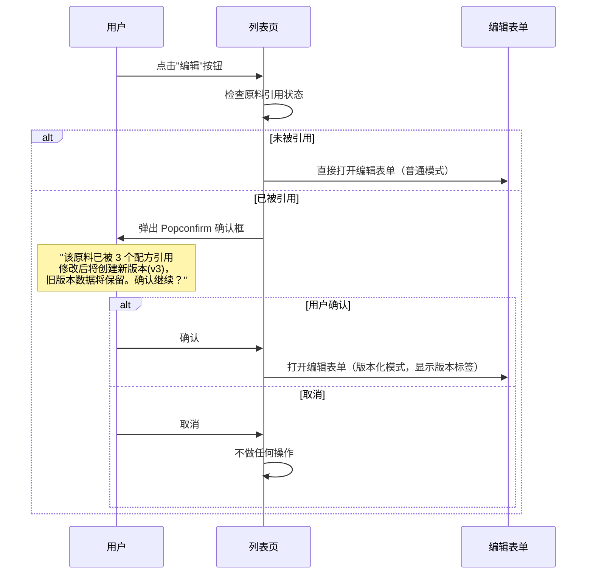

# 技术方案：原料管理版本化系统

## 1. 架构总览

```
┌─────────────────────────────────────────────────────────┐
│                      前端 (Vue 3)                        │
│  ┌──────────────────────────────────────────────────┐   │
│  │  MaterialList.vue  ·  MaterialForm.vue           │   │
│  │  MaterialVersionList.vue  (新增)                  │   │
│  │  MaterialVersionCompare.vue  (新增, P1)           │   │
│  └──────────────────────┬───────────────────────────┘   │
│                         │ Pinia                          │
│  ┌──────────────────────▼───────────────────────────┐   │
│  │  materialStore.ts (增强)                          │   │
│  └──────────────────────┬───────────────────────────┘   │
└─────────────────────────┼───────────────────────────────┘
                          │ HTTP /api/materials/*
┌─────────────────────────┼───────────────────────────────┐
│                         ▼                                │
│  ┌──────────────────────────────────────────────────┐   │
│  │  Routes: /api/materials                          │   │
│  │    GET    /              → 列表 (含版本信息)       │   │
│  │    GET    /:id           → 详情 (含版本链)         │   │
│  │    POST   /              → 创建                   │   │
│  │    PUT    /:id           → 更新 (自动版本化)       │   │
│  │    DELETE /:id           → 删除 (软删除)           │   │
│  │    GET    /:id/versions  → 版本历史 (新增)         │   │
│  │    GET    /:id/versions/:vid → 版本详情 (新增)      │   │
│  └──────────────────────┬───────────────────────────┘   │
│                         │                                │
│  ┌──────────────────────▼───────────────────────────┐   │
│  │  Controllers: materialController.ts (增强)        │   │
│  └──────────────────────┬───────────────────────────┘   │
│                         │                                │
│  ┌──────────────────────▼───────────────────────────┐   │
│  │  Service: materialService.ts (新增)               │   │
│  │    - 版本化逻辑                                   │   │
│  │    - 用户域权限检查                                │   │
│  │    - 引用检查                                     │   │
│  │    - 配方快照更新                                 │   │
│  └──────────────────────┬───────────────────────────┘   │
│                         │                                │
│  ┌──────────────────────▼───────────────────────────┐   │
│  │  Database (SQLite/MySQL)                          │   │
│  │    materials 表 (version 字段增强)                 │   │
│  │    material_nutrition 表 (版本关联)               │   │
│  │    formulas.materials_json (快照机制)             │   │
│  └──────────────────────────────────────────────────┘   │
└─────────────────────────────────────────────────────────┘
```

## 2. 数据库设计变更

### 2.1 materials 表 - 新增字段

```sql
-- 在现有 materials 表上新增版本化字段
ALTER TABLE materials ADD COLUMN version INTEGER NOT NULL DEFAULT 1;
ALTER TABLE materials ADD COLUMN previous_version_id TEXT DEFAULT NULL;
ALTER TABLE materials ADD COLUMN is_latest INTEGER NOT NULL DEFAULT 1;
ALTER TABLE materials ADD COLUMN is_deleted INTEGER NOT NULL DEFAULT 0;

CREATE INDEX IF NOT EXISTS idx_material_version_chain ON materials(previous_version_id);
CREATE INDEX IF NOT EXISTS idx_material_is_latest ON materials(is_latest);
```

### 2.2 版本链逻辑

```
初始创建:  id=A, version=1, previous_version_id=NULL, is_latest=1
   ↓
编辑触发:  id=A 的 is_latest=0
           新建 id=A_v2, version=2, previous_version_id=A, is_latest=1
   ↓
再次编辑:  id=A_v2 的 is_latest=0
           新建 id=A_v3, version=3, previous_version_id=A_v2, is_latest=1
```

### 2.3 material_nutrition - 关联版本

```sql
-- material_nutrition 新增 material_version 字段
ALTER TABLE material_nutrition ADD COLUMN material_version INTEGER NOT NULL DEFAULT 1;
ALTER TABLE material_nutrition ADD COLUMN is_latest INTEGER NOT NULL DEFAULT 1;
```

### 2.4 配方快照机制

现有 `formulas.materials_json` 存储格式变更：

```json
[
  {
    "materialId": "xxx",
    "materialName": "当归",
    "materialCode": "DG001",
    "materialVersion": 2,
    "quantity": 150,
    "unit": "g",
    "materialType": "herb",
    "snapshotNutrition": {       // ← 新增：引用时刻的营养快照
      "protein": 3.5,
      "fat": 1.2,
      "carbohydrate": 10.0,
      "sodium": 0.05,
      "calories": 68.0,
      "dietaryFiber": 5.0
    },
    "snapshotAt": "2026-05-21T10:00:00.000Z"
  }
]
```

## 3. 版本化逻辑（核心算法）

### 3.1 编辑流程

```
用户点击编辑 → 提交表单
       │
       ▼
检查: 当前用户是否有编辑权限?
  ├─ 不是创建者 + 不是 admin → 403 拒绝
  └─ 有权限
       │
       ▼
检查: 该原料是否被任何配方引用?
  ├─ 未被引用 → 原地 UPDATE（不创建版本）
  └─ 已被引用 → 进入版本化流程
       │
       ▼
版本化流程:
  1. 将当前版本标记 is_latest=0
  2. 创建新记录（新 UUID）
     - version = oldVersion + 1
     - previous_version_id = 旧 ID
     - is_latest = 1
     - 复制旧数据 + 应用新修改
  3. 复制营养数据到新版本
  4. 返回新版本数据
```

### 3.2 删除逻辑

```
用户点击删除
       │
       ▼
检查: 当前用户是否有删除权限?
  ├─ 不是 admin → 403 拒绝
  └─ 是 admin
       │
       ▼
检查: 该原料是否被引用?
  ├─ 未被引用 → 软删除 (is_deleted=1)
  └─ 已被引用 → 拒绝并提示"被 N 个配方引用"
```

### 3.3 配方营养计算 - 快照使用

```
配方营养计算时:
  1. 从 formula.materials_json 读取每个原料的 snapshotNutrition
  2. 使用快照数据进行营养计算（不再实时查询 material_nutrition）
  3. 配方显示原料版本信息: "当归 v2"

已有配方重新计算时:
  1. 提示用户"配方中部分原料已更新，是否刷新快照？"
  2. 确认后重新查询最新版本的营养数据并更新快照
```

## 4. 页面交互设计

### 4.1 MaterialList.vue - 原料列表页增强

#### 4.1.1 版本信息展示

```
┌─────────┬──────────┬──────────┬──────────┬──────────┬──────────┬──────────┬──────────┐
│  □      │ 原料信息   │ 类型     │ 版本      │ 营养     │ 库存     │ 创建时间   │ 操作     │
├─────────┼──────────┼──────────┼──────────┼──────────┼──────────┼──────────┼──────────┤
│  □      │ 当归 DG001│ 药材     │ v2  ←最新 │ 5项营养  │ 500g    │ 05-21    │ [编辑][..]│
│         │          │          │ ╭──────╮ │          │          │          │          │
│         │          │          │ │v2 ← │ │          │          │          │          │
│         │          │          │ │v1   │ │          │          │          │          │
│         │          │          │ ╰──────╯ │          │          │          │          │
└─────────┴──────────┴──────────┴──────────┴──────────┴──────────┴──────────┴──────────┘
```

**关键交互：**

| 元素 | 行为 | 说明 |
|------|------|------|
| **版本号标签** | 悬浮显示 tooltip："共 N 个版本" | 点击版本号直接跳转到版本历史页 |
| **最新版本标识** | 绿色小圆点 + "v{num}" | 当前最新版本高亮显示 |
| **非最新版本** | 灰色标签 + "v{num}" | 历史版本不显示绿色标识 |
| **行悬停** | 行背景高亮，显示行内版本预览 | 快速感知版本状态 |

#### 4.1.2 权限控制下的操作按钮

| 用户角色 | 自己的原料 | 他人的原料 |
|---------|-----------|-----------|
| **admin** | 显示 编辑·删除·版本历史 | 显示 编辑·删除·版本历史 |
| **formulist** | 显示 编辑·版本历史 | 仅显示 版本历史（编辑按钮隐藏） |

```
/* admin 视角 — 所有行显示完整操作 */
┌──────────┐ ┌──────────┐ ┌──────────┐
│ 编辑      │ │ 版本历史   │ │ 删除     │
└──────────┘ └──────────┘ └──────────┘

/* formulist 查看他人原料 — 编辑/删除隐藏 */
┌──────────┐
│ 版本历史   │
└──────────┘
```

#### 4.1.3 版本化编辑确认流程



**Popconfirm 文案设计：**

```
┌──────────────────────────────────┐
│ ⚠️  版本化编辑确认                  │
│                                  │
│ 该原料已被 3 个配方引用：           │
│ • 温补气血方                       │
│ • 四物汤改良方                     │
│ • 当归养血膏                       │
│                                  │
│ 修改后将创建新版本 (v2→v3)：        │
│ ✅ 旧版本数据完整保留               │
│ ✅ 引用旧版本的配方不受影响           │
│ ⚠️  新创建的配方将使用最新版本        │
│                                  │
│       [取消]    [确认编辑]          │
└──────────────────────────────────┘
```

### 4.2 MaterialForm.vue - 编辑表单增强

#### 4.2.1 编辑模式状态

| 模式 | 触发条件 | 界面表现 |
|:----:|----------|----------|
| **普通模式** | 新建原料，或编辑未引用原料 | 无版本提示，正常编辑 |
| **版本化模式** | 编辑已引用原料（已确认） | 顶部显示版本提示条，保存时创建新版本 |

#### 4.2.2 版本化模式 - 顶部提示条

```
┌─────────────────────────────────────────────────────────────┐
│ 🔄 版本化编辑模式                                           │
│ 当前版本：v2 · 修改后将创建 v3，旧版本数据完整保留            │
│ 被引用配方：温补气血方、四物汤改良方、当归养血膏               │
└─────────────────────────────────────────────────────────────┘

┌─────────────────────────────────────────────────────────────┐
│  原料名称: [___________当归___________]                     │
│  原料编码: [___________DG001__________]                     │
│   ...                                                      │
│                                                            │
│  ┌──────────────────────────────────────────────────┐      │
│  │ 💾 保存并创建新版本    [取消]                     │      │
│  └──────────────────────────────────────────────────┘      │
└─────────────────────────────────────────────────────────────┘
```

#### 4.2.3 保存反馈

| 模式 | 保存成功提示 | 行为 |
|:----:|-------------|------|
| 普通模式 | ✅ 原料更新成功 | 返回列表，列表数据刷新 |
| 版本化模式 | ✅ 新版本 v3 创建成功！ | 返回列表，列表数据刷新，新版本在列表中展示 |

### 4.3 MaterialVersions.vue - 版本历史页 (新增)

#### 4.3.1 页面布局

```
┌─────────────────────────────────────────────────────────────┐
│  ← 返回原料列表                                              │
│                                                            │
│  当归 (DG001) · 当前版本: v2                                │
│                                                            │
│  ┌── 版本时间线 ──────────────────────────────────────────┐ │
│  │                                                         │ │
│  │  ● v2  ← 当前最新版本                                    │ │
│  │  │  2026-05-21 14:30 · 由 管理员（张三）编辑              │ │
│  │  │  变更内容：单价从 ¥25.00 改为 ¥28.00，库存更新          │ │
│  │  │  [查看此版本详情]                                      │ │
│  │  │                                                       │ │
│  │  ● v1                                                    │ │
│  │     2026-05-15 09:00 · 由 配方师（李四）创建               │ │
│  │     初始创建                                              │ │
│  │     [查看此版本详情]                                      │ │
│  │                                                         │ │
│  └─────────────────────────────────────────────────────────┘ │
│                                                            │
│  ┌── 版本对比 (P1) ───────────────────────────────────────┐  │
│  │  [选择版本对比...]                                       │  │
│  └─────────────────────────────────────────────────────────┘ │
└─────────────────────────────────────────────────────────────┘
```

#### 4.3.2 版本详情查看

点击"查看此版本详情" → 展开或侧边栏显示该版本完整数据：

```
┌── 版本 v1 详情 (历史版本) ──────────────────────────┐
│                                                     │
│  基本信息:                                           │
│  名称: 当归    编码: DG001    类型: 药材              │
│  单价: ¥25.00/kg   库存: 300g                       │
│                                                     │
│  营养成分（每100g）:                                  │
│  蛋白质: 3.2g   脂肪: 1.0g   碳水: 8.5g             │
│  钠: 0.03g     热量: 55kcal  膳食纤维: 4.2g         │
│                                                     │
│  创建时间: 2026-05-15 09:00                          │
│  创建人: 配方师（李四）                                │
│                                                     │
│  [关闭]                                              │
└─────────────────────────────────────────────────────┘
```

#### 4.3.3 空状态

- 仅有 v1（初始版本）：显示"此原料尚无版本变更历史"
- 版本加载中：骨架屏

### 4.4 配方中的原料版本展示

#### 4.4.1 FormulaForm.vue / MaterialTableCore.vue - 原料选择

在配方编辑页的原料表格中，每行原料显示版本信息：

```
┌──────────┬─────────┬────────┬────────┬────────┬────────┐
│ 原料名称   │ 编码     │ 版本    │ 用量    │ 单价    │ 操作   │
├──────────┼─────────┼────────┼────────┼────────┼────────┤
│ 当归      │ DG001   │ v2     │ 150g   │ ¥28.00 │ [删除] │
│          │         │ ╰最新╯  │        │        │        │
│ 黄芪      │ HQ002   │ v1     │ 120g   │ ¥35.00 │ [删除] │
│          │         │        │        │        │        │
│ 甘草      │ GC003   │ v1     │ 50g    │ ¥12.00 │ [删除] │
└──────────┴─────────┴────────┴────────┴────────┴────────┘
```

**版本标记说明：**
- 该原料的最新版本 → 显示绿色「最新」标签
- 非最新版本 → 显示黄色「历史」标签 + tooltip "此原料已更新至 v{num}"

#### 4.4.2 快照刷新交互

```
当配方中的原料有最新版本时:

┌──────────────────────────────────────────────────┐
│ ⚠️ 部分原料已有新版本                              │
│ • 当归: v2 → v3 (单价、库存已更新)                 │
│ • 黄芪: v1 → v2 (营养数据已更新)                    │
│                                                   │
│ 刷新快照将更新配方中的营养数据，可能影响营养分析结果。  │
│                                                   │
│  [暂不刷新]    [立即刷新快照]                        │
└──────────────────────────────────────────────────┘
```

### 4.5 全局导航入口

在原料管理页面中，版本历史入口：

```
原料列表行操作:  [编辑] [📋 版本] [🗑 删除]
                       ↑
                点击跳转到该原料的版本历史页

原料详情页:
  ┌─────────────────────────────────────────┐
  │  当归 (DG001)       版本: v2  [查看历史] │
  │                                       │
  │  ...                                  │
  └─────────────────────────────────────────┘
                             ↑
                      点击跳转版本历史页
```

## 5. 路由变更

### 5.1 后端路由新增

```typescript
// materials.ts 新增路由
materialRoutes.get("/:id/versions", getMaterialVersions);         // 版本列表
materialRoutes.get("/:id/versions/:versionId", getMaterialVersion); // 版本详情
materialRoutes.put("/:id", updateMaterial);                        // ★ 增强：自动版本化
```

### 5.2 前端路由新增

```typescript
// router/index.ts 新增
{
  path: '/materials/:id/versions',
  name: 'MaterialVersions',
  component: () => import('@/views/materials/MaterialVersions.vue'),
  meta: { requiresAuth: true }
}
```

## 6. 权限检查矩阵

| 操作 | admin | 创建者 (formulist) | 其他用户 |
|------|-------|-------------------|---------|
| 查看列表 | ✅ 全部 | ✅ 全部 | ✅ 全部 |
| 查看详情 | ✅ | ✅ | ✅ |
| 创建 | ✅ | ✅ | ❌ |
| 编辑（未引用） | ✅ | ✅ 仅自己的 | ❌ |
| 编辑（已引用→新版本） | ✅ | ✅ 仅自己的 | ❌ |
| 删除 | ✅（软删除） | ❌ | ❌ |
| 查看版本历史 | ✅ | ✅ | ✅ |

## 7. 数据迁移方案

### 7.1 初始化脚本

执行迁移脚本 `backend/src/scripts/migrations/addVersionToMaterials.ts`：

```typescript
// 1. 为所有现有原料设置 version=1, is_latest=1
await query("UPDATE materials SET version = 1, is_latest = 1 WHERE version IS NULL");

// 2. 为 material_nutrition 设置 material_version=1
await query("UPDATE material_nutrition SET material_version = 1 WHERE material_version IS NULL");

// 3. 为已有配方的 materials_json 补充 snapshotNutrition
// 遍历所有配方，读取 materials_json，查询每个原料的最新营养数据写入
```

### 7.2 回滚方案

```typescript
// 回滚：删除新增字段
// 注意：版本化后数据不可逆回滚，回滚仅用于开发环境测试
```

## 8. 风险与应对

| 风险 | 概率 | 影响 | 应对 |
|------|------|------|------|
| 已有配方营养数据回填耗时 | 高 | 中 | 异步回填，分批处理 |
| 版本链过长影响查询 | 低 | 中 | 分页加载版本列表，默认只查最新的 is_latest |
| 用户误操作创建多余版本 | 中 | 低 | 版本历史可查，admin 可软删除版本 |
| 配方编辑时快照与最新数据不一致 | 高 | 低 | 显示版本标签，提示用户手动刷新 |

## 9. 目录结构变更

```
backend/src/
├── services/
│   └── materialService.ts          ← 新增：原料业务逻辑层
├── controllers/
│   └── materialController.ts       ← 增强：增加版本接口
├── routes/
│   └── materials.ts                ← 增强：增加版本路由
└── scripts/migrations/
    └── addVersionToMaterials.ts    ← 新增：迁移脚本

frontend/src/
├── api/
│   └── material.ts                 ← 增强：增加版本 API
├── stores/
│   └── material.ts                 ← 增强：增加版本状态
├── views/materials/
│   ├── MaterialList.vue            ← 增强：版本列+权限控制
│   ├── MaterialForm.vue            ← 增强：版本化提示
│   └── MaterialVersions.vue        ← 新增：版本历史页面
└── types/
    └── material.ts                 ← 新增：后端类型定义
```